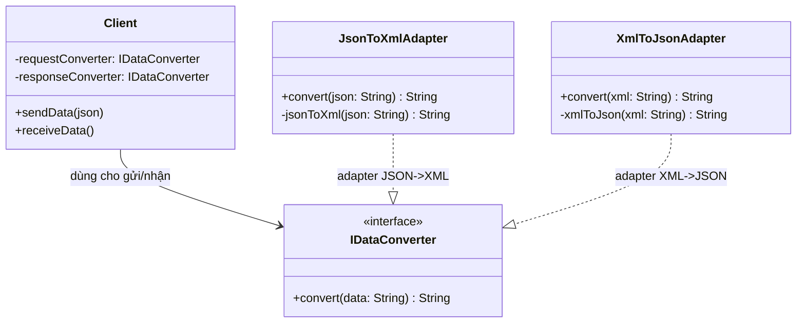

1. Phân tích bối cảnh bài toán
Trong thực tế, bạn thường gặp tình huống:

Client (Hệ thống mới): Chỉ biết cách gửi và nhận dữ liệu dưới dạng JSON.

Service (Hệ thống cũ/Bên thứ ba): Chỉ hiểu và xử lý dữ liệu dưới dạng XML.

Nếu bạn bắt hệ thống mới phải viết code để tạo XML, hoặc bắt hệ thống cũ phải đọc JSON, bạn sẽ vi phạm nguyên tắc "Open/Closed" (mở rộng chức năng nhưng hạn chế sửa đổi code cũ). Adapter sinh ra để giải quyết việc này.

2. Các thành phần trong mô hình Adapter
Để giải bài toán này, bạn cần xác định 4 thành phần chính:

Target (Interface mục tiêu): Giao diện mà Client mong muốn sử dụng (ví dụ: IJsonDataProcessor).

Adaptee (Phía cần thích nghi): Hệ thống/bên thứ ba chỉ hiểu XML (không nhất thiết phải map 1-1 thành một class cụ thể trong sơ đồ).

Adapter (Bộ chuyển đổi): Lớp thực thi Target, bên trong nó chứa logic chuyển đổi dữ liệu để giúp Client (JSON) nói chuyện được với hệ thống XML mà không cần thay đổi cả hai phía.

Client: Đối tượng sử dụng Target để gửi/nhận dữ liệu.

3. Quy trình chuyển đổi dữ liệu
Bài toán yêu cầu chuyển đổi hai chiều, vì vậy logic của Adapter sẽ như sau:

Chiều đi (JSON -> XML):

Client gọi hàm sendData(json).

Adapter tiếp nhận chuỗi JSON.

Adapter sử dụng một thư viện hoặc logic tự viết để convert JSON sang XML string.

Adapter gọi hàm processXML(xml) của hệ thống XML.

Chiều về (XML -> JSON):

Hệ thống XML trả về kết quả dạng success.

Adapter nhận kết quả này.

Adapter convert XML này sang JSON: {"status": "success"}.

Adapter trả kết quả JSON về cho Client.

## 4. Class Diagram (Sơ đồ lớp)



### Giải thích sơ đồ

- **Client**: Là hệ thống mới, chỉ muốn làm việc với JSON. Nó không biết gì về chi tiết xử lý XML ở bên dưới. Client giữ 2 reference:
  - `requestConverter: IDataConverter` dùng khi **gửi** dữ liệu (JSON → XML).
  - `responseConverter: IDataConverter` dùng khi **nhận** dữ liệu (XML → JSON).

- **IDataConverter (Target chung)**: Interface chung cho mọi adapter chuyển đổi định dạng dữ liệu. Nó chỉ có một phương thức:
  - `convert(data: String): String` – nhận vào một chuỗi, trả về chuỗi sau khi chuyển đổi (tùy từng adapter cụ thể).
  Nhờ interface này, Client chỉ phụ thuộc vào abstraction, không phụ thuộc trực tiếp vào từng adapter cụ thể.

- **JsonToXmlAdapter (Adapter JSON→XML)**: Cài đặt `IDataConverter` phục vụ chiều đi:
  - Nhận JSON từ Client trong `convert(json)`.
  - Dùng hàm private `jsonToXml(json)` để chuyển sang XML string.
  - (Tùy hiện thực cụ thể) XML này có thể được gửi sang hệ thống XML thực tế hoặc trả cho một lớp/hạ tầng khác tiếp tục xử lý.

- **XmlToJsonAdapter (Adapter XML→JSON)**: Cài đặt `IDataConverter` phục vụ chiều về:
  - Nhận XML (hoặc kết quả từ một nơi nào đó) trong `convert(xml)`.
  - Dùng hàm private `xmlToJson(xml)` để chuyển XML (ví dụ kết quả `"success"` hoặc `<status>success</status>`) sang JSON, ví dụ `{"status": "success"}`.
  - Trả chuỗi JSON cho Client.

- **Adaptee (ẩn trong hạ tầng)**: Hệ thống XML thực tế không được vẽ thành một class cụ thể (như `XMLService`), mà được xem là một phần hạ tầng/endpoint bên ngoài. Các adapter chỉ cần đảm bảo dữ liệu vào/ra đúng định dạng XML/JSON mà không quan tâm chi tiết implementation.

**Quan hệ trong sơ đồ:**
- `Client --> IDataConverter`: Client làm việc thông qua interface chung, có thể “cắm” bất kỳ adapter nào triển khai `IDataConverter` (tuân thủ Open/Closed + Dependency Inversion).
- `JsonToXmlAdapter ..|> IDataConverter`: Adapter dành cho chiều **JSON → XML**, tập trung vào việc chuẩn hóa dữ liệu sang XML.
- `XmlToJsonAdapter ..|> IDataConverter`: Adapter dành cho chiều **XML → JSON**, tập trung vào việc chuyển kết quả XML thành JSON.

Với cách tách 2 adapter cùng dùng chung một interface:
- Bạn **rõ ràng hóa trách nhiệm**: một lớp chuyên cho JSON→XML, một lớp chuyên cho XML→JSON.
- Client vẫn chỉ phụ thuộc vào `IDataConverter`, nên sau này có thể dễ dàng thêm các adapter khác (ví dụ `YamlToJsonAdapter`, `CsvToJsonAdapter`, ...) mà không cần sửa code Client.

---

## 5. Triển khai code (Java core) & Demo

Cấu trúc thư mục: `DesignPattern/Adapter/Code/adapter/`

| File | Mô tả |
|------|--------|
| `IDataConverter.java` | Interface Target: `String convert(String data)` |
| `JsonToXmlAdapter.java` | Adapter JSON → XML, implement `IDataConverter` |
| `XmlToJsonAdapter.java` | Adapter XML → JSON, implement `IDataConverter` |
| `Client.java` | Giữ `requestConverter` và `responseConverter`, gọi `sendData(json)` / `receiveData()` |
| `Demo.java` | Class chứa `main` để chạy demo |

### Cách chạy demo

Từ thư mục `DesignPattern/Adapter/Code`:

```bash
javac adapter/*.java
java adapter.Demo
```

### Kết quả demo mẫu

```
=== Chiều đi (JSON -> XML) ===
Client gửi JSON: {"user":"admin","action":"login"}
Adapter chuyển thành XML (gửi đi): <user>admin</user><action>login</action>

=== Chiều về (XML -> JSON) ===
Hệ thống XML trả về: success
Adapter chuyển thành JSON cho Client: {"status":"success"}

Hệ thống XML trả về: <status>ok</status><message>Welcome</message>
Adapter chuyển thành JSON: {"status":"ok","message":"Welcome"}
```

Client chỉ làm việc với JSON; hai adapter đảm nhiệm chuyển đổi hai chiều thông qua interface chung `IDataConverter`.

---

Hãy áp dụng Adapter Design Pattern vào trường hợp trên.

Yêu cầu: vẽ sơ đồ trước khi viết code.
