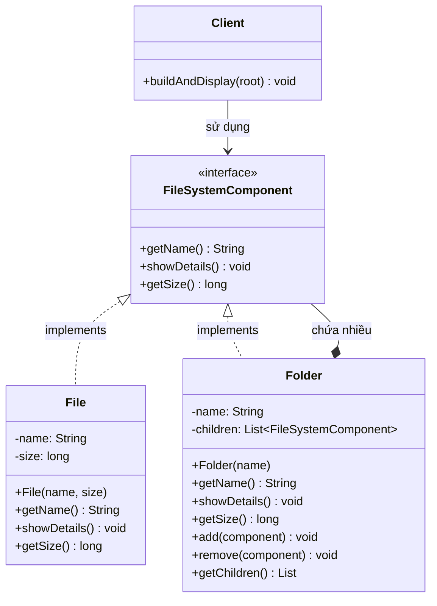

Để giải quyết bài toán quản lý hệ thống tệp tin và thư mục (File System) theo mô hình cây, Composite Design Pattern là lựa chọn tối ưu nhất. Nó cho phép bạn xử lý các đối tượng đơn lẻ (File) và các nhóm đối tượng (Folder) một cách đồng nhất.

Dưới đây là mô tả chi tiết yêu cầu bài toán khi áp dụng mẫu thiết kế này:

1. Phân tích các thành phần (Composite Pattern)
Để áp dụng mẫu này, chúng ta chia hệ thống thành 3 thành phần cốt lõi:

Component (Thành phần chung): Là một interface hoặc abstract class quy định các hành vi chung cho cả tập tin và thư mục (ví dụ: showDetails(), getSize()).

Leaf (Lá - Tập tin): Đại diện cho các đối tượng cơ bản. Một tập tin không thể chứa thành phần nào khác.

Composite (Hợp phần - Thư mục): Đại diện cho các đối tượng phức tạp có thể chứa các thành phần con (cả File và Folder khác). Nó thực thi các phương thức để thêm, xóa hoặc truy xuất các con.

2. Mô tả logic hoạt động
Cấu trúc phân cấp
Hệ thống sẽ được tổ chức theo dạng đệ quy. Một thư mục gốc (Root) có thể chứa:

Các tập tin (File A, File B).

Các thư mục con (Sub-folder 1).

Trong Sub-folder 1 lại có thể chứa tiếp các File hoặc Thư mục con khác.

Tính đồng nhất (Uniformity)
Client (người dùng hoặc hệ thống gọi) không cần biết họ đang tương tác với một tập tin hay một thư mục. Họ chỉ cần gọi phương thức showDetails(), và:

Nếu là File: Nó tự in ra tên và dung lượng của chính nó.

Nếu là Folder: Nó in ra tên của nó, sau đó duyệt qua danh sách các con bên trong và yêu cầu mỗi con tự in thông tin của chúng.

---

## 3. Class Diagram (Sơ đồ lớp)



### Giải thích sơ đồ

- **FileSystemComponent (Component)**: Giao diện chung cho mọi thành phần trong hệ thống file. Định nghĩa các hành vi thống nhất: `getName()`, `showDetails()` (in thông tin), `getSize()` (dung lượng). Nhờ đó Client xử lý File và Folder như một loại đối tượng.

- **File (Leaf)**: Đối tượng lá, không chứa thành phần con. Lưu `name` và `size`, triển khai `showDetails()` bằng cách in tên và dung lượng của chính nó; `getSize()` trả về dung lượng file.

- **Folder (Composite)**: Đối tượng hợp phần, chứa danh sách `children` (các `FileSystemComponent`). Có thêm phương thức `add()`, `remove()` để quản lý con. `showDetails()` in tên thư mục rồi gọi đệ quy `showDetails()` cho từng con; `getSize()` trả về tổng dung lượng của tất cả con.

- **Client**: Xây dựng cây thư mục (root và các con), gọi `showDetails()` hoặc `getSize()` lên thành phần gốc mà không cần biết đó là File hay Folder — thể hiện tính đồng nhất (uniformity) của mẫu Composite.

- **Quan hệ**: Folder chứa nhiều FileSystemComponent (có thể là File hoặc Folder con) tạo nên cấu trúc cây đệ quy; Client chỉ phụ thuộc vào FileSystemComponent.

---

## 4. Triển khai code (Java)

Cấu trúc thư mục: `DesignPattern/Composite/Code/composite/`

| Lớp | Vai trò | Mô tả ngắn |
|-----|--------|-------------|
| `FileSystemComponent` | Component | Interface: `getName()`, `showDetails()`, `getSize()` |
| `File` | Leaf | Tập tin: in tên + size, không có con |
| `Folder` | Composite | Thư mục: danh sách con, `add()`/`remove()`, đệ quy `showDetails()`/`getSize()` |
| `Demo` | Client | Tạo cây Root → File/Sub-folder → gọi `root.showDetails()` và `root.getSize()` |

**Chạy demo:** từ thư mục `Code`:  
`javac composite/*.java` rồi `java composite.Demo`

**Kết quả mẫu:**

```
=== showDetails() ===
[Folder] Root
  [File] readme.txt (1024 bytes)
  [File] config.ini (256 bytes)
[Folder] Sub-folder 1
  [File] File A (512 bytes)
  [File] File B (768 bytes)
[Folder] Sub-folder 2
  [File] nested.txt (128 bytes)

=== getSize() (tổng dung lượng) ===
Root total size: 2688 bytes
```