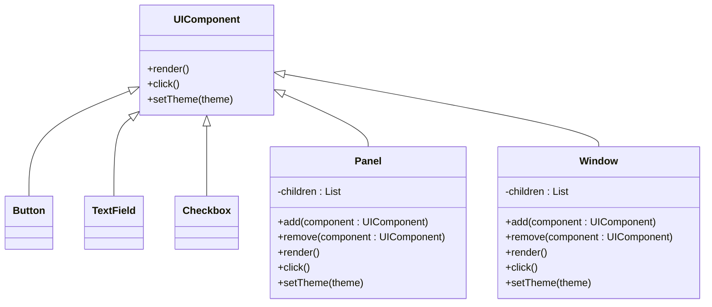

Để giải quyết bài toán quản lý giao diện người dùng (UI) phức tạp, Composite Design Pattern là một giải pháp cực kỳ mạnh mẽ. Nó cho phép bạn coi một nút bấm đơn lẻ (Button) và một bảng điều khiển phức tạp chứa nhiều nút bấm (Panel) như một đối tượng có cùng bản chất.

Dưới đây là mô tả chi tiết cách áp dụng mẫu thiết kế này vào bài toán UI của bạn:

## Class Diagram cho Composite UI



### Giải thích class diagram

- **UIComponent**  
  - Đóng vai trò **Component** trong Composite Pattern.  
  - Định nghĩa giao diện chung cho mọi phần tử UI: `render()`, `click()`, `setTheme(theme)`.  
  - Nhờ có lớp chung này, mọi đối tượng UI (Button, TextField, Panel, Window, …) đều có thể được xử lý một cách đồng nhất.

- **Button, TextField, Checkbox**  
  - Là các **Leaf** – phần tử đơn lẻ, không chứa các thành phần con.  
  - Cài đặt cụ thể cách `render()` (vẽ nút, ô nhập, checkbox), `click()` (xử lý sự kiện bấm, focus, chọn), `setTheme(theme)` (đổi màu, font, border theo theme).  
  - Khi Composite gọi các phương thức này, chúng chỉ thao tác trên chính bản thân chúng.

- **Panel, Window**  
  - Là các **Composite** – phần tử có thể chứa nhiều `UIComponent` (cả Leaf lẫn Composite khác).  
  - Thuộc tính `children : List<UIComponent>` lưu danh sách tất cả thành phần con.  
  - Phương thức `add()` / `remove()` cho phép xây dựng cây giao diện (thêm/xóa Button, TextField, Panel con, …).  
  - Khi gọi `render()`, `click()`, `setTheme(theme)` trên `Panel` hoặc `Window`, chúng:
    - Thực hiện phần việc của chính nó (vẽ khung panel/window, gán theme cho container, …).  
    - Sau đó **duyệt toàn bộ `children` và gọi tiếp các phương thức tương ứng** trên từng con, nhờ đó tạo nên hành vi đệ quy đặc trưng của Composite Pattern.

Nhờ cấu trúc này, từ góc nhìn client, bạn chỉ cần làm việc với kiểu dữ liệu chung `UIComponent` (ví dụ: `UIComponent root = mainWindow; root.render();`), mà không cần quan tâm đó là Button, Panel hay Window – Composite Pattern đã ẩn đi toàn bộ sự phức tạp của cấu trúc cây giao diện.

---

## Triển khai code (Java)

Cấu trúc thư mục: `DesignPattern/Composite/Code/composite2/`

| Lớp | Vai trò | Mô tả ngắn |
|-----|--------|-----------|
| `UIComponent` | Component | Interface: `render()`, `click()`, `setTheme(String)` |
| `Button` | Leaf | Nút bấm, không chứa con, log khi render/click/setTheme |
| `TextField` | Leaf | Ô nhập, không chứa con, log khi render/click/setTheme |
| `Checkbox` | Leaf | Checkbox, không chứa con, log khi render/click/setTheme |
| `UIContainer` | Composite (abstract) | Quản lý `List<UIComponent> children`, cài đặt đệ quy `render()`, `click()`, `setTheme()` và `add()`/`remove()` có log |
| `Panel` | Composite cụ thể | Kế thừa `UIContainer`, đại diện vùng nội dung/nhóm control |
| `Window` | Composite cụ thể | Kế thừa `UIContainer`, là cửa sổ gốc của UI |
| `CompositeUIDemo` | Client | Xây dựng cây UI và gọi `render()`, `setTheme()`, `click()` trên `Window` gốc |

**Chạy demo:** từ thư mục `Code`:

```bash
javac composite2/*.java
java composite2.CompositeUIDemo
```

**Kết quả mẫu (rút gọn):**

```text
===== RENDER UI =====
[LOG] Render Window: Main Window
[LOG] Render Panel: Toolbar
[LOG] Render Button: New
[LOG] Render Button: Open
[LOG] Render Button: Save
[LOG] Render Panel: Content Panel
[LOG] Render TextField: Search Box
[LOG] Render Checkbox: Show advanced options

===== APPLY THEME DARK =====
[LOG] Apply theme 'Dark' cho container Window: Main Window
[LOG] Apply theme 'Dark' cho container Panel: Toolbar
[LOG] Apply theme 'Dark' to Button: New
...

===== CLICK TOÀN BỘ UI =====
[LOG] Click trên container Window: Main Window
[LOG] Click trên container Panel: Toolbar
[LOG] Click Button: New
...
```

Qua log trên có thể thấy rõ:

- Client chỉ làm việc với `Window` (kiểu `UIComponent`), nhưng lệnh được **truyền đệ quy xuống toàn bộ cây UI**.  
- Leaf (Button, TextField, Checkbox) tự xử lý hành vi của chính nó, còn Composite (Panel, Window) chịu trách nhiệm lặp qua `children` và ủy quyền lời gọi – đúng tinh thần Composite Design Pattern.