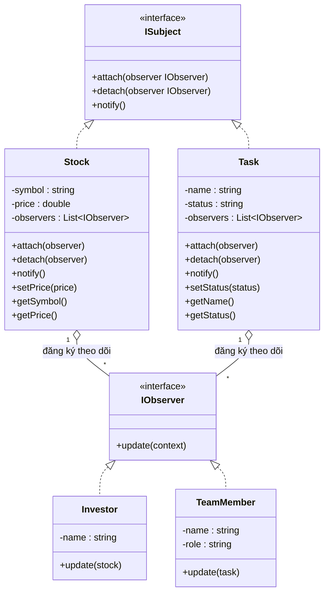

1. Phân tích thành phần cốt lõi
Dù là theo dõi Cổ phiếu hay Trạng thái công việc, cấu trúc của Observer luôn gồm hai phe:

Subject (Chủ thể - Phía phát tin): * Giữ danh sách các "người hâm mộ" (Observers).

Có các phương thức: attach() (đăng ký), detach() (hủy đăng ký), và quan trọng nhất là notify() (gửi thông báo).

Trong bài: Là lớp Stock (Cổ phiếu) hoặc lớp Task (Công việc).

Observer (Người quan sát - Phía nhận tin): * Định nghĩa một giao diện chung (Interface) có hàm update().

Trong bài: Là Investor (Nhà đầu tư) hoặc TeamMember (Thành viên nhóm).

2. Kịch bản 1: Theo dõi Cổ phiếu (Stock Market)
Đây là mô hình đẩy dữ liệu theo thời gian thực:

Trạng thái thay đổi: Giá cổ phiếu (ví dụ: mã VNM tăng từ 70k lên 72k).

Hành động: Hệ thống duyệt qua danh sách tất cả nhà đầu tư đã đăng ký mã VNM đó.

Kết quả: Mỗi nhà đầu tư nhận được một thông báo: "Mã VNM đã đổi giá, hãy kiểm tra danh mục của bạn!"

3. Kịch bản 2: Quản lý dự án (Task Tracking)
Đây là mô hình quản lý trạng thái quy trình (Workflow):

Trạng thái thay đổi: Thuộc tính status của Task chuyển từ In Progress sang Done.

Hành động: Đối tượng Task gọi hàm thông báo đến các thành viên đang theo dõi task đó.

Kết quả: Project Manager nhận được email, Developer nhận được tin nhắn Slack thông báo công việc đã hoàn thành.

4. Quy trình hoạt động (Workflow)
Thiết lập: Nhà đầu tư A và B thực hiện hành động subscribe (đăng ký) vào Cổ phiếu Apple.

Sự kiện xảy ra: Giá Apple thay đổi.

Kích hoạt: Cổ phiếu Apple tự động gọi phương thức notify().

Lan truyền: Phương thức notify() lặp qua danh sách (A, B) và gọi hàm update() của từng người.

Xử lý tại chỗ: Nhà đầu tư A quyết định bán, nhà đầu tư B quyết định mua tiếp dựa trên thông tin vừa nhận.

---

## 5. Class Diagram (Sơ đồ lớp)

Sơ đồ dưới đây mô tả Observer Pattern áp dụng cho **hai kịch bản**: Theo dõi Cổ phiếu (Stock – Investor) và Theo dõi Công việc (Task – TeamMember).



---

## 6. Giải thích sơ đồ & cách triển khai

- **`ISubject` (Chủ thể – giao diện)**  
  - Định nghĩa hợp đồng cho mọi đối tượng “phát tin”: phải có khả năng **đăng ký** (`attach`), **hủy đăng ký** (`detach`) và **thông báo** (`notify`) khi trạng thái thay đổi.  
  - Trong bài: **Stock** và **Task** đều là Subject (cổ phiếu phát tin khi giá đổi, công việc phát tin khi trạng thái đổi).

- **`IObserver` (Người quan sát – giao diện)**  
  - Định nghĩa phương thức chung `update(context)`: mỗi observer nhận thông tin mới và xử lý theo cách riêng (in log, gửi email, Slack, v.v.).  
  - Trong bài: **Investor** và **TeamMember** là Observer (nhà đầu tư phản ứng với giá cổ phiếu, thành viên nhóm phản ứng với trạng thái task).

- **`Stock` (Chủ thể cụ thể – Kịch bản 1)**  
  - Giữ `symbol`, `price` và danh sách `observers`.  
  - Khi gọi `setPrice(price)`: cập nhật giá → gọi `notify()` → duyệt danh sách observers và gọi `update(stock)` cho từng người.  
  - Investor nhận đối tượng Stock (hoặc thông tin tóm tắt) trong `update()` để quyết định mua/bán.

- **`Task` (Chủ thể cụ thể – Kịch bản 2)**  
  - Giữ `name`, `status` và danh sách `observers`.  
  - Khi gọi `setStatus(status)` (ví dụ: "In Progress" → "Done"): cập nhật trạng thái → gọi `notify()` → mỗi TeamMember nhận `update(task)`.  
  - Trong `update()` có thể phân role (PM → gửi email, Developer → gửi Slack) tùy cách triển khai.

- **Quan hệ trong sơ đồ**  
  - `ISubject <|.. Stock`, `ISubject <|.. Task`: Subject cụ thể thực thi giao diện ISubject.  
  - `IObserver <|.. Investor`, `IObserver <|.. TeamMember`: Observer cụ thể thực thi IObserver.  
  - `Stock o-- "*" IObserver`, `Task o-- "*" IObserver`: Một Subject quản lý nhiều Observer (danh sách đăng ký); khi `notify()` thì gọi `update()` trên từng phần tử.

**Luồng hoạt động tóm tắt:**  
1. Observer gọi `subject.attach(this)` để đăng ký.  
2. Khi trạng thái Subject thay đổi (giá cổ phiếu / trạng thái task), Subject gọi `notify()`.  
3. `notify()` lặp qua danh sách observers và gọi `update(context)` với thông tin mới.  
4. Mỗi Observer xử lý theo logic riêng (hiển thị, gửi thông báo, cập nhật UI, v.v.).

---

## 7. Triển khai code mẫu

Code **Java core** mẫu nằm trong thư mục **`Code/observer1/`**, gồm:

| File | Mô tả |
|------|--------|
| `Subject.java` | Giao diện Subject với `attach`, `detach`, `notifyObservers` |
| `Observer.java` | Giao diện Observer với `update(context)` |
| `Stock.java` | Subject cụ thể – Cổ phiếu (kịch bản 1) + log attach/detach/notify |
| `Investor.java` | Observer cụ thể – Nhà đầu tư, in log quyết định khi giá đổi |
| `Task.java` | Subject cụ thể – Công việc (kịch bản 2) + log thay đổi trạng thái |
| `TeamMember.java` | Observer cụ thể – Thành viên nhóm (PM / Developer), log gửi email/Slack |
| `Demo.java` | Hàm `main` dựng hai kịch bản và log chi tiết luồng thực thi |

**Chạy demo (trên Windows, đã cài JDK và có `javac`, `java` trong PATH):**

```bash
cd "DesignPattern/Observer/Code/observer1"
javac *.java
java observer1.Demo
```