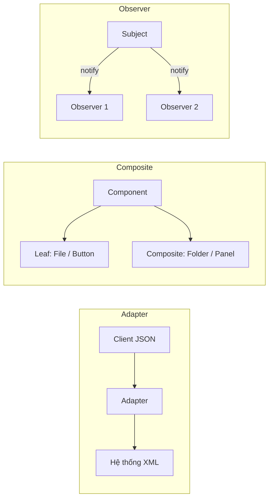

# Design Pattern – Bài thực hành KTPM

Thư mục này chứa tài liệu phân tích, mã nguồn minh họa và đề bài liên quan đến các **Design Pattern** trong môn Kiến trúc Phần mềm (KTPM).

## Cấu trúc thư mục

```
DesignPattern/
├── Adapter/          # Adapter Pattern – chuyển đổi JSON ↔ XML
├── Composite/        # Composite Pattern – File System & UI
├── Observer/         # Observer Pattern – Stock & Task
└── bt2.md            # Đề bài: Hệ thống quản lý thư viện (nhiều pattern)
```

## Các mẫu thiết kế đã triển khai

| Pattern | Bài toán minh họa | Tài liệu | Mã nguồn |
|---------|-------------------|----------|----------|
| **Adapter** | Client dùng JSON, hệ thống cũ chỉ hiểu XML | [Adapter Design Pattern.md](Adapter/Adapter%20Design%20Pattern.md) | [Adapter/Code/adapter/](Adapter/Code/adapter/) |
| **Composite** | Quản lý cây thư mục/tệp tin (File System) | [Composite Design Pattern1.md](Composite/Composite%20Design%20Pattern1.md) | [Composite/Code/composite1/](Composite/Code/composite1/) |
| **Composite** | Giao diện UI lồng nhau (Button, Panel, Window) | [Composite Design Pattern2.md](Composite/Composite%20Design%20Pattern2.md) | [Composite/Code/composite2/](Composite/Code/composite2/) |
| **Observer** | Theo dõi cổ phiếu & trạng thái công việc | [Observer Design Pattern.md](Observer/Observer%20Design%20Pattern.md) | [Observer/Code/observer1/](Observer/Code/observer1/) |

## Yêu cầu hệ thống

- **JDK 8+** (chỉ dùng Java core, không phụ thuộc thư viện bên ngoài)

## Cách biên dịch và chạy

Mỗi demo là project Java thuần với `package` riêng. Biên dịch từ thư mục `Code/` (một cấp trên package), rồi chạy class `main` tương ứng.

### Adapter Pattern

```bash
cd Adapter/Code
javac adapter/*.java
java adapter.Demo
```

**Kịch bản:** Client gửi/nhận JSON; `JsonToXmlAdapter` và `XmlToJsonAdapter` chuyển đổi qua lại với hệ thống XML mà không sửa code hai phía.

### Composite Pattern – File System

```bash
cd Composite/Code
javac composite1/*.java
java composite1.Demo
```

**Kịch bản:** Xây dựng cây thư mục lồng nhau; gọi `showDetails()` và `getSize()` trên root mà không phân biệt File hay Folder.

### Composite Pattern – UI

```bash
cd Composite/Code
javac composite2/*.java
java composite2.CompositeUIDemo
```

**Kịch bản:** Window chứa Panel, Panel chứa Button/TextField/Checkbox; render và click lan truyền đệ quy trên cây UI.

### Observer Pattern

```bash
cd Observer/Code
javac observer1/*.java
java observer1.Demo
```

**Kịch bản:** Hai ví dụ — (1) nhà đầu tư đăng ký theo dõi cổ phiếu, (2) thành viên nhóm theo dõi trạng thái Task; Subject gọi `notify()` khi dữ liệu thay đổi.

## Đề bài tổng hợp: Quản lý thư viện

File [bt2.md](bt2.md) mô tả bài toán **hệ thống quản lý thư viện** yêu cầu kết hợp nhiều pattern:

| Pattern | Vai trò trong hệ thống thư viện |
|---------|----------------------------------|
| **Singleton** | Một đối tượng `Library` duy nhất quản lý toàn bộ sách |
| **Factory Method** | Tạo các loại sách (giấy, điện tử, nói, …) |
| **Strategy** | Chiến lược tìm kiếm theo tên, tác giả, thể loại |
| **Observer** | Thông báo khi có sách mới hoặc sách quá hạn mượn |
| **Decorator** | Mở rộng tính năng mượn sách (gia hạn, phiên bản đặc biệt) |

Các bài lab khác trong repo (`singleton_factory/`, `State_Strategy_Decorator/`) triển khai một phần các pattern trên với bài toán khác.

## Tóm tắt vai trò từng pattern



- **Adapter:** Cầu nối giữa hai interface không tương thích.
- **Composite:** Xử lý đồng nhất đối tượng đơn lẻ và nhóm đối tượng (cấu trúc cây).
- **Observer:** Phát sự kiện từ Subject tới nhiều Observer đã đăng ký, tách biệt phát và nhận.

## Tài liệu chi tiết

Mỗi pattern có file markdown riêng kèm phân tích bài toán, sơ đồ lớp (Mermaid) và giải thích luồng hoạt động. Đọc theo thứ tự: tài liệu → chạy demo → đối chiếu với mã nguồn.
