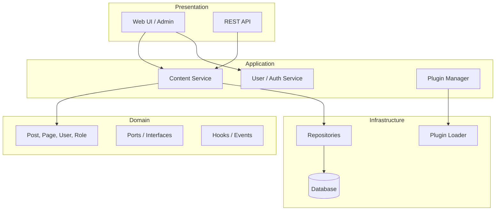
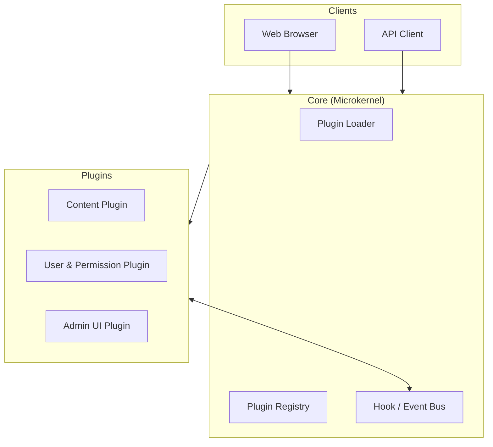

# Plugin-based CMS – Thiết kế kiến trúc

Tài liệu thiết kế cho một **Content Management System (CMS)** có thể mở rộng bằng plugin. Thư mục này tập trung vào **yêu cầu chức năng** và **hai phương án kiến trúc** (phân lớp và vi nhân); chưa chứa mã triển khai.

## Mục tiêu

Xây dựng CMS vừa đủ dùng (quản lý nội dung, người dùng, bảo mật) vừa dễ mở rộng: tính năng mới thêm qua plugin mà **không sửa core**.

## Ba chức năng chính

| Chức năng | Mô tả ngắn |
|-----------|------------|
| **Hệ thống Plugin** | Đăng ký/tải plugin, bật/tắt, hook & event, lifecycle (`load → activate → … → unload`) |
| **Quản lý nội dung** | Post, Page (CRUD, slug, trạng thái nháp/xuất bản); mở rộng Custom Post Type qua hook |
| **Quản lý người dùng & phân quyền** | Auth, vai trò (Admin, Editor, Author, Subscriber), kiểm tra quyền theo capability |

Chi tiết đầy đủ: [requirement.md](requirement.md)

## Hai phương án kiến trúc

Cùng một bộ yêu cầu có thể được tổ chức theo hai cách nhìn khác nhau:

| Tiêu chí | [Layered](architecture-layered.md) | [Microkernel](architecture-microkernel.md) |
|----------|-------------------------------------|--------------------------------------------|
| **Tổ chức** | 4 lớp: Presentation → Application → Domain → Infrastructure | Core mỏng (kernel) + Plugins mở rộng |
| **Plugin System** | Nằm ở Infrastructure + Application | **Là toàn bộ Core** |
| **Content / User** | Service và repository trong các lớp tương ứng | Mỗi chức năng là một **plugin** riêng |
| **Mở rộng** | Thêm code vào lớp phù hợp | Thêm plugin mới, đăng ký hook |
| **Phù hợp khi** | Nhấn mạnh tách biệt UI – nghiệp vụ – dữ liệu | Nhấn mạnh mở rộng động, core ổn định |

Hai phương án có thể **kết hợp**: bên trong mỗi plugin vẫn áp dụng kiến trúc phân lớp.

## Tổng quan kiến trúc

### Kiến trúc phân lớp (Layered)



Luồng điều khiển đi **từ trên xuống**; lớp trên không gọi trực tiếp Infrastructure mà thông qua Application và port do Domain định nghĩa.

→ Chi tiết: [architecture-layered.md](architecture-layered.md)

### Kiến trúc vi nhân (Microkernel)



Kernel **không** chứa logic CRUD nội dung hay đăng nhập; chỉ quản lý plugin, lifecycle và event bus. Content, User, Admin UI là các plugin độc lập.

→ Chi tiết: [architecture-microkernel.md](architecture-microkernel.md)

## Luồng xử lý điển hình (Microkernel)

Ví dụ request **lưu bài viết**:

1. Client gửi request tới Kernel
2. Kernel phát hook `content.before_save`
3. User Plugin kiểm tra quyền (allow/deny)
4. Content Plugin thực hiện lưu
5. Kernel phát hook `content.after_save`
6. Trả response về Client

Sơ đồ trình tự đầy đủ có trong [architecture-microkernel.md](architecture-microkernel.md).

## Cấu trúc tài liệu

```
Plugin-based CMS/
├── README.md                      # File này – tổng quan
├── requirement.md                 # Yêu cầu chức năng chi tiết
├── architecture-layered.md        # Thiết kế theo kiến trúc phân lớp
└── architecture-microkernel.md    # Thiết kế theo kiến trúc vi nhân
```

## Hướng triển khai gợi ý

Khi bắt đầu code, có thể đi theo các bước:

1. **Core / Infrastructure:** Plugin Loader, Registry, Hook Dispatcher, lifecycle
2. **Domain:** Entity cơ bản (Post, Page, User, Role), định nghĩa tên hook và contract
3. **Application:** ContentService, UserService, PluginManager — gọi hook trước/sau mỗi use case
4. **Presentation:** Admin UI và REST API
5. **Plugin mẫu:** Plugin đăng ký Custom Post Type hoặc custom field qua hook

## Liên quan

Thư mục [DesignPattern](../DesignPattern/) trong cùng repo minh họa các pattern (Adapter, Composite, Observer) có thể áp dụng khi thiết kế hook system, cấu trúc nội dung dạng cây, hoặc event notification trong CMS.
