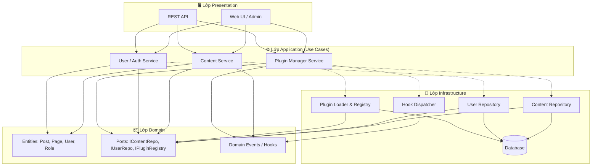
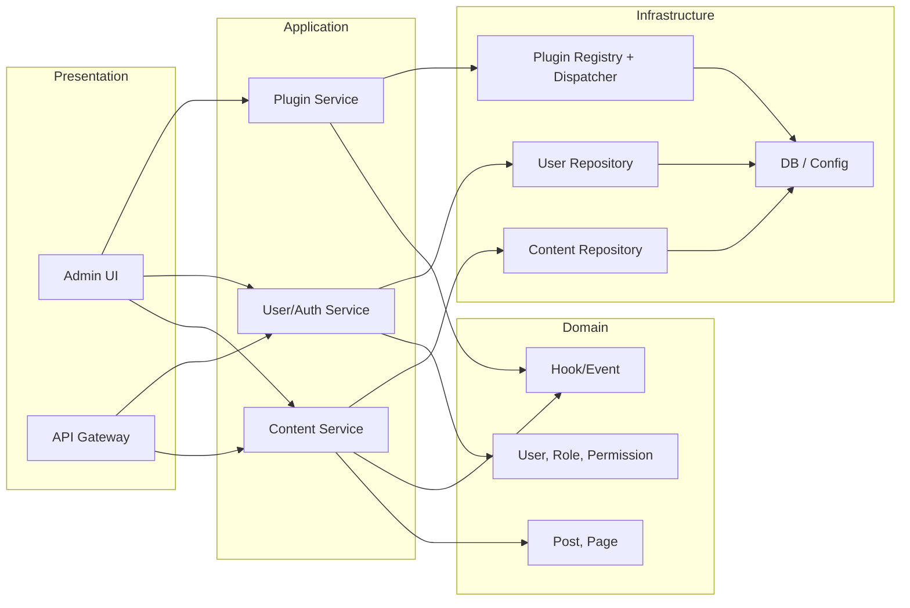

# Plugin-based CMS – Kiến trúc phân lớp (Layered Architecture)

---

## 1. Yêu cầu chức năng chính (Requirements)

### 1.1. Hệ thống Plugin (Plugin System)

**Mô tả:** Đây là nòng cốt của CMS, cho phép mở rộng chức năng mà không cần sửa core.

- **Đăng ký & tải plugin:** Core phát hiện plugin trong thư mục (ví dụ `plugins/`), đọc metadata (tên, phiên bản, mô tả) và tải khi khởi động.
- **Kích hoạt / vô hiệu hóa:** Admin có thể bật/tắt từng plugin qua giao diện; trạng thái được lưu (config/DB).
- **Hook & Event:** Core cung cấp các điểm móc (hooks) và sự kiện (events) để plugin đăng ký callback (ví dụ: `before_save_content`, `after_render_page`), giúp plugin can thiệp vào luồng xử lý mà không sửa code core.
- **Lifecycle:** Mỗi plugin có chu kỳ rõ ràng: load → activate → (chạy) → deactivate → unload; đảm bảo khởi tạo/tắt gọn, tránh xung đột.

**Lợi ích:** CMS giữ gọn, dễ bảo trì; tính năng mới thêm qua plugin, dễ tái sử dụng và phân phối.

### 1.2. Quản lý nội dung (Content Management)

**Mô tả:** Chức năng cốt lõi của mọi CMS – tạo, sửa, lưu trữ và xuất bản nội dung.

- **Loại nội dung cơ bản:** Hỗ trợ ít nhất hai loại: **Bài viết (Post)** và **Trang (Page)**; mỗi loại có trường: tiêu đề, nội dung (rich text/HTML), slug, trạng thái (nháp/đã xuất bản), ngày tạo/cập nhật.
- **Mở rộng qua plugin:** Plugin có thể đăng ký thêm loại nội dung (Custom Post Type) hoặc thêm trường (custom fields) cho bài viết/trang thông qua hook của core.
- **Lưu trữ & truy vấn:** Core cung cấp API lưu/lấy nội dung (có thể qua DB hoặc file); hỗ trợ tìm kiếm, lọc theo trạng thái, loại, ngày.
- **Xuất bản & hiển thị:** Nội dung đã xuất bản có URL cố định (slug); core hoặc plugin theme quyết định cách render (HTML, RSS, API).

**Lợi ích:** Người dùng quản lý nội dung tập trung; hệ thống mở rộng được nhờ plugin (ví dụ: sản phẩm, sự kiện, portfolio).

### 1.3. Quản lý người dùng và phân quyền (User & Permission Management)

**Mô tả:** Xác thực người dùng và kiểm soát ai được làm gì trong hệ thống và trong từng plugin.

- **Xác thực (Authentication):** Đăng ký, đăng nhập, đăng xuất; lưu session/token; có thể mở rộng (đăng nhập bằng mạng xã hội) qua plugin.
- **Vai trò (Roles):** Định nghĩa sẵn ít nhất: **Admin**, **Editor**, **Author**, **Subscriber** (chỉ xem). Mỗi vai trò gắn với tập quyền (permissions/capabilities).
- **Phân quyền (Authorization):** Mỗi thao tác (tạo bài, xóa trang, cài plugin, v.v.) được kiểm tra quyền; plugin có thể khai báo thêm capability mới và gắn vào vai trò.
- **Giao diện quản lý:** Trang quản lý user (danh sách, thêm/sửa/xóa, gán vai trò); chỉ user có quyền mới truy cập được.

**Lợi ích:** Bảo mật rõ ràng, nhiều người dùng cùng làm việc an toàn; plugin có thể bổ sung quyền riêng mà vẫn tích hợp với core.

### 1.4. Tóm tắt yêu cầu

| Chức năng | Mục đích |
|-----------|----------|
| **Hệ thống Plugin** | Mở rộng CMS mà không sửa core; hook, lifecycle, bật/tắt plugin. |
| **Quản lý nội dung** | Tạo/sửa/xuất bản bài viết, trang; mở rộng loại nội dung và trường qua plugin. |
| **Quản lý người dùng & phân quyền** | Đăng nhập, vai trò, kiểm soát quyền truy cập cho core và plugin. |

Ba chức năng này tạo nên một CMS vừa đủ dùng (nội dung + bảo mật) vừa dễ mở rộng nhờ kiến trúc plugin.

---

## 2. Tổng quan (Layered Architecture)

Kiến trúc phân lớp tổ chức hệ thống thành các lớp xếp chồng: mỗi lớp chỉ giao tiếp với lớp ngay bên dưới (và có thể với lớp ngay bên trên khi phản hồi). Luồng điều khiển và dữ liệu đi từ **Presentation → Application → Domain → Infrastructure**; không cho phép bỏ qua lớp (ví dụ Presentation không gọi trực tiếp Infrastructure).

---

## 3. Các lớp và trách nhiệm

| Lớp | Tên | Trách nhiệm | Ánh xạ chức năng |
|-----|-----|-------------|-------------------|
| **1** | **Presentation** | Giao diện người dùng (Web UI, REST API). Nhận request, validate input, gọi Application, trả response/view. | Cả 3: UI quản lý nội dung, user, plugin; API cho client/plugin. |
| **2** | **Application** | Use cases / dịch vụ ứng dụng. Điều phối Domain và Infrastructure, gọi hook/event trước-sau thao tác. | Content service, User/Auth service, Plugin manager service. |
| **3** | **Domain** | Nghiệp vụ cốt lõi: entity, value object, domain logic, interface (port) cho persistence & plugin. | Post, Page, User, Role, Permission; ContentType; Hook/Event định nghĩa. |
| **4** | **Infrastructure** | Triển khai cụ thể: DB, file, plugin loader, gửi event. | Repository impl, PluginRegistry, HookDispatcher, Session/Token store. |

---

## 4. Luồng dữ liệu và phụ thuộc

- **Presentation** → gọi **Application** (services).
- **Application** → dùng **Domain** (entities, ports) và **Infrastructure** (qua interface/port).
- **Domain** → không phụ thuộc Application hay Infrastructure; chỉ định nghĩa interface (ví dụ `IContentRepository`, `IPluginRegistry`).
- **Infrastructure** → implement interface do Domain/Application định nghĩa; phụ thuộc Domain (entity, port).

Plugin hệ thống nằm chủ yếu ở **Infrastructure** (loader, registry, hook dispatcher); **Application** đăng ký và kích hoạt hook; **Domain** định nghĩa các sự kiện/hook (tên, payload).

---

## 5. Sơ đồ kiến trúc phân lớp

---

## 6. Sơ đồ chi tiết theo chức năng

---

## 7. Ánh xạ ba chức năng chính vào các lớp

| Chức năng | Presentation | Application | Domain | Infrastructure |
|-----------|--------------|-------------|--------|----------------|
| **Plugin System** | Trang bật/tắt plugin, danh sách plugin | PluginManager: load, activate, deactivate, trigger hooks | Định nghĩa Hook/Event, interface IPluginRegistry | PluginLoader, HookDispatcher, lưu trạng thái plugin (DB/config) |
| **Content Management** | Form tạo/sửa bài, trang; API CRUD | ContentService: create, update, publish, query; gọi hook before/after | Post, Page, ContentType, IContentRepository | ContentRepository, lưu DB/file |
| **User & Permission** | Login, quản lý user, gán role | UserService, AuthService: login, check permission, CRUD user | User, Role, Permission, IUserRepository | UserRepository, Session store, token |

---

## 8. Ưu điểm và lưu ý

**Ưu điểm:**
- Tách biệt rõ: giao diện, nghiệp vụ, dữ liệu.
- Dễ test từng lớp (mock lớp dưới).
- Thay đổi DB hoặc UI ít ảnh hưởng Domain.

**Lưu ý:**
- Hook/Plugin cần được định nghĩa ở Domain (tên event, contract) và triển khai ở Infrastructure (dispatcher, loader); Application chỉ gọi “phát event” / “chạy hook” qua port, không biết chi tiết plugin.
