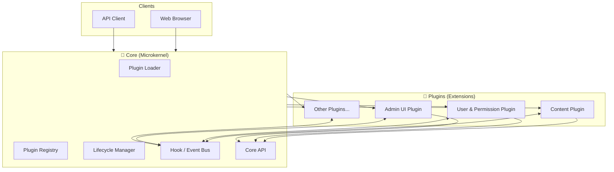
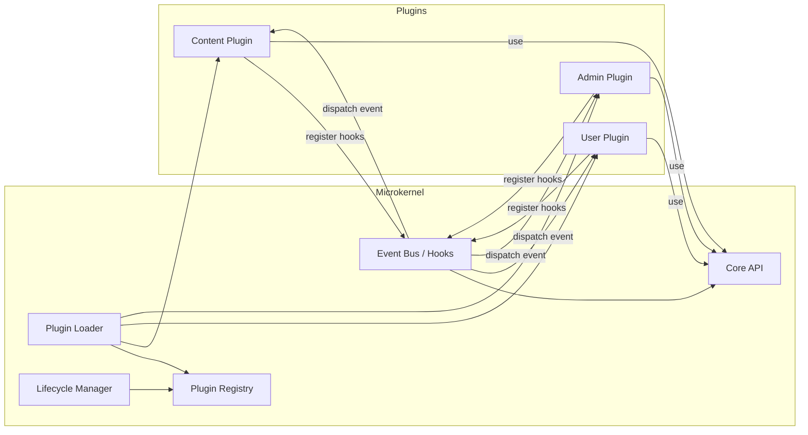
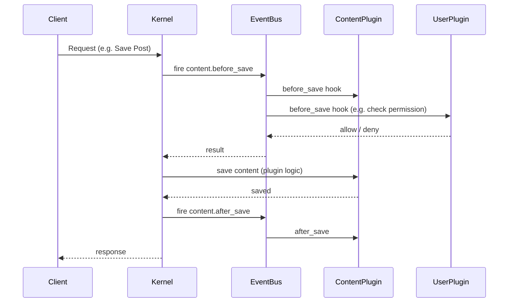

# Plugin-based CMS – Kiến trúc vi nhân (Microkernel Architecture)

---

## 1. Yêu cầu chức năng chính (Requirements)

### 1.1. Hệ thống Plugin (Plugin System)

**Mô tả:** Đây là nòng cốt của CMS, cho phép mở rộng chức năng mà không cần sửa core.

- **Đăng ký & tải plugin:** Core phát hiện plugin trong thư mục (ví dụ `plugins/`), đọc metadata (tên, phiên bản, mô tả) và tải khi khởi động.
- **Kích hoạt / vô hiệu hóa:** Admin có thể bật/tắt từng plugin qua giao diện; trạng thái được lưu (config/DB).
- **Hook & Event:** Core cung cấp các điểm móc (hooks) và sự kiện (events) để plugin đăng ký callback (ví dụ: `before_save_content`, `after_render_page`), giúp plugin can thiệp vào luồng xử lý mà không sửa code core.
- **Lifecycle:** Mỗi plugin có chu kỳ rõ ràng: load → activate → (chạy) → deactivate → unload; đảm bảo khởi tạo/tắt gọn, tránh xung đột.

**Lợi ích:** CMS giữ gọn, dễ bảo trì; tính năng mới thêm qua plugin, dễ tái sử dụng và phân phối.

### 1.2. Quản lý nội dung (Content Management)

**Mô tả:** Chức năng cốt lõi của mọi CMS – tạo, sửa, lưu trữ và xuất bản nội dung.

- **Loại nội dung cơ bản:** Hỗ trợ ít nhất hai loại: **Bài viết (Post)** và **Trang (Page)**; mỗi loại có trường: tiêu đề, nội dung (rich text/HTML), slug, trạng thái (nháp/đã xuất bản), ngày tạo/cập nhật.
- **Mở rộng qua plugin:** Plugin có thể đăng ký thêm loại nội dung (Custom Post Type) hoặc thêm trường (custom fields) cho bài viết/trang thông qua hook của core.
- **Lưu trữ & truy vấn:** Core cung cấp API lưu/lấy nội dung (có thể qua DB hoặc file); hỗ trợ tìm kiếm, lọc theo trạng thái, loại, ngày.
- **Xuất bản & hiển thị:** Nội dung đã xuất bản có URL cố định (slug); core hoặc plugin theme quyết định cách render (HTML, RSS, API).

**Lợi ích:** Người dùng quản lý nội dung tập trung; hệ thống mở rộng được nhờ plugin (ví dụ: sản phẩm, sự kiện, portfolio).

### 1.3. Quản lý người dùng và phân quyền (User & Permission Management)

**Mô tả:** Xác thực người dùng và kiểm soát ai được làm gì trong hệ thống và trong từng plugin.

- **Xác thực (Authentication):** Đăng ký, đăng nhập, đăng xuất; lưu session/token; có thể mở rộng (đăng nhập bằng mạng xã hội) qua plugin.
- **Vai trò (Roles):** Định nghĩa sẵn ít nhất: **Admin**, **Editor**, **Author**, **Subscriber** (chỉ xem). Mỗi vai trò gắn với tập quyền (permissions/capabilities).
- **Phân quyền (Authorization):** Mỗi thao tác (tạo bài, xóa trang, cài plugin, v.v.) được kiểm tra quyền; plugin có thể khai báo thêm capability mới và gắn vào vai trò.
- **Giao diện quản lý:** Trang quản lý user (danh sách, thêm/sửa/xóa, gán vai trò); chỉ user có quyền mới truy cập được.

**Lợi ích:** Bảo mật rõ ràng, nhiều người dùng cùng làm việc an toàn; plugin có thể bổ sung quyền riêng mà vẫn tích hợp với core.

### 1.4. Tóm tắt yêu cầu

| Chức năng | Mục đích |
|-----------|----------|
| **Hệ thống Plugin** | Mở rộng CMS mà không sửa core; hook, lifecycle, bật/tắt plugin. |
| **Quản lý nội dung** | Tạo/sửa/xuất bản bài viết, trang; mở rộng loại nội dung và trường qua plugin. |
| **Quản lý người dùng & phân quyền** | Đăng nhập, vai trò, kiểm soát quyền truy cập cho core và plugin. |

Ba chức năng này tạo nên một CMS vừa đủ dùng (nội dung + bảo mật) vừa dễ mở rộng nhờ kiến trúc plugin.

---

## 2. Tổng quan (Microkernel)

Kiến trúc vi nhân (Microkernel/Plugin) gồm:
- **Core (Microkernel):** phần nhỏ, ổn định – chỉ làm nhiệm vụ nền: load plugin, quản lý lifecycle, cung cấp hook/event bus và API tối thiểu.
- **Plugins (Extensions):** mọi chức năng nghiệp vụ (quản lý nội dung, user, phân quyền, v.v.) đều nằm trong plugin; kernel không implement logic nghiệp vụ.

Hệ thống Plugin-based CMS phù hợp kiến trúc này: **Core = kernel** (plugin system + hook), **3 chức năng chính = các plugin** (Content, User/Permission; có thể tách thêm plugin khác).

---

## 3. Thành phần Core (Microkernel)

Kernel **không** chứa logic tạo bài viết, đăng nhập hay phân quyền chi tiết. Chỉ cung cấp:

| Thành phần | Trách nhiệm |
|------------|-------------|
| **Plugin Loader** | Quét thư mục plugin, đọc metadata, load và khởi tạo từng plugin. |
| **Plugin Registry** | Lưu danh sách plugin đã load, trạng thái (active/inactive), tham chiếu instance. |
| **Lifecycle Manager** | activate / deactivate / unload plugin theo yêu cầu (admin hoặc config). |
| **Hook / Event Bus** | Định nghĩa và phát các sự kiện (e.g. `content.before_save`, `user.authenticate`); plugin đăng ký listener. |
| **Core API (Runtime)** | API tối thiểu cho plugin gọi: đăng ký hook, lấy config, ghi log. Không gồm CRUD nội dung hay user – đó do plugin cung cấp. |

---

## 4. Thành phần Plugin (Extensions)

Mỗi chức năng chính được triển khai như **một hoặc nhiều plugin**:

| Plugin | Chức năng tương ứng | Giao diện với Kernel |
|--------|----------------------|------------------------|
| **Content Plugin** | Quản lý nội dung (Post, Page), CRUD, xuất bản, custom type/field qua hook. | Đăng ký hook `content.*`, cung cấp API/UI cho content. |
| **User & Permission Plugin** | Xác thực, vai trò, phân quyền; quản lý user. | Đăng ký hook `user.*`, `auth.*`; kernel gọi “kiểm tra quyền” qua interface do plugin đăng ký. |
| **Admin UI Plugin** (tùy chọn) | Giao diện quản lý chung: menu, trang quản lý plugin, tích hợp Content + User. | Gọi API do Content/User plugin cung cấp; đăng ký hook để hiển thị menu/màn hình. |

Plugin giao tiếp với nhau **qua kernel**: dùng hook/event (ví dụ Content Plugin phát `content.published`, User Plugin lắng nghe để ghi audit).

---

## 5. Sơ đồ kiến trúc vi nhân – Tổng quan

---

## 6. Sơ đồ chi tiết Kernel và luồng Hook

---

## 7. Sơ đồ trình tự: Request đi qua Kernel và Plugin

---

## 8. Ánh xạ ba chức năng chính sang Kernel vs Plugin

| Chức năng (requirement) | Trong Microkernel | Trong Plugin |
|-------------------------|-------------------|--------------|
| **Hệ thống Plugin** | Toàn bộ: Loader, Registry, Lifecycle, Hook/Event Bus, Core API. | Mỗi plugin implement interface do kernel định nghĩa (metadata, activate, deactivate, register hooks). |
| **Quản lý nội dung** | Chỉ cung cấp hook (`content.*`) và Core API; không lưu bài/trang. | **Content Plugin:** CRUD Post/Page, repository, custom type/field, đăng ký và xử lý hook content. |
| **Quản lý người dùng & phân quyền** | Chỉ cung cấp hook (`user.*`, `auth.*`); không lưu user. | **User & Permission Plugin:** Auth, Role, Permission, repository; đăng ký hook để plugin khác gọi “check permission”. |

---

## 9. Ưu điểm và lưu ý

**Ưu điểm:**
- Core nhỏ, ít thay đổi; dễ bảo trì và nâng cấp.
- Chức năng thêm/bớt bằng thêm/gỡ plugin, không sửa kernel.
- Plugin có thể tái sử dụng cho dự án khác nếu cùng kernel contract.

**Lưu ý:**
- Cần định nghĩa rõ contract (interface plugin, tên hook, payload) để plugin tương thích.
- Thứ tự load và phụ thuộc giữa plugin (ví dụ User Plugin load trước Content để kiểm tra quyền) cần được kernel hỗ trợ (dependency/load order).

---

## 10. So sánh nhanh với Layered

| Tiêu chí | Layered | Microkernel |
|----------|---------|-------------|
| **Tổ chức** | Theo lớp (Presentation → Application → Domain → Infrastructure). | Theo Core + Plugins; kernel mỏng, logic ở plugin. |
| **Plugin System** | Một phần của Infrastructure + Application. | Là toàn bộ Core; Content/User là plugin. |
| **Mở rộng** | Thêm code trong từng lớp tương ứng. | Thêm plugin mới, đăng ký hook. |

Cả hai đều có thể áp dụng cho cùng một hệ thống Plugin-based CMS; tùy mục tiêu (nhấn mạnh tách lớp vs nhấn mạnh mở rộng bằng plugin) mà chọn hoặc kết hợp (ví dụ: bên trong mỗi plugin dùng layered).
