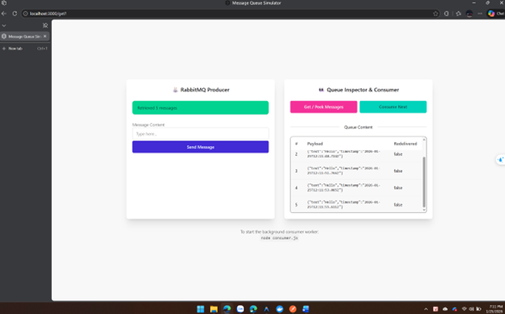
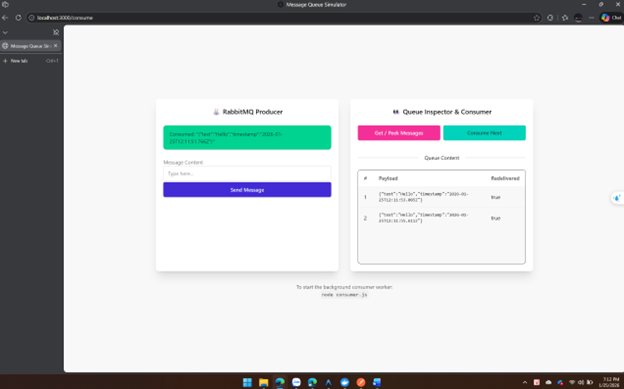
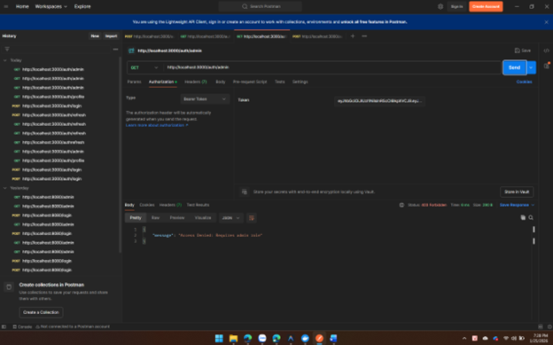

# Bài tập thực hành — Kiến trúc phần mềm (KTPM)

Repository chứa 2 bài lab Node.js/Express minh họa Message Queue, JWT Authentication và Clean Architecture.

| Bài | Thư mục | Nội dung |
|-----|---------|----------|
| Bài 1 | [`Ex1+2/`](Ex1+2/) | Ex1: Message Queue Simulator · Ex2: JWT Authentication |
| Bài 2 | [`Ex3/`](Ex3/) | Clean Architecture — Hệ thống đặt hàng đồng bộ |

**Yêu cầu:** Node.js 18+, npm, Docker (RabbitMQ cho Ex1), MariaDB (cho Ex3)

---

## Bài 1 — Ex1 + Ex2

Thư mục [`Ex1+2/`](Ex1+2/) gồm 2 bài tập trong cùng một project Express.

### Ex1 — Message Queue Simulator (RabbitMQ)

Mô phỏng Producer/Consumer với RabbitMQ qua giao diện web:

- **Producer** — `producer.js`: gửi message vào queue `task_queue`
- **Consumer** — `consumer.js`: nhận và xử lý message nền (delay 2s)
- **Web UI** — gửi message, peek queue, consume thủ công qua Management API

```bash
# Khởi động RabbitMQ (Docker)
docker run -d --name rabbitmq -p 5672:5672 -p 15672:15672 rabbitmq:3-management

cd Ex1+2
npm install
npm start                    # http://localhost:3000
node consumer.js             # chạy consumer nền (terminal riêng)
```

### Ex2 — JWT Authentication

API xác thực với Access Token + Refresh Token, phân quyền theo role:

- **Login** — `POST /auth/login`: cấp token (admin / guest)
- **Refresh** — `POST /auth/refresh`: làm mới access token
- **Profile** — `GET /auth/profile`: route được bảo vệ bởi `verifyToken`
- **Admin** — `GET /auth/admin`: chỉ role `admin` qua `checkRole`

```bash
# Cần file .env với ACCESS_TOKEN_SECRET và REFRESH_TOKEN_SECRET
curl -X POST http://localhost:3000/auth/login \
  -H "Content-Type: application/json" \
  -d '{"username":"admin"}'
```

---

## Bài 2 — Ex3: Hệ thống đặt hàng (Clean Architecture)

> Cấu trúc chi tiết: [`Ex3/system-structure.md`](Ex3/system-structure.md)

Project áp dụng Clean Architecture với 4 tầng:

- **Domain** — `Order` entity, `IOrderRepository`, `IMailer` interface
- **Application** — `CreateOrderSync` use case: lưu DB → gửi email
- **Infrastructure** — Sequelize/MariaDB, `SmtpMailer` (giả lập delay 3s)
- **Presentation** — `OrderController`, route `/order/sync`

```javascript
// Luồng: POST /order/sync → CreateOrderSync.execute()
// 1. Tạo Order entity
// 2. Lưu qua SequelizeOrderRepository
// 3. Gửi email qua SmtpMailer (chờ 3 giây)
```

**Chạy thử:**

```bash
cd Ex3
npm install
npm start                      # http://localhost:3000/order
```

---

## Minh chứng

### Bài 1 — Ex1 (tiền tố `1_`)

**1. RabbitMQ Management — queue `task_queue`**


**2. Producer — gửi message vào queue**


**3. Consumer — nhận và xử lý message**


**4. Docker — container RabbitMQ đang chạy**


**5. Message Queue Simulator — peek message trong queue**



**6. Message Queue Simulator — consume message thành công**



### Bài 1 — Ex2 (tiền tố `2_`)

**1. Đăng nhập admin — `POST /auth/login`**


**2. Truy cập profile — `GET /auth/profile` (Bearer Token)**


**3. Truy cập route admin — `GET /auth/admin` (200 OK)**


**4. Refresh token — `POST /auth/refresh`**


**5. Đăng nhập guest — `POST /auth/login` (role guest)**


**6. Profile guest — `GET /auth/profile`**


**7. Từ chối truy cập admin — `GET /auth/admin` (403 Forbidden)**



---

## Tác giả

**Nguyễn Gia Bảo** — MSSV: 22691861  
Môn học: Kiến trúc và Thiết kế Phần mềm (KTPM)
