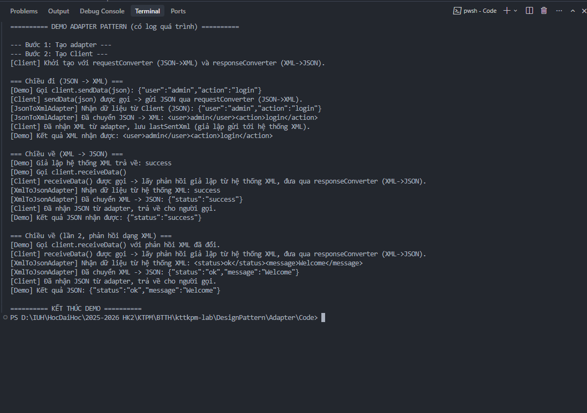
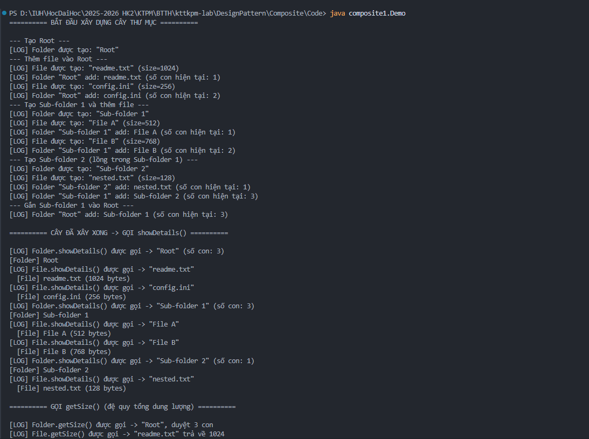
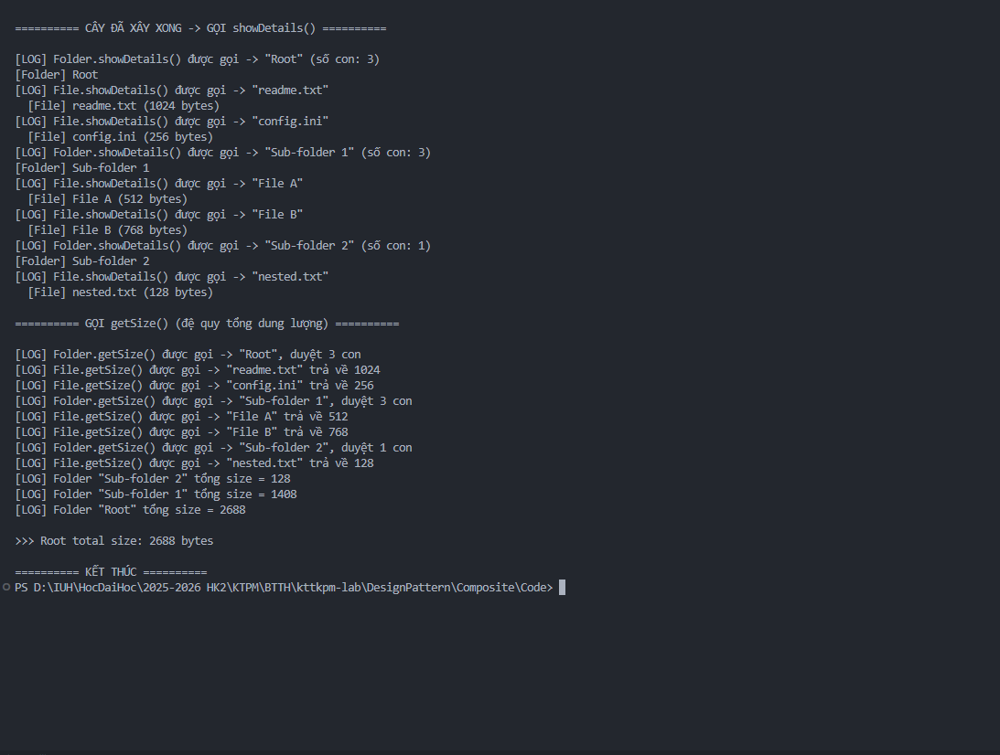
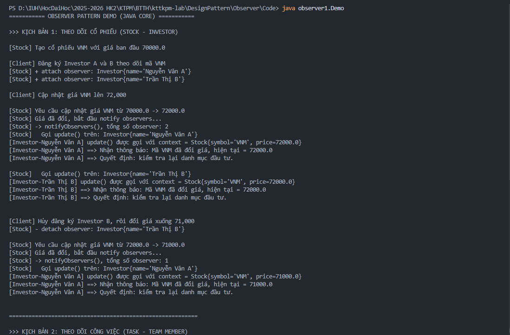
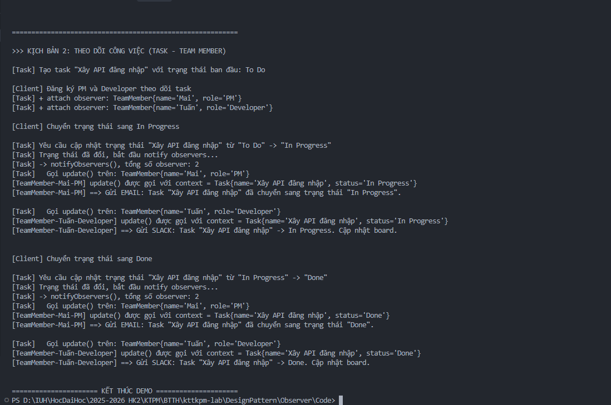

# KTPM Lab – Design Pattern & Plugin-based CMS

Bài thực hành môn **Kiến trúc Phần mềm (KTPM)** — gồm hai phần chính: minh họa **Design Pattern** bằng Java và thiết kế kiến trúc **Plugin-based CMS**.

## Cấu trúc repo

```
kttkpm-lab/
├── DesignPattern/          # Adapter, Composite, Observer + mã nguồn demo
├── Plugin-based CMS/       # Yêu cầu & thiết kế kiến trúc CMS
└── img/                    # Minh chứng chạy demo Design Pattern
```

| Thư mục | Nội dung | Tài liệu chi tiết |
|---------|----------|-------------------|
| [DesignPattern/](DesignPattern/) | Phân tích pattern, mã Java, đề bài thư viện | [DesignPattern/README.md](DesignPattern/README.md) |
| [Plugin-based CMS/](Plugin-based%20CMS/) | Yêu cầu CMS, kiến trúc Layered & Microkernel | [Plugin-based CMS/README.md](Plugin-based%20CMS/README.md) |

---

## 1. Design Pattern

Thư mục [DesignPattern/](DesignPattern/) triển khai bốn demo Java thuần (JDK 8+), kèm tài liệu phân tích và sơ đồ lớp.

| Pattern | Bài toán | Demo |
|---------|----------|------|
| **Adapter** | Client JSON ↔ hệ thống XML | `adapter.Demo` |
| **Composite** | Cây thư mục / tệp tin | `composite1.Demo` |
| **Composite** | UI lồng nhau (Window, Panel, Button…) | `composite2.CompositeUIDemo` |
| **Observer** | Theo dõi cổ phiếu & trạng thái công việc | `observer1.Demo` |

Ngoài ra, [DesignPattern/bt2.md](DesignPattern/bt2.md) mô tả đề bài **hệ thống quản lý thư viện** kết hợp Singleton, Factory Method, Strategy, Observer và Decorator.

**Chạy nhanh** (ví dụ Adapter):

```bash
cd DesignPattern/Adapter/Code
javac adapter/*.java
java adapter.Demo
```

→ Hướng dẫn đầy đủ cho từng pattern: [DesignPattern/README.md](DesignPattern/README.md)

---

## 2. Plugin-based CMS

Thư mục [Plugin-based CMS/](Plugin-based%20CMS/) là tài liệu thiết kế cho CMS mở rộng bằng plugin — **chưa có mã triển khai**.

**Ba chức năng cốt lõi:**

- **Hệ thống Plugin** — load/activate/deactivate, hook & event, lifecycle
- **Quản lý nội dung** — Post, Page, slug, trạng thái xuất bản; mở rộng qua Custom Post Type
- **Quản lý người dùng & phân quyền** — Auth, vai trò (Admin / Editor / Author / Subscriber), capability

**Hai phương án kiến trúc** cho cùng bộ yêu cầu:

| | [Layered](Plugin-based%20CMS/architecture-layered.md) | [Microkernel](Plugin-based%20CMS/architecture-microkernel.md) |
|---|------------------------------------------------------|--------------------------------------------------------------|
| Tổ chức | 4 lớp: Presentation → Application → Domain → Infrastructure | Core mỏng + Plugins |
| Plugin System | Infrastructure + Application | Là toàn bộ Core |
| Mở rộng | Thêm code vào lớp tương ứng | Thêm plugin, đăng ký hook |

→ Chi tiết: [Plugin-based CMS/README.md](Plugin-based%20CMS/README.md) · [requirement.md](Plugin-based%20CMS/requirement.md)

---

## 3. Minh chứng (`img/`)

Ảnh chụp kết quả chạy demo Design Pattern trên terminal.

### Adapter Pattern

Client gửi/nhận JSON; adapter chuyển đổi hai chiều JSON ↔ XML.



### Composite Pattern – File System

Xây dựng cây thư mục lồng nhau và gọi `showDetails()` đệ quy.



Tính tổng dung lượng bằng `getSize()` đệ quy — Root total size: **2688 bytes**.



### Observer Pattern – Cổ phiếu (Stock / Investor)

Subject `Stock` thông báo cho Observer khi giá thay đổi; hỗ trợ `attach` / `detach`.



### Observer Pattern – Công việc (Task / Team Member)

Subject `Task` thông báo khi trạng thái đổi; mỗi Observer phản ứng khác nhau (email, Slack…).



---

## Liên kết nhanh

- [DesignPattern/README.md](DesignPattern/README.md) — cấu trúc, biên dịch, chạy demo
- [Plugin-based CMS/README.md](Plugin-based%20CMS/README.md) — kiến trúc CMS
- [Plugin-based CMS/requirement.md](Plugin-based%20CMS/requirement.md) — yêu cầu chức năng
- [Plugin-based CMS/architecture-layered.md](Plugin-based%20CMS/architecture-layered.md) — kiến trúc phân lớp
- [Plugin-based CMS/architecture-microkernel.md](Plugin-based%20CMS/architecture-microkernel.md) — kiến trúc vi nhân
