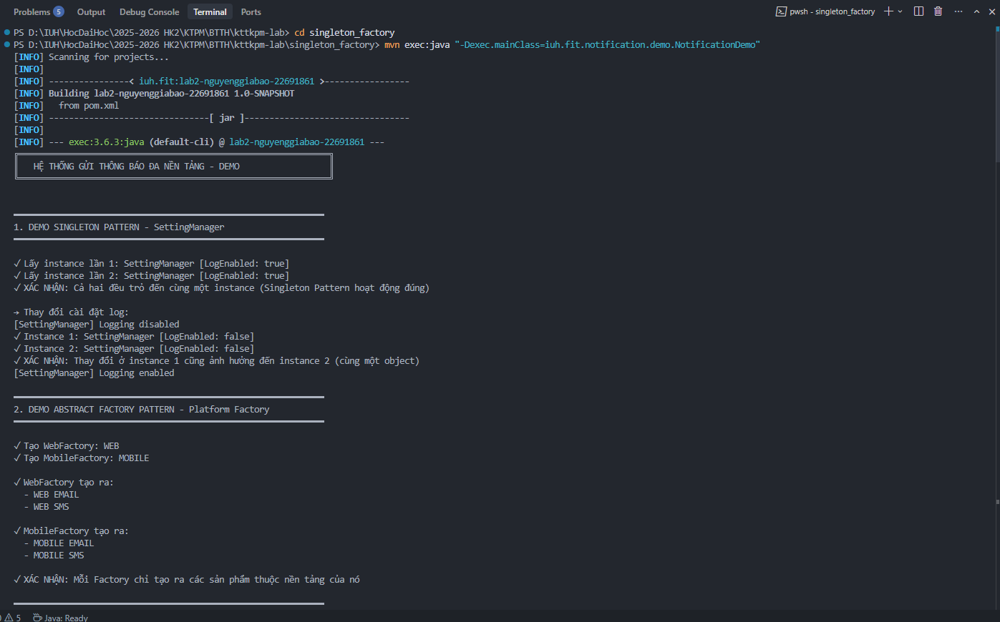
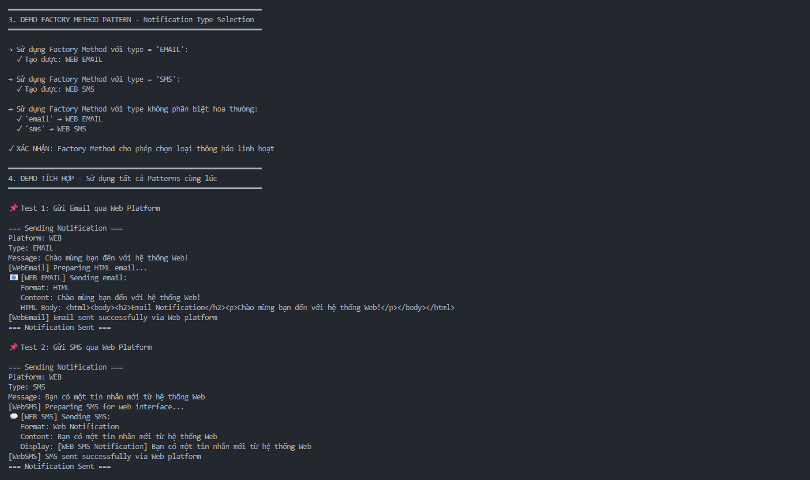
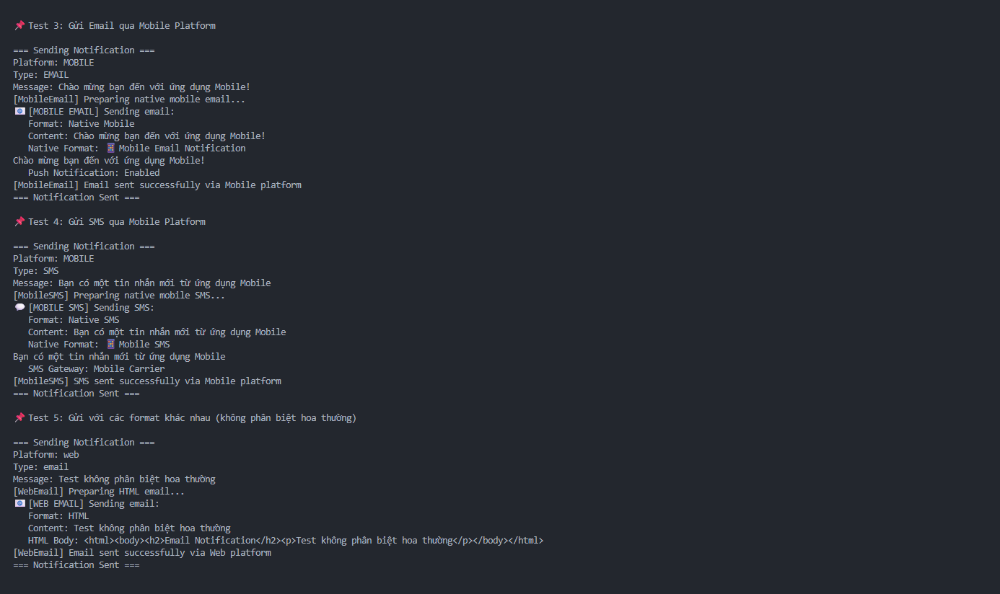
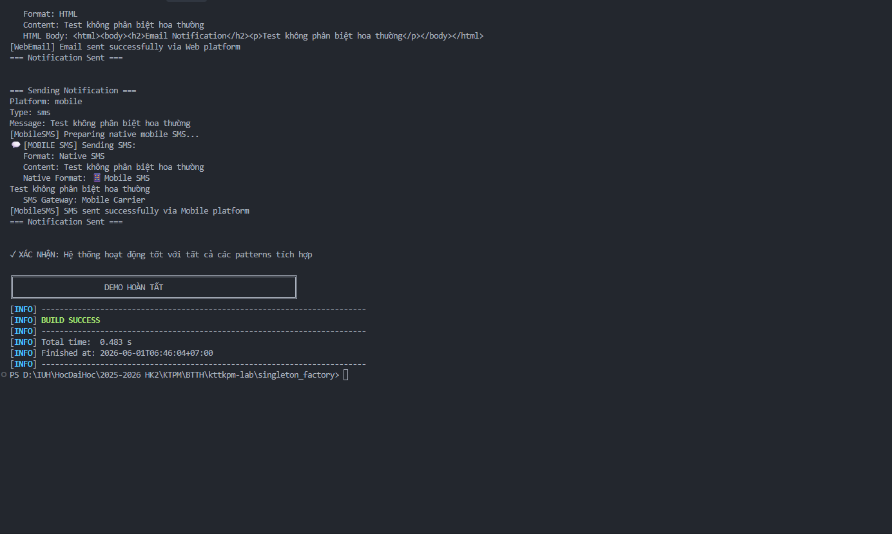
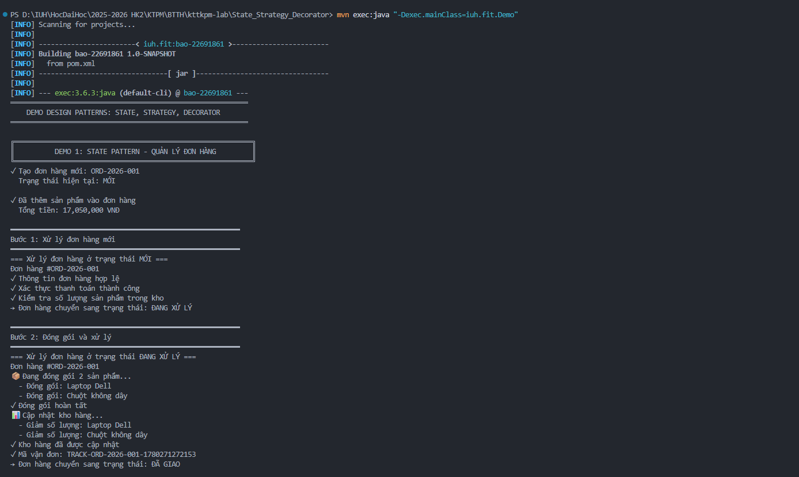
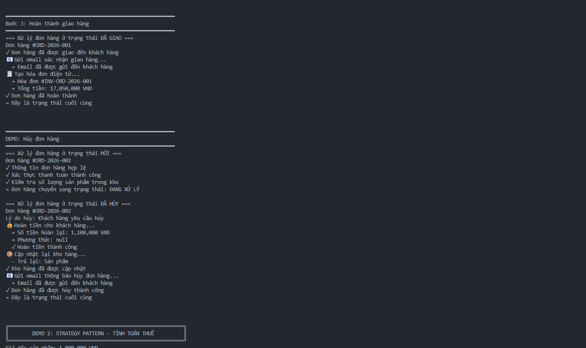
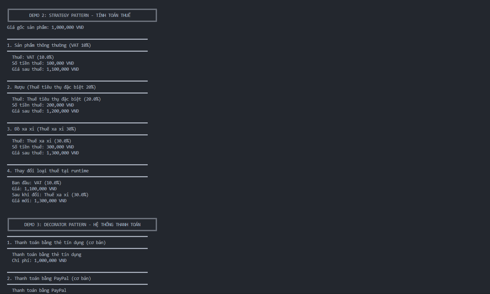
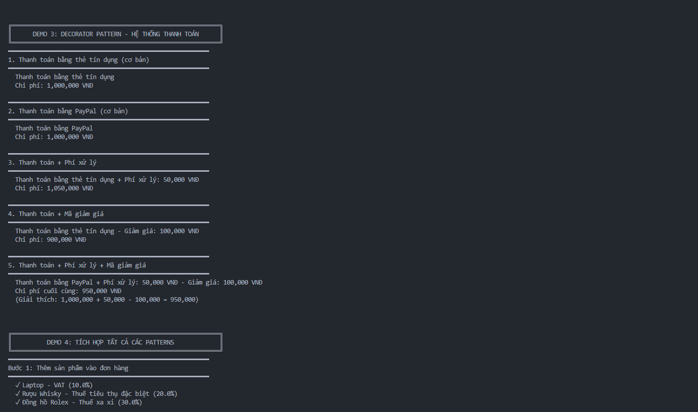
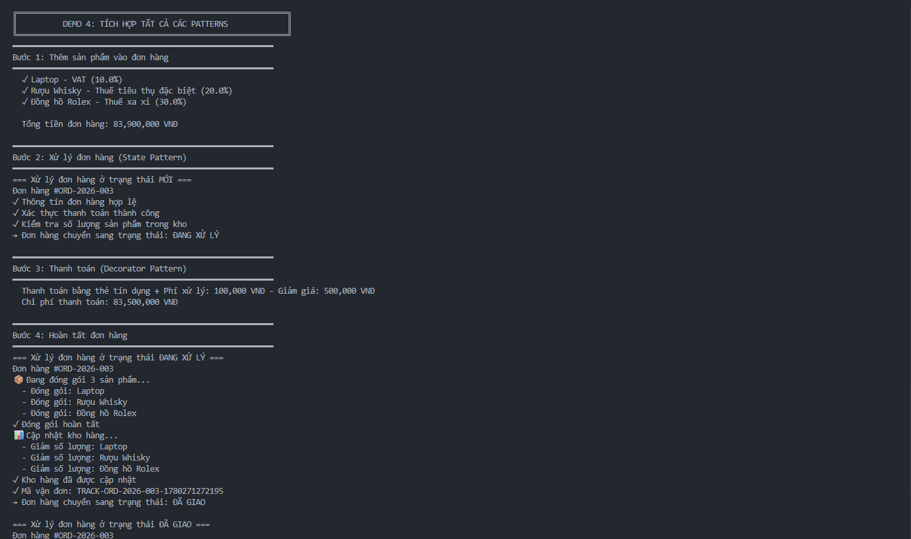
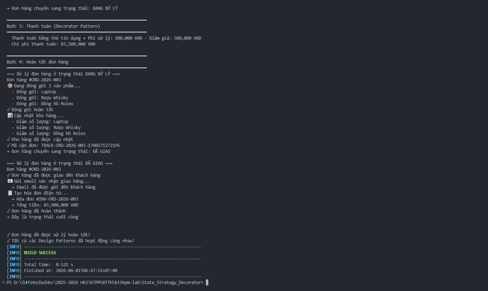

# Bài tập thực hành — Design Patterns (KTPM)

Repository chứa 2 bài lab Java minh họa 6 Design Pattern trong các bài toán thực tế.

## Mục lục

- [Tổng quan](#tổng-quan)
- [Bài 1 — Singleton & Factory](#bài-1--singleton--factory)
- [Bài 2 — State, Strategy & Decorator](#bài-2--state-strategy--decorator)
- [Cấu trúc repository](#cấu-trúc-repository)
- [Minh chứng](#minh-chứng)
- [Tác giả](#tác-giả)

---

## Tổng quan

| Bài | Thư mục | Patterns | Java |
|-----|---------|----------|------|
| Bài 1 | [`singleton_factory/`](singleton_factory/) | Singleton, Abstract Factory, Factory Method | 21 |
| Bài 2 | [`State_Strategy_Decorator/`](State_Strategy_Decorator/) | State, Strategy, Decorator | 23 |

**Yêu cầu:** JDK 21+, Maven 3.6+

> Tài liệu chi tiết: [`singleton_factory/README.md`](singleton_factory/README.md) · [`State_Strategy_Decorator/README.md`](State_Strategy_Decorator/README.md)

---

## Bài 1 — Singleton & Factory

> Chi tiết: [`singleton_factory/README.md`](singleton_factory/README.md) · [`singleton_factory/DOCUMENTATION.md`](singleton_factory/DOCUMENTATION.md)

Hệ thống gửi thông báo Email/SMS trên nền tảng **Web** và **Mobile**.

| Pattern | Class chính | Vai trò |
|---------|-------------|---------|
| **Singleton** | `SettingManager` | Quản lý cấu hình tập trung, thread-safe |
| **Abstract Factory** | `WebFactory`, `MobileFactory` | Tạo nhóm sản phẩm theo nền tảng |
| **Factory Method** | `createNotification(type)` | Chọn loại thông báo EMAIL/SMS |

```java
NotificationService service = new NotificationService();
service.sendNotification("WEB", "EMAIL", "Xin chào từ Web!");
service.sendNotification("MOBILE", "SMS", "Xin chào từ Mobile!");
```

**Chạy thử:**

```bash
cd singleton_factory
mvn clean compile
mvn exec:java "-Dexec.mainClass=iuh.fit.notification.demo.NotificationDemo"
mvn test
```

---

## Bài 2 — State, Strategy & Decorator

> Chi tiết: [`State_Strategy_Decorator/README.md`](State_Strategy_Decorator/README.md) · [`State_Strategy_Decorator/DOCUMENTATION.md`](State_Strategy_Decorator/DOCUMENTATION.md)

Minh họa 3 pattern trong hệ thống thương mại điện tử:

| Pattern | Mô tả | Thành phần chính |
|---------|-------|------------------|
| **State** | Quản lý trạng thái đơn hàng | `NewOrderState` → `ProcessingState` → `DeliveredState` / `CanceledState` |
| **Strategy** | Tính thuế linh hoạt tại runtime | `VatTax` (10%), `ConsumptionTax` (20%), `LuxuryTax` (30%) |
| **Decorator** | Mở rộng thanh toán động | `ProcessingFeeDecorator`, `DiscountDecorator` trên `CreditCardPayment` / `PayPalPayment` |

```java
Order order = new Order("ORD-001");
order.addProduct(new Product("Laptop", 15000000, new VatTax()));
order.nextStep(); // → Processing
order.nextStep(); // → Delivered

Payment payment = new CreditCardPayment(1000000);
payment = new ProcessingFeeDecorator(payment, 50000);
payment = new DiscountDecorator(payment, 100000);
// finalCost = 950,000 VNĐ
```

**Chạy thử:**

```bash
cd State_Strategy_Decorator
mvn clean compile
mvn exec:java "-Dexec.mainClass=iuh.fit.Demo"
mvn test
```

---

## Cấu trúc repository

```
kttkpm-lab/
├── img/                            # Ảnh minh chứng (1_* → Bài 1, 2_* → Bài 2)
├── singleton_factory/              # Bài 1
│   ├── src/main/java/iuh/fit/notification/
│   │   ├── singleton/              # SettingManager
│   │   ├── factory/                # WebFactory, MobileFactory
│   │   ├── product/                # WebEmail, WebSMS, MobileEmail, MobileSMS
│   │   ├── demo/NotificationDemo.java
│   │   └── NotificationService.java
│   ├── src/test/java/              # Unit tests
│   └── img/class diagram.png
│
└── State_Strategy_Decorator/       # Bài 2
    ├── src/main/java/iuh/fit/
    │   ├── state/                  # Order, OrderState, các state cụ thể
    │   ├── strategy/               # TaxStrategy, Product, các loại thuế
    │   ├── decorator/              # Payment, các decorator
    │   └── Demo.java
    └── src/test/java/              # Unit tests + IntegrationTest
```

---

## Minh chứng

### Bài 1 — `singleton_factory` (tiền tố `1_`)

**Class Diagram — Hệ thống gửi thông báo**


**1. Demo Singleton & Abstract Factory — `NotificationDemo`**



**2. Demo Factory Method & tích hợp Web Email/SMS**



**3. Demo Mobile Email/SMS & không phân biệt hoa thường**



**4. Demo tích hợp hoàn tất — BUILD SUCCESS**



### Bài 2 — `State_Strategy_Decorator` (tiền tố `2_`)

**1. Demo State Pattern — quản lý đơn hàng (MỚI → ĐANG XỬ LÝ → ĐÃ GIAO)**



**2. Demo State — hoàn thành giao hàng & hủy đơn hàng**



**3. Demo Strategy Pattern — tính toán thuế (VAT, tiêu thụ, xa xỉ)**



**4. Demo Decorator Pattern — hệ thống thanh toán**



**5. Demo tích hợp tất cả patterns — luồng đơn hàng hoàn chỉnh**



**6. Demo hoàn tất — BUILD SUCCESS**



---

## Tác giả

**Nguyễn Gia Bảo** — MSSV: 22691861  
Môn học: Kiến trúc và Thiết kế Phần mềm (KTPM) · Lab 2 — Design Patterns
