# KTVTKPM — Tuần 05

Repository tổng hợp các bài thực hành môn **Kiến trúc và Thiết kế phần mềm** (tuần 5): Docker & CSDL, phân vùng dữ liệu, kiến trúc monolith theo module, và ứng dụng tìm kiếm full-stack.

## Cấu trúc thư mục

| Thư mục                 | Nội dung                                                                                                                                                       |
| ----------------------- | -------------------------------------------------------------------------------------------------------------------------------------------------------------- |
| [Bai01](Bai01/)         | Docker Compose, **multi-stage build** image Node, Postgres + **volume** bảo toàn dữ liệu, script khởi tạo schema/seed                                          |
| [Bai02](Bai02/)         | Demo **phân vùng / truy vấn có điều kiện** (horizontal theo giới tính, theo độ tuổi; vertical; API tổng hợp) — Express + **Sequelize** + MariaDB               |
| [Bai03](Bai03/)         | **Monolith** chia module **Order / Payment / Shipping** dùng chung một CSDL (MongoDB + Mongoose), giao diện tĩnh trong `public/`                               |
| [Bai05](Bai05/)         | **Spring Boot** + **React**: tìm kiếm user theo từ khóa, backend gọi **stored procedure** trên **SQL Server**, Flyway migration; frontend **debounce** gọi API |
| [MinhChung](MinhChung/) | Ảnh chụp màn hình minh chứng từng bài (xem bảng dưới)                                                                                                          |
| [Notes.txt](Notes.txt)  | Ghi chú nhanh chủ đề tuần (partition, service, event, so sánh choreography/orchestration, v.v.)                                                                |

Trong repo **không có thư mục Bai04**; các bài được nộp gồm **Bai01, Bai02, Bai03, Bai05**.

---

## Mô tả từng bài

### Bai01 — Docker multi-stage & Postgres (volume)

- **Compose** chạy Postgres và app Node; Postgres dùng **volume** để dữ liệu không mất khi `docker compose down` (chỉ mất khi `down -v`).
- Image app build **nhiều stage** (tách cài dependency, source, bước build, runtime) để image chạy gọn.
- Endpoint: danh sách user từ DB, `/health` kiểm tra app + kết nối DB (cổng host mặc định **3001**).
- Hướng dẫn chi tiết: [Bai01/README.md](Bai01/README.md).

### Bai02 — Phân vùng CSDL (Sequelize + MariaDB)

- Mô phỏng các hướng truy cập dữ liệu: theo **giới tính**, theo **độ tuổi**, **vertical** (tách cột sang “bảng”/model phụ), qua các route REST.
- Có thể chạy bằng **Docker** (MariaDB cổng host **3307**, app **3002**) hoặc cài MariaDB/MySQL local.
- Hướng dẫn chi tiết: [Bai02/README.md](Bai02/README.md).

### Bai03 — Monolith module hóa (Order, Payment, Shipping) — một DB

- Một process Express, ba nhánh route `/orders`, `/payments`, `/shipping`, cùng kết nối **MongoDB** (có thể dùng in-memory cho dev).
- Minh họa bước từ **mono** sang tách logic theo “service” trong code, vẫn **một database**.
- Chạy: `npm install`, (tùy chọn `npm run seed`), `npm start` — xem [Bai03/package.json](Bai03/package.json).

### Bai05 — Spring Boot + React + SQL Server (stored procedure + debounce)

- **Flyway** tạo bảng `users`, procedure `sp_search_users`, dữ liệu mẫu.
- API: `GET /api/search?keyword=...`
- React: ô tìm kiếm với **debounce** (mặc định 500 ms).
- Hướng dẫn SQL Server (Docker cổng **14333**), backend, frontend: [Bai05/readme.md](Bai05/readme.md).

---

## Minh chứng (`MinhChung`)

| Bài   | Thư mục (ánh xạ bài tập)            | File              |
| ----- | ----------------------------------- | ----------------- |
| Bai01 | [MinhChung/Bai1](MinhChung/Bai01/)  | `1.png`, `2.png`  |
| Bai02 | [MinhChung/Bai2](MinhChung/Bai02/)  | `1.png` … `4.png` |
| Bai03 | [MinhChung/Bai03](MinhChung/Bai03/) | `1.png`, `2.png`  |
| Bai05 | [MinhChung/Bai05](MinhChung/Bai05/) | `1.png` … `3.png` |

_(Thư mục minh chứng Bai01/Bai02 dùng tên `Bai1` / `Bai2`.)_

### Bai01

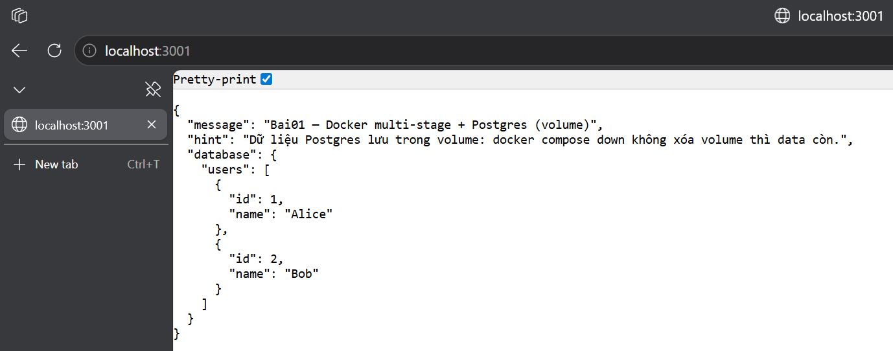

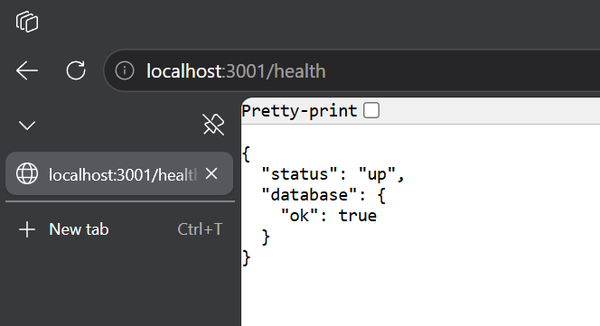

### Bai02

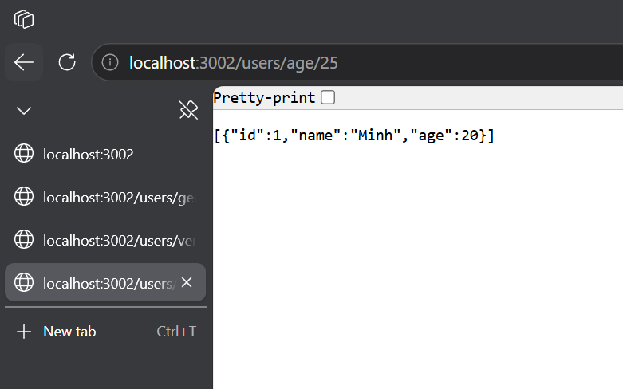

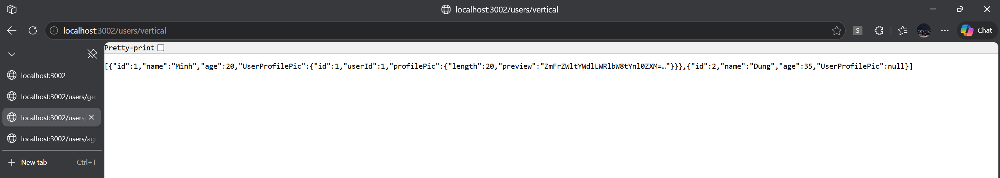

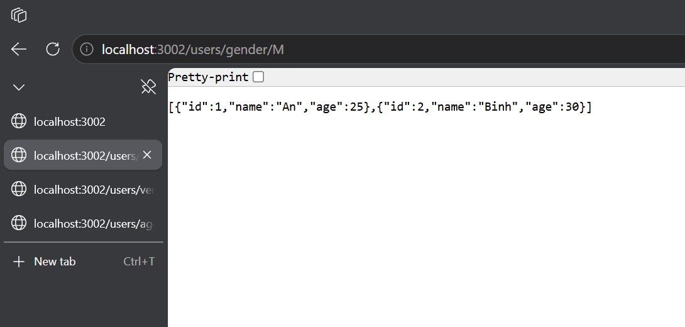

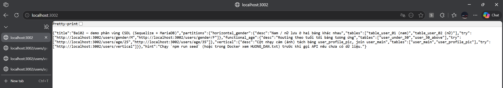

### Bai03

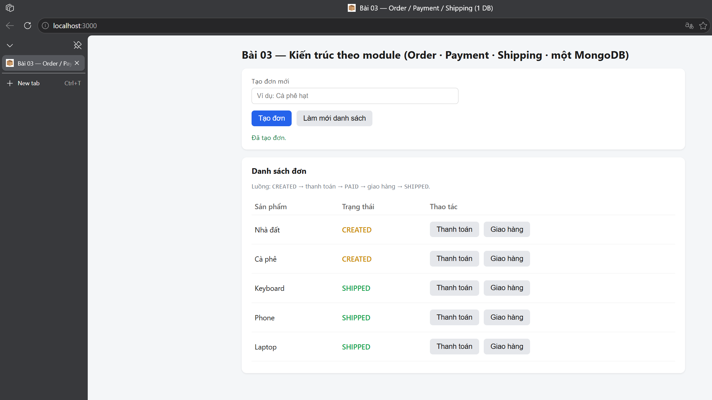

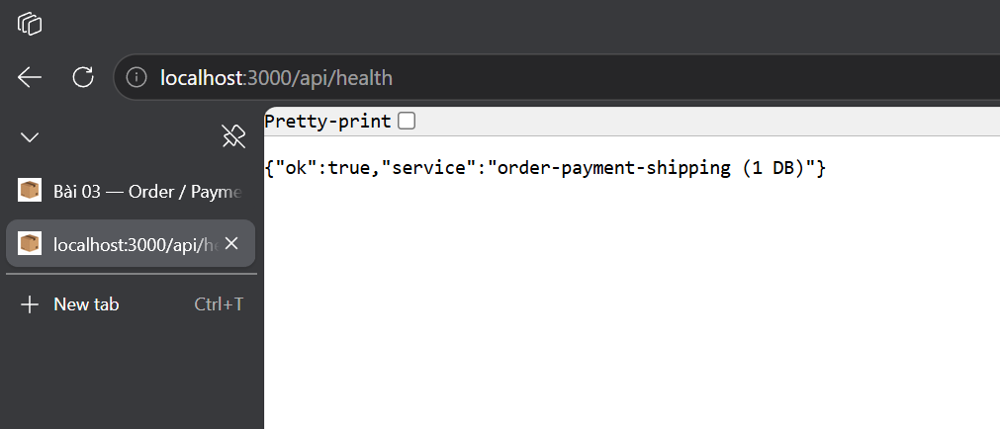

### Bai05

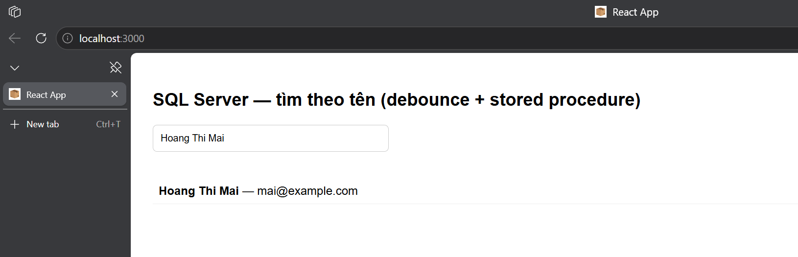

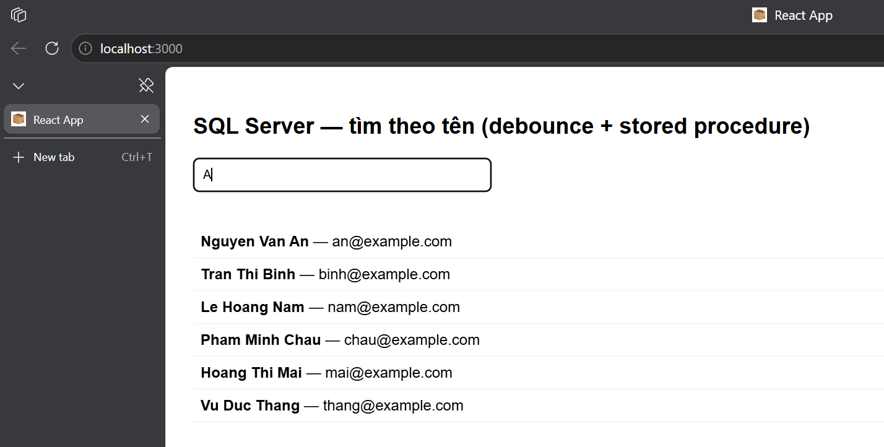

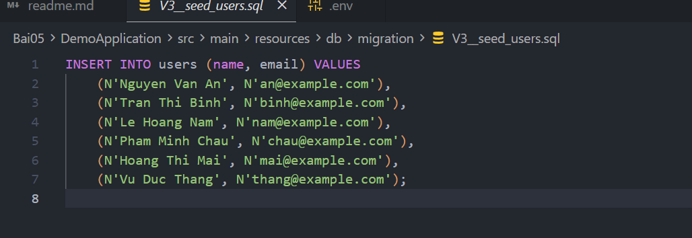
