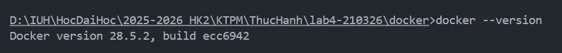
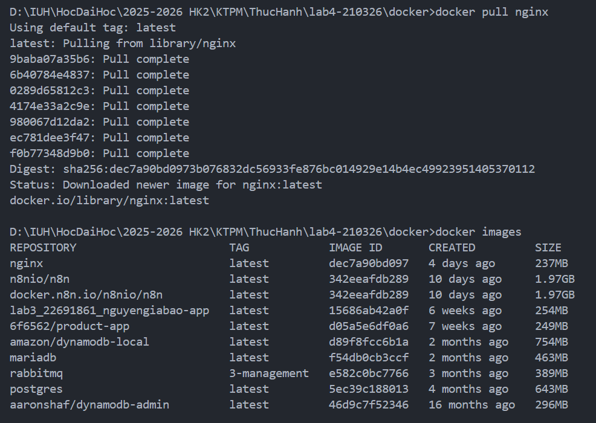
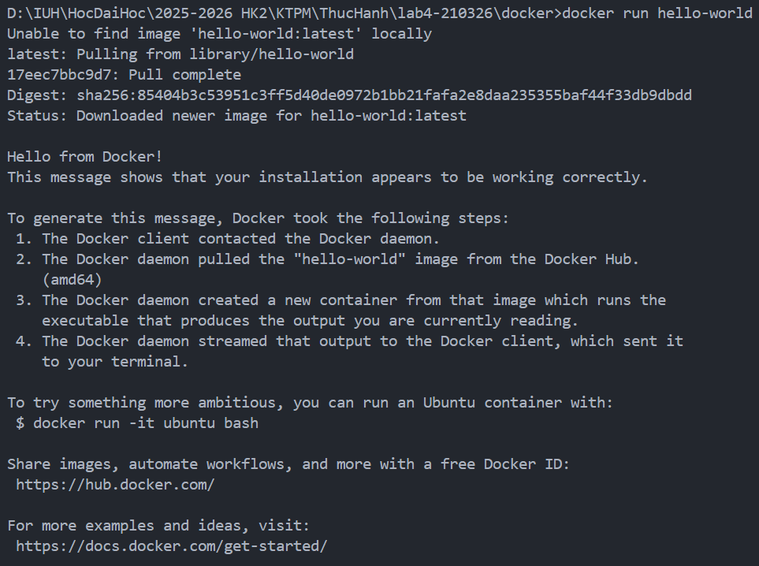
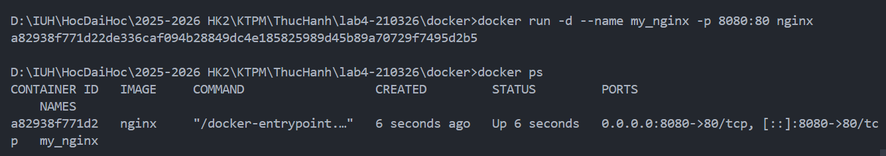
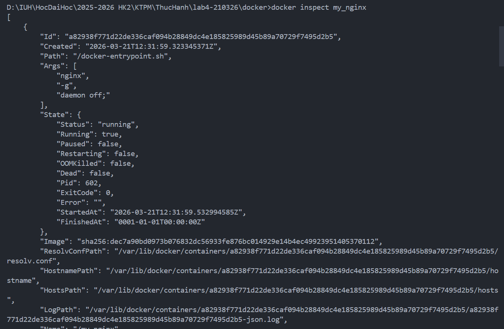
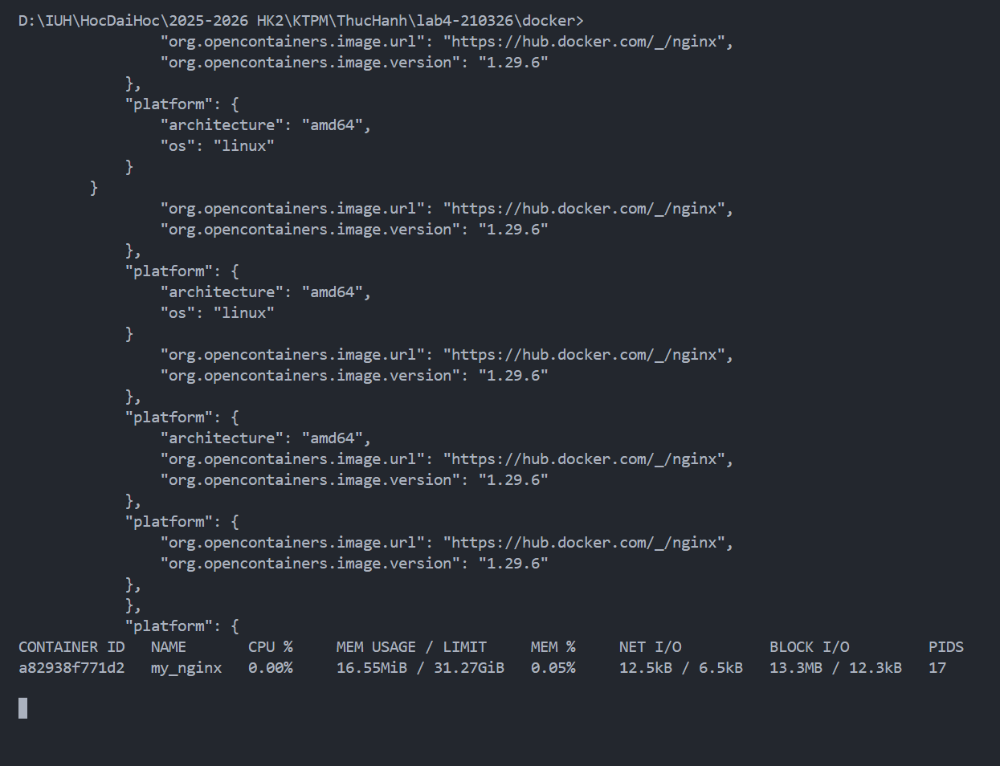
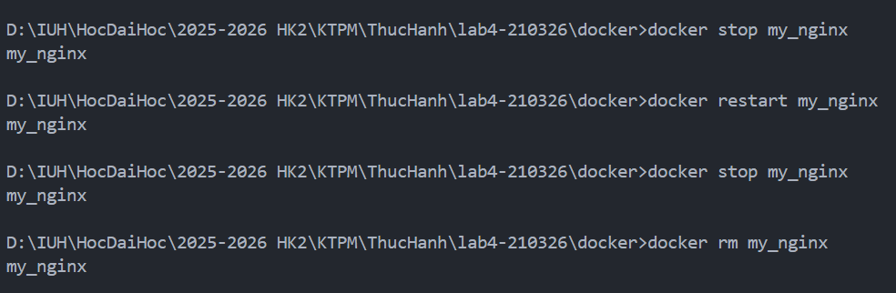
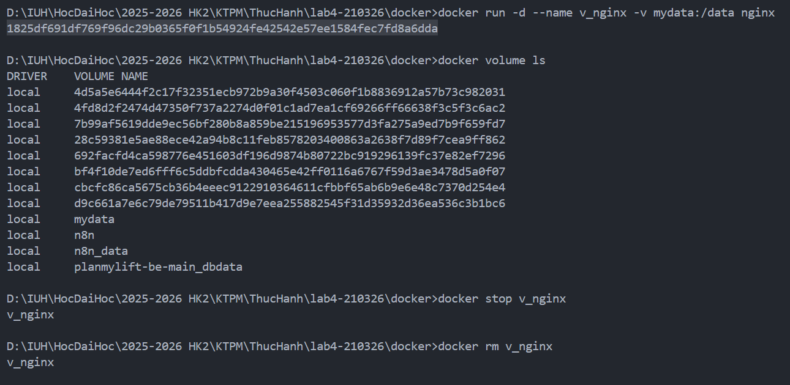
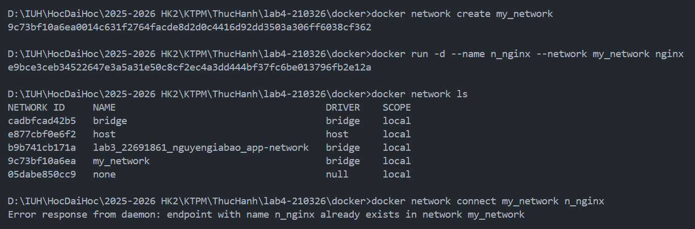

# KTPM Lab — Thực hành Docker

Repository chứa các bài thực hành Docker cho môn Kỹ thuật phần mềm, gồm phần làm quen Docker CLI và các bài Docker hóa ứng dụng đa nền tảng (Node.js, Python, React, Nginx, Go).

## Yêu cầu môi trường

- **Hệ điều hành:** Windows 10/11
- **Docker Desktop** đã cài đặt và Engine đang chạy
- **Terminal:** PowerShell

Kiểm tra Docker trước khi bắt đầu:

```powershell
docker --version
```

## Cấu trúc thư mục

```
kttkpm-lab/
├── docker/
│   ├── docker.md              # Tổng hợp lệnh Docker thường dùng
│   ├── docker-lab-p1.md       # Báo cáo thực hành Lab 4 — Phần 1 (Docker CLI)
│   ├── docker-lab-p2.md       # Báo cáo thực hành Lab 4 — Phần 2
│   ├── image*.png             # Ảnh minh họa báo cáo
│   └── Dockerfile/
│       ├── bai1/              # Node.js — multi-stage build
│       ├── bai2/              # Python Flask — multi-stage build
│       ├── bai3/              # React (Vite) + Nginx — multi-stage build
│       ├── bai4/              # Website tĩnh với Nginx
│       └── bai5/              # Go — static binary trên image scratch
└── README.md
```

## Phần 1 — Làm quen Docker CLI

Phần này thực hành các nhóm lệnh cơ bản: quản lý image, container, logs, port mapping, volume, network và build image từ Dockerfile.

Chi tiết từng bước và ảnh minh họa xem tại [`docker/docker-lab-p1.md`](docker/docker-lab-p1.md).

Tra cứu nhanh các lệnh: [`docker/docker.md`](docker/docker.md).

| Chủ đề | Lệnh tiêu biểu |
|--------|----------------|
| Image | `docker pull`, `docker images`, `docker rmi` |
| Container | `docker run`, `docker ps`, `docker stop`, `docker rm` |
| Tương tác | `docker logs`, `docker exec`, `docker inspect`, `docker stats` |
| Cấu hình | `-p` (port), `-v` (volume), `--network`, `-e` (env) |
| Build | `docker build -t <tên> .` |

### Minh chứng thực hành (Phần 1)

#### Bước 0 — Kiểm tra Docker

```powershell
docker --version
```



#### Bước 1 — Quản lý Images

```powershell
docker pull nginx
docker images
```



#### Bước 2 — Chạy container kiểm thử

```powershell
docker run hello-world
```



#### Bước 3 — Chạy Nginx ở chế độ nền và map cổng

```powershell
docker run -d --name my_nginx -p 8080:80 nginx
docker ps
```



Truy cập `http://localhost:8080`:


#### Bước 4 — Tương tác với container

```powershell
docker logs my_nginx
docker exec -it my_nginx /bin/sh
docker inspect my_nginx
docker stats
```






#### Bước 5 — Dừng, khởi động lại, xóa container

```powershell
docker stop my_nginx
docker restart my_nginx
docker stop my_nginx
docker rm my_nginx
docker ps -a
```




#### Bước 6 — Volume và Network

**Volume**

```powershell
docker run -d --name v_nginx -v mydata:/data nginx
docker volume ls
```



**Network**

```powershell
docker network create my_network
docker run -d --name n_nginx --network my_network nginx
docker network ls
```



## Phần 2 — Docker hóa ứng dụng

Tất cả lệnh build/run bên dưới chạy từ thư mục `docker`:

```powershell
cd docker
```

### Tổng quan các bài

| Bài | Công nghệ | Cổng | Image tag | Kỹ thuật nổi bật |
|-----|-----------|------|-----------|------------------|
| [Bài 1](docker/Dockerfile/bai1/README.md) | Node.js | 3000 | `hello-docker-bai1` | Multi-stage, chạy non-root (`node`) |
| [Bài 2](docker/Dockerfile/bai2/README.md) | Python Flask | 5000 | `flask-hello-app` | Multi-stage, image slim |
| [Bài 3](docker/Dockerfile/bai3/README.md) | React + Vite | 8080 → 80 | `react-app-prod` | Build React + phục vụ bằng Nginx |
| [Bài 4](docker/Dockerfile/bai4/README.md) | HTML tĩnh | 8080 → 80 | `my-static-web` | Nginx Alpine, copy static files |
| [Bài 5](docker/Dockerfile/bai5/README.md) | Go | 8080 | `hello-go-app` | Multi-stage, binary trên `scratch` |

### Bài 1 — Node.js

```powershell
docker build -t hello-docker-bai1 ./Dockerfile/bai1
docker run -d --name hello-docker-bai1 -p 3000:3000 hello-docker-bai1
```

Truy cập `http://localhost:3000` — kết quả: `Hello, Docker!`

### Bài 2 — Python Flask

```powershell
docker build -t flask-hello-app ./Dockerfile/bai2
docker run -d --name flask-hello-container -p 5000:5000 flask-hello-app
```

Truy cập `http://localhost:5000` — kết quả: `Hello, Docker Flask!`

### Bài 3 — React (Vite)

```powershell
docker build -t react-app-prod ./Dockerfile/bai3
docker run -d --name react-app-prod-container -p 8080:80 react-app-prod
```

Truy cập `http://localhost:8080` — hiển thị giao diện React.

### Bài 4 — Website tĩnh (Nginx)

```powershell
docker build -t my-static-web ./Dockerfile/bai4
docker run -d -p 8080:80 --name web-nginx my-static-web
```

Truy cập `http://localhost:8080` — phục vụ nội dung từ `index.html`.

### Bài 5 — Go (Scratch)

```powershell
docker build -t hello-go-app ./Dockerfile/bai5
docker run -d --name hello-go-app-container -p 8080:8080 hello-go-app
```

Truy cập `http://localhost:8080` — kết quả: `Hello, Docker Go!`

## Dọn dẹp tài nguyên

Dừng và xóa container (thay `<tên>` bằng tên container tương ứng):

```powershell
docker stop <tên>
docker rm <tên>
```

Xóa image:

```powershell
docker rmi <tên-image>
```

Dọn dẹp hàng loạt (cẩn thận — xóa tài nguyên không dùng):

```powershell
docker container prune -f
docker image prune -a -f
docker volume prune -f
```

## Lỗi thường gặp

| Lỗi | Cách xử lý |
|-----|------------|
| Docker daemon chưa chạy | Mở Docker Desktop, đợi trạng thái **Engine running** |
| Port đã được sử dụng | Đổi cổng host, ví dụ `-p 8081:80` thay vì `8080:80` |
| Trùng tên container | Dùng tên mới hoặc xóa container cũ sau khi `docker stop` |
| Không xóa được image | Dừng và xóa các container đang dùng image đó trước |

## Tài liệu tham khảo

- [Docker Documentation](https://docs.docker.com/)
- [Dockerfile reference](https://docs.docker.com/reference/dockerfile/)
- Báo cáo chi tiết: [`docker/docker-lab-p1.md`](docker/docker-lab-p1.md), [`docker/docker-lab-p2.md`](docker/docker-lab-p2.md)
