# Tài liệu Thiết kế Hệ thống E-Commerce
## Áp dụng Design Patterns: State, Strategy, và Decorator

---

## 1. Mô tả bài toán

### 1.1. Vấn đề cần giải quyết

Trong hệ thống thương mại điện tử hiện đại, chúng ta gặp phải các vấn đề thiết kế phức tạp:

**Vấn đề 1: Quản lý trạng thái đơn hàng**
- Đơn hàng có nhiều trạng thái khác nhau (Mới, Đang xử lý, Đã giao, Đã hủy)
- Hành vi của đơn hàng thay đổi hoàn toàn dựa trên trạng thái hiện tại
- Việc sử dụng nhiều câu lệnh `if-else` hoặc `switch-case` làm code khó bảo trì và mở rộng
- Khi thêm trạng thái mới, phải sửa đổi nhiều nơi trong code

**Vấn đề 2: Tính toán thuế đa dạng**
- Có nhiều loại thuế khác nhau: VAT (10%), Thuế tiêu thụ đặc biệt (20%), Thuế xa xỉ (30%)
- Mỗi loại thuế có công thức tính toán riêng biệt
- Cần khả năng thay đổi thuật toán tính thuế tại thời điểm chạy
- Việc hard-code các công thức tính thuế làm code cứng nhắc và khó mở rộng

**Vấn đề 3: Thanh toán với tính năng động**
- Có nhiều phương thức thanh toán: Thẻ tín dụng, PayPal
- Cần thêm các tính năng bổ sung: Phí xử lý, Mã giảm giá
- Các tính năng này có thể kết hợp linh hoạt (ví dụ: Thanh toán thẻ + Phí xử lý + Giảm giá)
- Việc tạo lớp con cho mỗi tổ hợp tính năng dẫn đến "bùng nổ lớp con" (class explosion)

### 1.2. Yêu cầu thiết kế

**Yêu cầu cho State Pattern (Quản lý Đơn hàng):**
- Đơn hàng phải có khả năng chuyển đổi trạng thái một cách tự động và an toàn
- Mỗi trạng thái phải có hành vi riêng biệt:
  - **NewOrderState**: Kiểm tra thông tin đơn hàng, xác thực thanh toán
  - **ProcessingState**: Đóng gói sản phẩm, chuẩn bị giao hàng
  - **DeliveredState**: Cập nhật trạng thái giao hàng, gửi thông báo
  - **CanceledState**: Hoàn tiền, cập nhật kho hàng
- Phải đảm bảo tính nhất quán: không thể chuyển từ trạng thái "Đã giao" sang "Mới"
- Dễ dàng thêm trạng thái mới mà không cần sửa đổi code hiện có

**Yêu cầu cho Strategy Pattern (Tính toán Thuế):**
- Hỗ trợ nhiều chiến lược tính thuế khác nhau
- Có thể thay đổi chiến lược tính thuế tại thời điểm chạy
- Mỗi chiến lược phải độc lập và có thể test riêng biệt
- Dễ dàng thêm loại thuế mới mà không ảnh hưởng đến code hiện có

**Yêu cầu cho Decorator Pattern (Thanh toán):**
- Hỗ trợ nhiều phương thức thanh toán cơ bản
- Có thể thêm tính năng bổ sung một cách linh hoạt
- Các decorator có thể kết hợp với nhau (ví dụ: Phí xử lý + Giảm giá)
- Không làm thay đổi interface của đối tượng gốc

### 1.3. Luồng hoạt động chi tiết

#### Luồng 1: Quản lý Đơn hàng (State Pattern)

```
1. Khách hàng đặt đơn hàng
   └─> Order được tạo với trạng thái NewOrderState
   
2. Hệ thống kiểm tra thông tin đơn hàng
   └─> NewOrderState.handle() được gọi
   └─> Kiểm tra thông tin khách hàng, sản phẩm, thanh toán
   
3. Nếu hợp lệ, đơn hàng chuyển sang ProcessingState
   └─> Order.setState(ProcessingState)
   
4. Nhân viên kho đóng gói sản phẩm
   └─> ProcessingState.handle() được gọi
   └─> Thực hiện đóng gói, cập nhật kho hàng
   
5. Đơn hàng được giao đến khách hàng
   └─> Order.setState(DeliveredState)
   └─> DeliveredState.handle() được gọi
   └─> Cập nhật trạng thái, gửi email xác nhận
   
6. (Trường hợp hủy) Khách hàng hủy đơn hàng
   └─> Order.setState(CanceledState)
   └─> CanceledState.handle() được gọi
   └─> Hoàn tiền, cập nhật lại kho hàng
```

#### Luồng 2: Tính toán Thuế (Strategy Pattern)

```
1. Khách hàng chọn sản phẩm
   └─> Product được tạo với giá gốc
   
2. Hệ thống xác định loại thuế áp dụng
   └─> Dựa trên loại sản phẩm:
       - Sản phẩm thông thường → VatTax (10%)
       - Rượu, thuốc lá → ConsumptionTax (20%)
       - Đồ xa xỉ → LuxuryTax (30%)
   
3. TaxCalculator nhận TaxStrategy tương ứng
   └─> TaxCalculator.setStrategy(VatTax)
   
4. Tính giá sau thuế
   └─> TaxCalculator.calculateTax(price)
   └─> Strategy.calculateTax() được gọi
   └─> Trả về giá sau thuế
   
5. Có thể thay đổi chiến lược tại runtime
   └─> TaxCalculator.setStrategy(LuxuryTax)
   └─> Tính lại với chiến lược mới
```

#### Luồng 3: Thanh toán với Decorator (Decorator Pattern)

```
1. Khách hàng chọn phương thức thanh toán
   └─> Tạo Payment cơ bản: CreditCardPayment hoặc PayPalPayment
   
2. Tính toán chi phí ban đầu
   └─> payment.cost() → Trả về giá gốc
   
3. Thêm phí xử lý (nếu có)
   └─> payment = new ProcessingFeeDecorator(payment, fee)
   └─> payment.cost() → Giá gốc + phí xử lý
   
4. Áp dụng mã giảm giá (nếu có)
   └─> payment = new DiscountDecorator(payment, discount)
   └─> payment.cost() → (Giá gốc + phí) - giảm giá
   
5. Kết hợp nhiều decorator
   └─> Payment finalPayment = new DiscountDecorator(
           new ProcessingFeeDecorator(
               new CreditCardPayment(amount), 
               fee), 
           discount)
   └─> finalPayment.cost() → Tính toán cuối cùng
```

### 1.4. Lý do áp dụng Design Patterns

#### State Pattern - Giải quyết vấn đề quản lý trạng thái

**Vấn đề không dùng Pattern:**
```java
// Code cứng nhắc, khó bảo trì
if (order.getState().equals("NEW")) {
    // Kiểm tra thông tin
    if (isValid()) {
        order.setState("PROCESSING");
    }
} else if (order.getState().equals("PROCESSING")) {
    // Đóng gói
    packageOrder();
    order.setState("DELIVERED");
} else if (order.getState().equals("DELIVERED")) {
    // ...
}
// Khi thêm trạng thái mới → phải sửa nhiều nơi
```

**Lợi ích khi dùng State Pattern:**
- **Tách biệt trách nhiệm**: Mỗi trạng thái là một lớp riêng, quản lý logic của riêng nó
- **Dễ mở rộng**: Thêm trạng thái mới chỉ cần tạo lớp mới, không sửa code cũ
- **Giảm điều kiện**: Loại bỏ các câu lệnh if-else phức tạp
- **Tuân thủ OCP**: Mở rộng mà không sửa đổi (Open/Closed Principle)

#### Strategy Pattern - Giải quyết vấn đề tính toán thuế

**Vấn đề không dùng Pattern:**
```java
// Hard-code công thức tính thuế
public double calculateTax(String taxType, double price) {
    if (taxType.equals("VAT")) {
        return price * 0.1;
    } else if (taxType.equals("CONSUMPTION")) {
        return price * 0.2;
    } else if (taxType.equals("LUXURY")) {
        return price * 0.3;
    }
    // Thêm loại thuế mới → phải sửa hàm này
}
```

**Lợi ích khi dùng Strategy Pattern:**
- **Linh hoạt**: Thay đổi thuật toán tại runtime
- **Tách biệt thuật toán**: Mỗi chiến lược độc lập, dễ test
- **Tuân thủ DIP**: Phụ thuộc vào abstraction, không phụ thuộc vào implementation cụ thể
- **Dễ bảo trì**: Sửa một loại thuế không ảnh hưởng đến loại khác

#### Decorator Pattern - Giải quyết vấn đề thanh toán động

**Vấn đề không dùng Pattern:**
```java
// Bùng nổ lớp con
class CreditCardPayment { }
class CreditCardPaymentWithFee { }
class CreditCardPaymentWithDiscount { }
class CreditCardPaymentWithFeeAndDiscount { }
class PayPalPayment { }
class PayPalPaymentWithFee { }
// ... và nhiều lớp khác
// Với N phương thức thanh toán và M tính năng → N × 2^M lớp!
```

**Lợi ích khi dùng Decorator Pattern:**
- **Kết hợp linh hoạt**: Có thể kết hợp nhiều decorator theo nhiều cách
- **Tránh bùng nổ lớp con**: Không cần tạo lớp cho mỗi tổ hợp
- **Tuân thủ SRP**: Mỗi decorator chỉ thêm một tính năng
- **Tuân thủ OCP**: Thêm tính năng mới mà không sửa code cũ

### 1.5. Lợi ích chi tiết của thiết kế

#### Lợi ích tổng thể

1. **Khả năng mở rộng cao**
   - Thêm trạng thái mới: Chỉ cần tạo lớp State mới
   - Thêm loại thuế mới: Chỉ cần tạo Strategy mới
   - Thêm tính năng thanh toán: Chỉ cần tạo Decorator mới

2. **Code dễ bảo trì**
   - Mỗi pattern tách biệt logic riêng biệt
   - Dễ debug vì mỗi lớp có trách nhiệm rõ ràng
   - Dễ test từng thành phần độc lập

3. **Tuân thủ SOLID Principles**
   - **S**ingle Responsibility: Mỗi lớp có một trách nhiệm duy nhất
   - **O**pen/Closed: Mở rộng mà không sửa đổi
   - **L**iskov Substitution: Có thể thay thế implementation mà không ảnh hưởng
   - **I**nterface Segregation: Interface nhỏ gọn, tập trung
   - **D**ependency Inversion: Phụ thuộc vào abstraction

4. **Giảm coupling, tăng cohesion**
   - Các lớp ít phụ thuộc vào nhau
   - Logic liên quan được nhóm lại với nhau

5. **Tái sử dụng code**
   - Các Strategy có thể dùng lại cho nhiều sản phẩm
   - Các Decorator có thể áp dụng cho mọi Payment
   - Các State có thể tái sử dụng cho nhiều loại đơn hàng

#### Lợi ích cụ thể từng Pattern

**State Pattern:**
- ✅ Quản lý trạng thái rõ ràng, dễ theo dõi
- ✅ Đảm bảo tính nhất quán: Chỉ chuyển được sang trạng thái hợp lệ
- ✅ Dễ thêm logic phức tạp cho mỗi trạng thái
- ✅ Hỗ trợ undo/redo nếu cần

**Strategy Pattern:**
- ✅ Thay đổi thuật toán tại runtime
- ✅ Dễ test từng chiến lược riêng biệt
- ✅ Có thể kết hợp nhiều strategy (nếu cần)
- ✅ Dễ dàng A/B testing các thuật toán khác nhau

**Decorator Pattern:**
- ✅ Kết hợp tính năng động, không cần tạo lớp mới
- ✅ Thêm/bỏ tính năng tại runtime
- ✅ Giữ nguyên interface, code client không đổi
- ✅ Có thể áp dụng nhiều decorator cùng lúc

---

## 2. Use Cases và Scenarios

### 2.1. Use Case Diagram

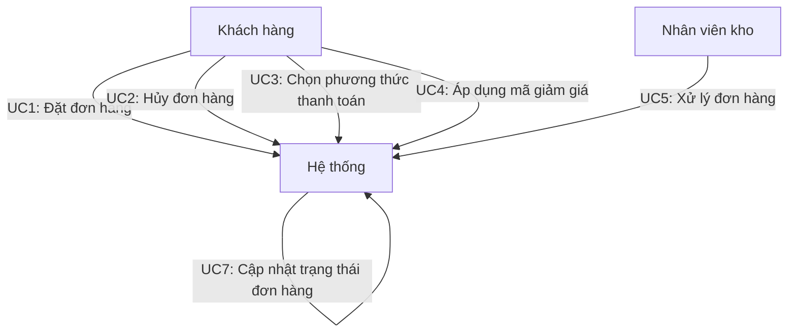

### 2.2. Use Cases chi tiết

#### UC1: Đặt đơn hàng (State Pattern)

**Actor:** Khách hàng

**Mô tả:** Khách hàng tạo đơn hàng mới với các sản phẩm đã chọn

**Preconditions:**
- Khách hàng đã đăng nhập vào hệ thống
- Giỏ hàng có ít nhất một sản phẩm

**Main Flow:**
1. Khách hàng chọn "Đặt hàng"
2. Hệ thống tạo Order mới với trạng thái NewOrderState
3. Hệ thống kiểm tra thông tin đơn hàng (NewOrderState.handle())
4. Nếu hợp lệ, đơn hàng tự động chuyển sang ProcessingState
5. Hệ thống hiển thị thông báo "Đơn hàng đã được tiếp nhận"

**Postconditions:**
- Đơn hàng được tạo với ID duy nhất
- Đơn hàng ở trạng thái ProcessingState
- Khách hàng nhận được email xác nhận

**Alternative Flows:**
- 3a. Thông tin không hợp lệ: Đơn hàng giữ nguyên NewOrderState, hiển thị lỗi
- 3b. Hết hàng: Đơn hàng chuyển sang CanceledState, thông báo cho khách hàng

---

#### UC2: Hủy đơn hàng (State Pattern)

**Actor:** Khách hàng

**Mô tả:** Khách hàng hủy đơn hàng đã đặt

**Preconditions:**
- Đơn hàng tồn tại và thuộc về khách hàng
- Đơn hàng ở trạng thái NewOrderState hoặc ProcessingState

**Main Flow:**
1. Khách hàng chọn đơn hàng cần hủy
2. Khách hàng nhấn nút "Hủy đơn hàng"
3. Hệ thống xác nhận yêu cầu hủy
4. Khách hàng xác nhận hủy
5. Hệ thống chuyển đơn hàng sang CanceledState
6. CanceledState.handle() được gọi:
   - Hoàn tiền cho khách hàng
   - Cập nhật lại số lượng sản phẩm trong kho
   - Gửi email thông báo hủy đơn hàng
7. Hệ thống hiển thị thông báo "Đơn hàng đã được hủy"

**Postconditions:**
- Đơn hàng ở trạng thái CanceledState
- Tiền đã được hoàn lại
- Kho hàng đã được cập nhật

**Alternative Flows:**
- 2a. Đơn hàng đã ở DeliveredState: Không thể hủy, hiển thị thông báo
- 4a. Khách hàng không xác nhận: Hủy bỏ thao tác, đơn hàng giữ nguyên trạng thái

---

#### UC3: Chọn phương thức thanh toán (Decorator Pattern)

**Actor:** Khách hàng

**Mô tả:** Khách hàng chọn phương thức thanh toán cho đơn hàng

**Preconditions:**
- Đơn hàng đã được tạo
- Tổng tiền đã được tính toán

**Main Flow:**
1. Khách hàng đến bước thanh toán
2. Hệ thống hiển thị danh sách phương thức thanh toán:
   - Thẻ tín dụng (CreditCardPayment)
   - PayPal (PayPalPayment)
3. Khách hàng chọn một phương thức
4. Hệ thống tạo Payment object tương ứng
5. Hệ thống hiển thị chi phí: payment.cost()

**Postconditions:**
- Payment object đã được tạo
- Chi phí đã được tính toán và hiển thị

**Alternative Flows:**
- 3a. Khách hàng thay đổi phương thức: Tạo Payment mới, tính lại chi phí

---

#### UC4: Áp dụng mã giảm giá (Decorator Pattern)

**Actor:** Khách hàng

**Mô tả:** Khách hàng áp dụng mã giảm giá vào đơn hàng

**Preconditions:**
- Đơn hàng đã được tạo
- Payment đã được khởi tạo
- Khách hàng có mã giảm giá hợp lệ

**Main Flow:**
1. Khách hàng nhập mã giảm giá
2. Hệ thống kiểm tra tính hợp lệ của mã
3. Nếu hợp lệ, hệ thống tạo DiscountDecorator:
   ```
   payment = new DiscountDecorator(payment, discountAmount)
   ```
4. Hệ thống tính lại chi phí: payment.cost()
5. Hệ thống hiển thị chi phí mới (đã trừ giảm giá)

**Postconditions:**
- Payment đã được bao bọc bởi DiscountDecorator
- Chi phí đã được cập nhật với giảm giá

**Alternative Flows:**
- 2a. Mã không hợp lệ: Hiển thị lỗi, không áp dụng giảm giá
- 2b. Mã đã hết hạn: Hiển thị thông báo, không áp dụng giảm giá
- 2c. Mã đã được sử dụng: Hiển thị thông báo, không áp dụng giảm giá

---

#### UC5: Xử lý đơn hàng (State Pattern)

**Actor:** Nhân viên kho

**Mô tả:** Nhân viên kho xử lý và đóng gói đơn hàng

**Preconditions:**
- Đơn hàng ở trạng thái ProcessingState
- Nhân viên đã đăng nhập vào hệ thống

**Main Flow:**
1. Nhân viên xem danh sách đơn hàng cần xử lý
2. Nhân viên chọn một đơn hàng
3. Nhân viên nhấn nút "Bắt đầu xử lý"
4. Hệ thống gọi ProcessingState.handle():
   - Kiểm tra số lượng sản phẩm trong kho
   - Đóng gói sản phẩm
   - Cập nhật kho hàng
   - Tạo mã vận đơn
5. Nhân viên hoàn tất đóng gói
6. Nhân viên nhấn nút "Hoàn thành xử lý"
7. Hệ thống chuyển đơn hàng sang DeliveredState
8. DeliveredState.handle() được gọi:
   - Cập nhật trạng thái giao hàng
   - Gửi email thông báo cho khách hàng
   - Tạo hóa đơn

**Postconditions:**
- Đơn hàng ở trạng thái DeliveredState
- Sản phẩm đã được đóng gói
- Khách hàng đã nhận được thông báo

**Alternative Flows:**
- 4a. Hết hàng: Đơn hàng chuyển sang CanceledState, thông báo cho khách hàng

---

#### UC6: Tính toán thuế (Strategy Pattern)

**Actor:** Hệ thống

**Mô tả:** Hệ thống tự động tính toán thuế cho sản phẩm dựa trên loại sản phẩm

**Preconditions:**
- Sản phẩm đã được thêm vào đơn hàng
- Loại thuế đã được xác định

**Main Flow:**
1. Hệ thống xác định loại sản phẩm
2. Hệ thống chọn TaxStrategy tương ứng:
   - Sản phẩm thông thường → VatTax (10%)
   - Rượu, thuốc lá → ConsumptionTax (20%)
   - Đồ xa xỉ → LuxuryTax (30%)
3. Hệ thống tạo TaxCalculator với Strategy đã chọn
4. Hệ thống gọi TaxCalculator.calculateTax(basePrice)
5. Strategy tính toán và trả về số tiền thuế
6. Hệ thống tính giá cuối cùng = basePrice + taxAmount

**Postconditions:**
- Thuế đã được tính toán chính xác
- Giá cuối cùng đã được cập nhật

**Alternative Flows:**
- 2a. Sản phẩm miễn thuế: Sử dụng NoTaxStrategy, trả về 0

---

#### UC7: Thanh toán với phí xử lý (Decorator Pattern)

**Actor:** Khách hàng

**Mô tả:** Khách hàng thanh toán với phí xử lý được áp dụng

**Preconditions:**
- Payment đã được tạo
- Phương thức thanh toán yêu cầu phí xử lý

**Main Flow:**
1. Khách hàng chọn phương thức thanh toán (ví dụ: PayPal)
2. Hệ thống kiểm tra: Phương thức này có yêu cầu phí xử lý không?
3. Nếu có, hệ thống tự động tạo ProcessingFeeDecorator:
   ```
   payment = new ProcessingFeeDecorator(payment, processingFee)
   ```
4. Hệ thống tính chi phí: payment.cost() = baseAmount + processingFee
5. Hệ thống hiển thị chi phí bao gồm phí xử lý

**Postconditions:**
- Payment đã được bao bọc bởi ProcessingFeeDecorator
- Chi phí đã bao gồm phí xử lý

---

### 2.3. Scenarios chi tiết

#### Scenario 1: Đặt đơn hàng thành công với nhiều sản phẩm

**Mô tả:** Khách hàng đặt đơn hàng với 3 sản phẩm khác nhau, mỗi sản phẩm có loại thuế khác nhau

**Actors:** Khách hàng, Hệ thống

**Steps:**
1. Khách hàng thêm sản phẩm A (giá 100.000đ, VAT 10%) vào giỏ hàng
   - Hệ thống tạo Product với VatTax strategy
   - Giá sau thuế: 110.000đ

2. Khách hàng thêm sản phẩm B (giá 200.000đ, Thuế tiêu thụ đặc biệt 20%)
   - Hệ thống tạo Product với ConsumptionTax strategy
   - Giá sau thuế: 240.000đ

3. Khách hàng thêm sản phẩm C (giá 500.000đ, Thuế xa xỉ 30%)
   - Hệ thống tạo Product với LuxuryTax strategy
   - Giá sau thuế: 650.000đ

4. Khách hàng nhấn "Đặt hàng"
   - Hệ thống tạo Order với NewOrderState
   - Tổng tiền: 1.000.000đ

5. NewOrderState.handle() được gọi:
   - Kiểm tra thông tin: Hợp lệ
   - Chuyển sang ProcessingState

6. Khách hàng chọn thanh toán bằng thẻ tín dụng
   - Tạo CreditCardPayment(1.000.000đ)

7. Khách hàng nhập mã giảm giá "SAVE100"
   - Tạo DiscountDecorator với giảm giá 100.000đ
   - Chi phí cuối: 900.000đ

8. Khách hàng xác nhận thanh toán
   - Thanh toán thành công
   - Order chuyển sang ProcessingState

**Kết quả:** Đơn hàng được tạo thành công với tổng tiền 900.000đ (sau giảm giá)

---

#### Scenario 2: Hủy đơn hàng đang xử lý

**Mô tả:** Khách hàng hủy đơn hàng khi đơn hàng đang ở trạng thái ProcessingState

**Actors:** Khách hàng, Hệ thống

**Steps:**
1. Đơn hàng đang ở ProcessingState (đã được đóng gói nhưng chưa giao)

2. Khách hàng vào trang "Quản lý đơn hàng"

3. Khách hàng chọn đơn hàng và nhấn "Hủy đơn hàng"

4. Hệ thống hiển thị xác nhận: "Bạn có chắc muốn hủy đơn hàng này?"

5. Khách hàng xác nhận

6. Hệ thống chuyển Order sang CanceledState

7. CanceledState.handle() được gọi:
   - Hoàn tiền 900.000đ cho khách hàng
   - Cập nhật lại kho hàng (trả lại 3 sản phẩm)
   - Gửi email thông báo hủy đơn hàng
   - Ghi log hoạt động

8. Hệ thống hiển thị: "Đơn hàng đã được hủy thành công"

**Kết quả:** Đơn hàng đã được hủy, tiền đã được hoàn lại, kho hàng đã được cập nhật

---

#### Scenario 3: Thanh toán với nhiều decorator

**Mô tả:** Khách hàng thanh toán bằng PayPal với phí xử lý và mã giảm giá

**Actors:** Khách hàng, Hệ thống

**Steps:**
1. Tổng tiền đơn hàng: 1.000.000đ

2. Khách hàng chọn PayPal làm phương thức thanh toán
   - Tạo PayPalPayment(1.000.000đ)
   - Chi phí hiện tại: 1.000.000đ

3. Hệ thống phát hiện PayPal yêu cầu phí xử lý 2%
   - Tạo ProcessingFeeDecorator với phí 20.000đ
   - payment = new ProcessingFeeDecorator(paypalPayment, 20000)
   - Chi phí: 1.020.000đ

4. Khách hàng nhập mã giảm giá "VIP50"
   - Mã hợp lệ, giảm giá 50.000đ
   - Tạo DiscountDecorator
   - payment = new DiscountDecorator(processingFeeDecorator, 50000)
   - Chi phí cuối: 970.000đ

5. Khách hàng xác nhận thanh toán
   - Thanh toán 970.000đ thành công

**Kết quả:** Thanh toán thành công với chi phí 970.000đ (bao gồm phí xử lý và giảm giá)

**Cấu trúc Decorator:**
```
DiscountDecorator (giảm 50.000đ)
  └─> ProcessingFeeDecorator (cộng 20.000đ)
        └─> PayPalPayment (1.000.000đ)
```

---

#### Scenario 4: Thay đổi loại thuế tại runtime

**Mô tả:** Hệ thống phát hiện phân loại sai và thay đổi loại thuế cho sản phẩm

**Actors:** Hệ thống, Admin

**Steps:**
1. Sản phẩm ban đầu được phân loại là "Sản phẩm thông thường"
   - Product được tạo với VatTax strategy (10%)
   - Giá: 1.000.000đ → Thuế: 100.000đ → Tổng: 1.100.000đ

2. Admin phát hiện sản phẩm này thuộc loại "Đồ xa xỉ"
   - Cần thay đổi loại thuế

3. Admin cập nhật phân loại sản phẩm
   - Product.setTaxStrategy(new LuxuryTax())
   - Strategy được thay đổi tại runtime

4. Hệ thống tính lại giá:
   - Giá: 1.000.000đ → Thuế: 300.000đ → Tổng: 1.300.000đ

5. Nếu đơn hàng chưa thanh toán, hệ thống cập nhật tổng tiền

**Kết quả:** Loại thuế đã được thay đổi thành công, giá đã được tính lại

**Lợi ích của Strategy Pattern:** Có thể thay đổi thuật toán mà không cần tạo Product mới

---

### 2.4. Use Case Realization

#### Realization của UC1 (Đặt đơn hàng)

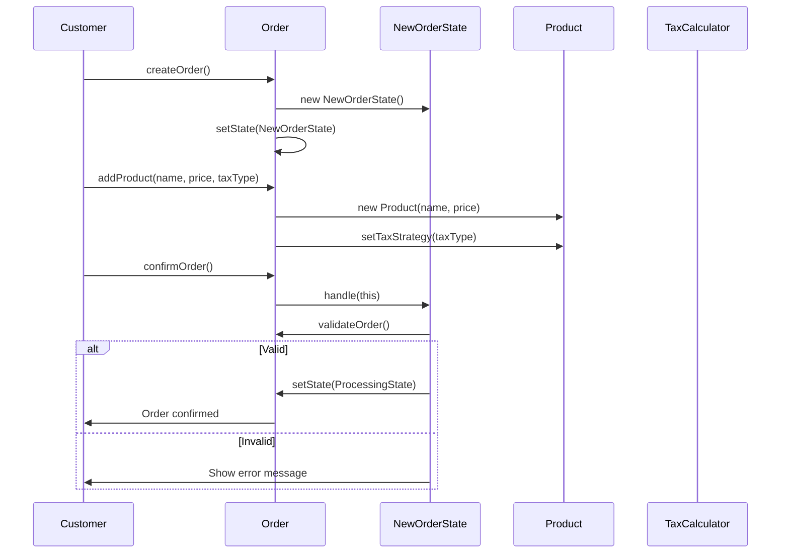

---

## 3. State Transition Diagram

### 3.1. State Transition Diagram cho Order (State Pattern)

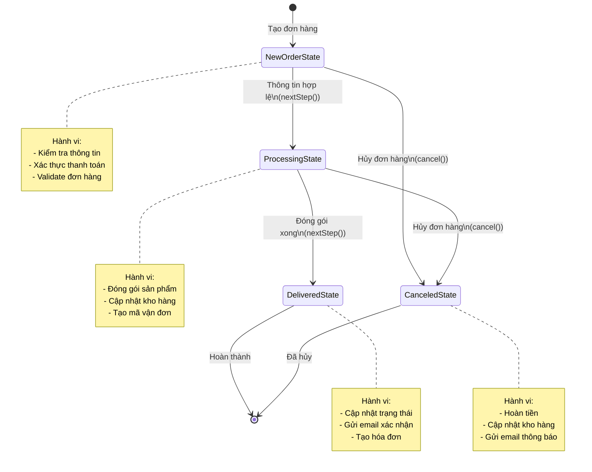

### 3.2. Giải thích State Transition Diagram

#### Các trạng thái (States)

1. **NewOrderState** (Trạng thái mới)
   - **Mô tả:** Đơn hàng vừa được tạo, đang chờ kiểm tra và xác thực
   - **Hành vi:**
     - Kiểm tra thông tin khách hàng
     - Xác thực phương thức thanh toán
     - Validate số lượng sản phẩm trong kho
   - **Entry Action:** Ghi log tạo đơn hàng
   - **Exit Action:** Gửi email xác nhận đơn hàng

2. **ProcessingState** (Đang xử lý)
   - **Mô tả:** Đơn hàng đã được xác thực, đang được đóng gói và chuẩn bị giao hàng
   - **Hành vi:**
     - Đóng gói sản phẩm
     - Cập nhật số lượng trong kho
     - Tạo mã vận đơn
     - Gán nhân viên xử lý
   - **Entry Action:** Thông báo cho nhân viên kho
   - **Exit Action:** Cập nhật thời gian xử lý

3. **DeliveredState** (Đã giao)
   - **Mô tả:** Đơn hàng đã được giao đến khách hàng, là trạng thái cuối cùng
   - **Hành vi:**
     - Cập nhật trạng thái giao hàng
     - Gửi email xác nhận giao hàng
     - Tạo hóa đơn điện tử
     - Cập nhật lịch sử mua hàng
   - **Entry Action:** Ghi log hoàn thành đơn hàng
   - **Exit Action:** Không có (trạng thái cuối)

4. **CanceledState** (Đã hủy)
   - **Mô tả:** Đơn hàng đã bị hủy, có thể hủy từ NewOrderState hoặc ProcessingState
   - **Hành vi:**
     - Hoàn tiền cho khách hàng
     - Cập nhật lại kho hàng (trả lại sản phẩm)
     - Gửi email thông báo hủy đơn hàng
     - Ghi log lý do hủy
   - **Entry Action:** Xác định lý do hủy
   - **Exit Action:** Không có (trạng thái cuối)

#### Các chuyển đổi (Transitions)

| Từ trạng thái | Đến trạng thái | Sự kiện | Điều kiện | Hành động |
|---------------|----------------|---------|-----------|-----------|
| [*] | NewOrderState | createOrder() | - | Tạo Order mới |
| NewOrderState | ProcessingState | nextStep() | Thông tin hợp lệ | Validate thành công |
| NewOrderState | CanceledState | cancel() | - | Khách hàng hủy |
| ProcessingState | DeliveredState | nextStep() | Đóng gói xong | Hoàn tất xử lý |
| ProcessingState | CanceledState | cancel() | Chưa giao hàng | Hủy đơn hàng |
| DeliveredState | [*] | - | - | Kết thúc |
| CanceledState | [*] | - | - | Kết thúc |

#### Các sự kiện không hợp lệ (Invalid Transitions)

Các chuyển đổi sau đây **KHÔNG ĐƯỢC PHÉP** và hệ thống sẽ từ chối:

- ❌ DeliveredState → NewOrderState: Không thể reset đơn hàng đã giao
- ❌ DeliveredState → ProcessingState: Không thể quay lại xử lý
- ❌ CanceledState → NewOrderState: Không thể khôi phục đơn hàng đã hủy
- ❌ CanceledState → ProcessingState: Không thể xử lý đơn hàng đã hủy
- ❌ ProcessingState → NewOrderState: Không thể quay lại trạng thái mới

#### Guard Conditions (Điều kiện bảo vệ)

```java
// Ví dụ guard condition cho transition NewOrderState → ProcessingState
if (order.isValid() && 
    order.isPaymentVerified() && 
    order.hasEnoughStock()) {
    order.setState(new ProcessingState());
}
```

### 3.3. State Transition Table

| Current State | Event | Condition | Next State | Action |
|---------------|-------|-----------|------------|--------|
| - | createOrder() | - | NewOrderState | Tạo Order, gán ID |
| NewOrderState | nextStep() | isValid() == true | ProcessingState | Validate, chuyển trạng thái |
| NewOrderState | nextStep() | isValid() == false | NewOrderState | Hiển thị lỗi |
| NewOrderState | cancel() | - | CanceledState | Hủy đơn hàng |
| ProcessingState | nextStep() | isPackaged() == true | DeliveredState | Hoàn tất giao hàng |
| ProcessingState | cancel() | - | CanceledState | Hủy đơn hàng |
| DeliveredState | - | - | [*] | Kết thúc |
| CanceledState | - | - | [*] | Kết thúc |

### 3.4. State Machine với các trường hợp đặc biệt

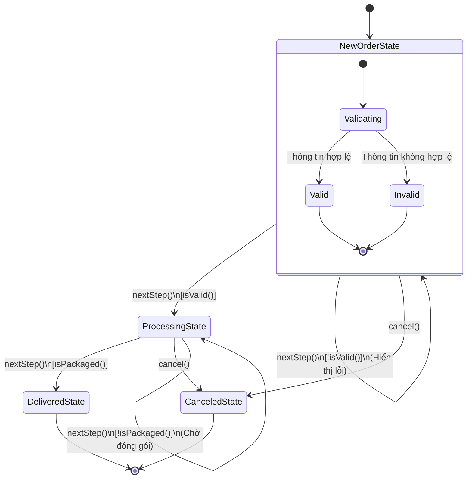

### 3.5. Phân tích State Transition

#### Tính nhất quán (Consistency)

- ✅ Mỗi đơn hàng chỉ có thể ở một trạng thái tại một thời điểm
- ✅ Chuyển đổi trạng thái chỉ xảy ra thông qua các sự kiện được định nghĩa
- ✅ Không có vòng lặp vô hạn (mọi đường đi đều dẫn đến trạng thái cuối)

#### Tính toàn vẹn (Integrity)

- ✅ Không thể chuyển từ trạng thái cuối (DeliveredState, CanceledState) sang trạng thái khác
- ✅ Mọi chuyển đổi đều có điều kiện kiểm tra
- ✅ Các hành động quan trọng (hoàn tiền, cập nhật kho) chỉ xảy ra ở trạng thái phù hợp

#### Khả năng mở rộng (Extensibility)

Để thêm trạng thái mới (ví dụ: **ShippedState** - Đã vận chuyển):

1. Tạo lớp ShippedState implements OrderState
2. Thêm transition: ProcessingState → ShippedState
3. Thêm transition: ShippedState → DeliveredState
4. Không cần sửa đổi code hiện có

**State Transition Diagram mở rộng:**

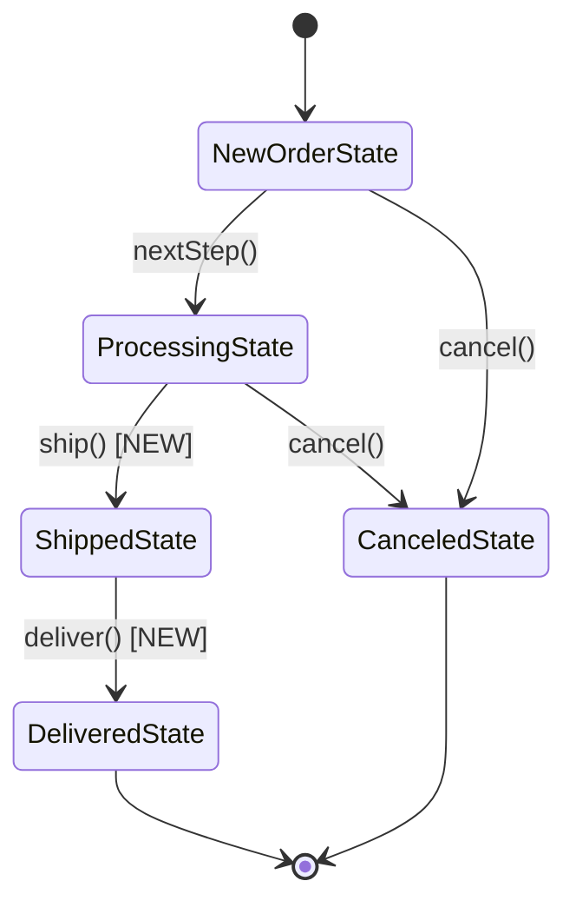

---

## 4. Sơ đồ Class Diagram

### 4.1. State Pattern - Quản lý Đơn hàng

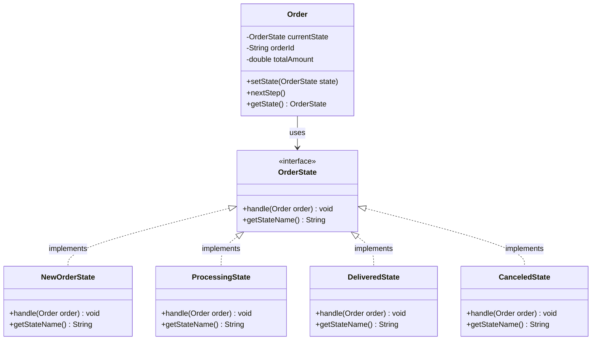

**Giải thích các thành phần:**

- **Order (Context)**: 
  - Lớp đại diện cho đơn hàng, giữ tham chiếu đến trạng thái hiện tại
  - Cung cấp phương thức `nextStep()` để chuyển sang bước tiếp theo
  - Ủy quyền hành vi cho đối tượng State hiện tại

- **OrderState (State Interface)**:
  - Interface định nghĩa các phương thức mà mọi trạng thái phải triển khai
  - `handle(Order order)`: Xử lý logic của trạng thái và chuyển sang trạng thái tiếp theo
  - `getStateName()`: Trả về tên trạng thái

- **Concrete States (NewOrderState, ProcessingState, DeliveredState, CanceledState)**:
  - Mỗi lớp triển khai logic cụ thể cho một trạng thái
  - Quyết định trạng thái tiếp theo hợp lệ
  - Thực hiện các hành động cụ thể (kiểm tra, đóng gói, giao hàng, hủy)

### 4.2. Strategy Pattern - Tính toán Thuế

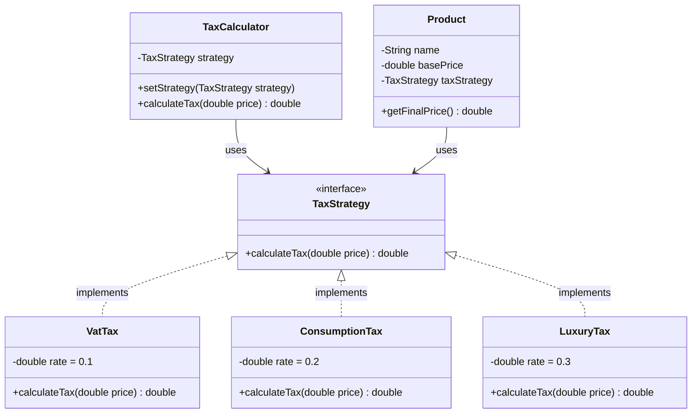

**Giải thích các thành phần:**

- **TaxCalculator (Context)**:
  - Lớp sử dụng Strategy để tính thuế
  - Có thể thay đổi Strategy tại runtime
  - Ủy quyền việc tính toán cho Strategy

- **TaxStrategy (Strategy Interface)**:
  - Interface định nghĩa phương thức tính thuế
  - Đảm bảo mọi Strategy đều có cùng interface

- **Concrete Strategies (VatTax, ConsumptionTax, LuxuryTax)**:
  - Mỗi lớp triển khai một thuật toán tính thuế cụ thể
  - Độc lập với nhau, có thể thay thế cho nhau

- **Product**:
  - Sử dụng TaxStrategy để tính giá cuối cùng
  - Có thể thay đổi loại thuế áp dụng

### 4.3. Decorator Pattern - Hệ thống Thanh toán

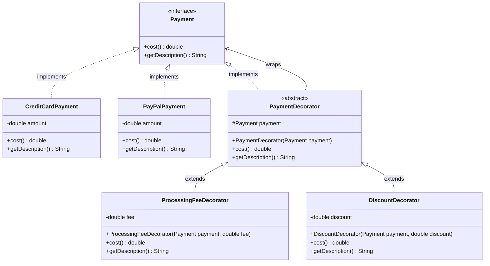

**Giải thích các thành phần:**

- **Payment (Component Interface)**:
  - Interface định nghĩa các phương thức cơ bản
  - `cost()`: Tính tổng chi phí
  - `getDescription()`: Mô tả phương thức thanh toán

- **Concrete Components (CreditCardPayment, PayPalPayment)**:
  - Các lớp triển khai phương thức thanh toán cơ bản
  - Trả về giá trị gốc, không có tính năng bổ sung

- **PaymentDecorator (Decorator Abstract Class)**:
  - Lớp trừu tượng giữ tham chiếu đến Payment
  - Triển khai Payment interface
  - Ủy quyền các phương thức cho Payment được bao bọc

- **Concrete Decorators (ProcessingFeeDecorator, DiscountDecorator)**:
  - Mỗi decorator thêm một tính năng cụ thể
  - Gọi phương thức của Payment được bao bọc, sau đó thêm logic của riêng nó
  - Có thể kết hợp với nhau

### 4.4. Sơ đồ tổng hợp - Tương tác giữa các Pattern

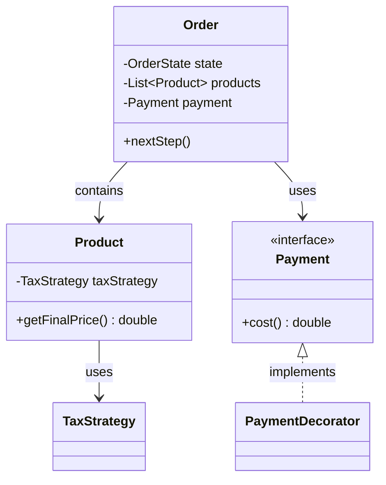

---

## 5. Phân tích chi tiết sự tương tác

### 5.1. Tương tác trong State Pattern

#### Sequence Diagram: Chuyển đổi trạng thái đơn hàng

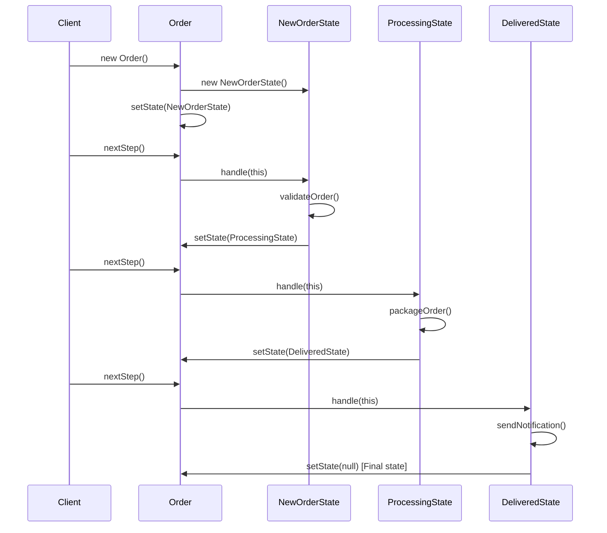

**Phân tích chi tiết:**

1. **Khởi tạo**: Order được tạo với NewOrderState làm trạng thái ban đầu
2. **Xử lý trạng thái**: Mỗi lần gọi `nextStep()`, Order ủy quyền cho State hiện tại xử lý
3. **Chuyển trạng thái**: State tự quyết định và thực hiện chuyển sang trạng thái tiếp theo
4. **Đóng gói**: Order không cần biết logic cụ thể của từng trạng thái

**Lợi ích:**
- Order chỉ cần gọi `nextStep()`, không cần biết đang ở trạng thái nào
- Mỗi State tự quản lý logic và quyết định trạng thái tiếp theo
- Dễ dàng thêm trạng thái mới mà không sửa Order

### 5.2. Tương tác trong Strategy Pattern

#### Sequence Diagram: Tính toán thuế với Strategy

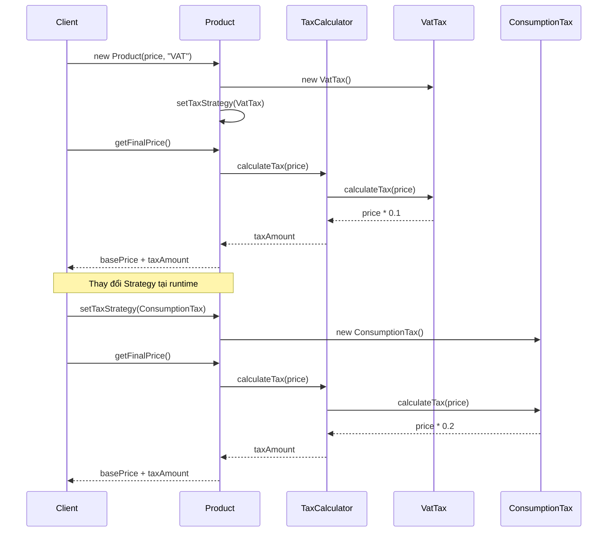

**Phân tích chi tiết:**

1. **Khởi tạo Strategy**: Product nhận Strategy tương ứng với loại sản phẩm
2. **Tính toán**: TaxCalculator ủy quyền việc tính toán cho Strategy
3. **Thay đổi động**: Có thể thay đổi Strategy tại runtime
4. **Độc lập**: Mỗi Strategy hoạt động độc lập, không ảnh hưởng lẫn nhau

**Lợi ích:**
- Client không cần biết công thức tính thuế cụ thể
- Có thể thay đổi thuật toán mà không sửa TaxCalculator
- Dễ test từng Strategy riêng biệt

### 5.3. Tương tác trong Decorator Pattern

#### Sequence Diagram: Thanh toán với Decorator

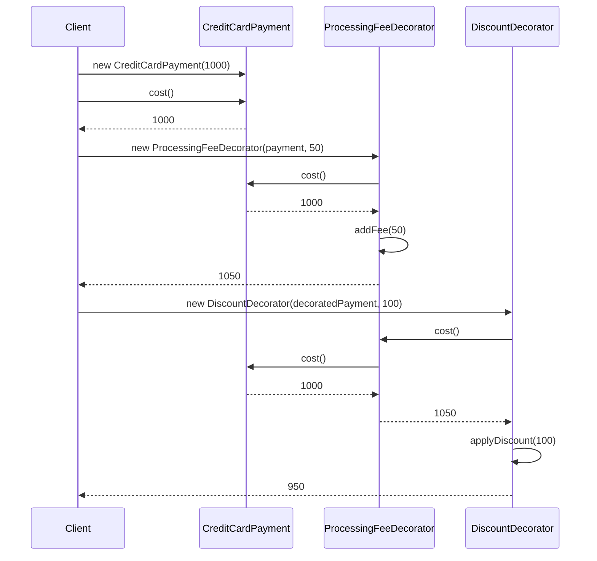

**Phân tích chi tiết:**

1. **Payment cơ bản**: CreditCardPayment trả về giá gốc
2. **Thêm Decorator**: ProcessingFeeDecorator bao bọc Payment, cộng thêm phí
3. **Kết hợp Decorator**: DiscountDecorator bao bọc ProcessingFeeDecorator, trừ đi giảm giá
4. **Chuỗi gọi**: Mỗi decorator gọi `cost()` của đối tượng được bao bọc, sau đó thêm logic của riêng nó

**Lợi ích:**
- Có thể kết hợp nhiều decorator theo nhiều cách khác nhau
- Thêm/bỏ tính năng mà không sửa code cũ
- Giữ nguyên interface, client code không đổi

### 5.4. Tương tác tích hợp: Từ đơn hàng đến thanh toán

#### Sequence Diagram: Luồng hoàn chỉnh

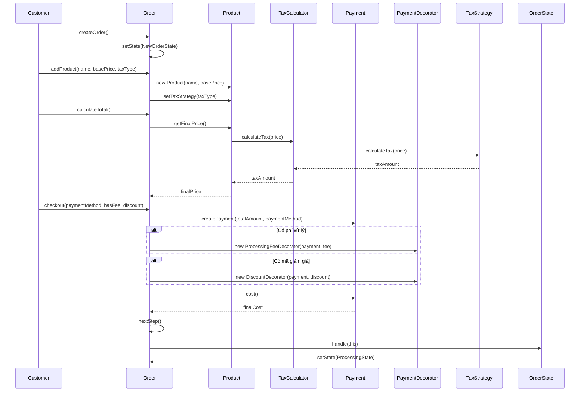

**Phân tích tích hợp:**

1. **Tạo đơn hàng**: Order được tạo với NewOrderState
2. **Thêm sản phẩm**: Mỗi Product có TaxStrategy riêng
3. **Tính tổng**: Order tính tổng giá các sản phẩm (đã bao gồm thuế)
4. **Thanh toán**: Tạo Payment và áp dụng Decorator nếu cần
5. **Xử lý đơn hàng**: Chuyển sang ProcessingState và tiếp tục luồng

**Lợi ích tích hợp:**
- Ba pattern hoạt động độc lập nhưng bổ trợ cho nhau
- Order là điểm tập trung, điều phối các pattern
- Mỗi pattern giải quyết một vấn đề cụ thể, không can thiệp vào nhau

---

## 6. Kết luận

### 4.1. Tổng kết

Dự án này đã thành công trong việc áp dụng ba Design Pattern quan trọng để giải quyết các vấn đề thiết kế phức tạp trong hệ thống thương mại điện tử:

1. **State Pattern** giải quyết vấn đề quản lý trạng thái đơn hàng một cách linh hoạt và dễ mở rộng
2. **Strategy Pattern** cho phép tính toán thuế đa dạng với khả năng thay đổi tại runtime
3. **Decorator Pattern** hỗ trợ thanh toán động với các tính năng bổ sung có thể kết hợp linh hoạt

### 4.2. Đánh giá thiết kế

**Điểm mạnh:**
- ✅ Code rõ ràng, dễ đọc và dễ hiểu
- ✅ Tuân thủ các nguyên tắc SOLID
- ✅ Dễ dàng mở rộng và bảo trì
- ✅ Tách biệt trách nhiệm rõ ràng
- ✅ Có thể test từng thành phần độc lập

**Hạn chế và cải thiện:**
- ⚠️ Có thể thêm Factory Pattern để tạo State/Strategy/Decorator
- ⚠️ Có thể thêm Observer Pattern để thông báo khi đơn hàng thay đổi trạng thái
- ⚠️ Có thể thêm Builder Pattern để xây dựng Order phức tạp
- ⚠️ Cần thêm validation và error handling

### 4.3. Bài học rút ra

1. **Chọn Pattern phù hợp**: Mỗi pattern giải quyết một vấn đề cụ thể, không nên lạm dụng
2. **Kết hợp Pattern**: Các pattern có thể hoạt động cùng nhau để giải quyết bài toán phức tạp
3. **Balance**: Cân bằng giữa tính linh hoạt và độ phức tạp của code
4. **Documentation**: Tài liệu rõ ràng giúp team hiểu và maintain code tốt hơn

### 4.4. Hướng phát triển

1. **Thêm các Pattern khác**:
   - Factory Pattern: Tạo State/Strategy/Decorator
   - Observer Pattern: Thông báo thay đổi trạng thái
   - Builder Pattern: Xây dựng Order phức tạp

2. **Cải thiện tính năng**:
   - Thêm validation cho các State transition
   - Hỗ trợ undo/redo cho State Pattern
   - Thêm logging và monitoring
   - Thêm unit tests và integration tests

3. **Tối ưu hiệu năng**:
   - Cache các Strategy instance
   - Optimize Decorator chain
   - Thêm lazy loading nếu cần

### 4.5. Kết luận cuối cùng

Thiết kế này đã chứng minh được giá trị của Design Patterns trong việc xây dựng hệ thống phần mềm có khả năng mở rộng cao, dễ bảo trì và tuân thủ các nguyên tắc thiết kế tốt. Việc áp dụng đúng Pattern không chỉ giải quyết vấn đề hiện tại mà còn tạo nền tảng vững chắc cho việc phát triển trong tương lai.

---

**Tài liệu được tạo bởi:** [Tên sinh viên]  
**Ngày:** 31/01/2026  
**Môn học:** Kiến trúc và Thiết kế Phần mềm
