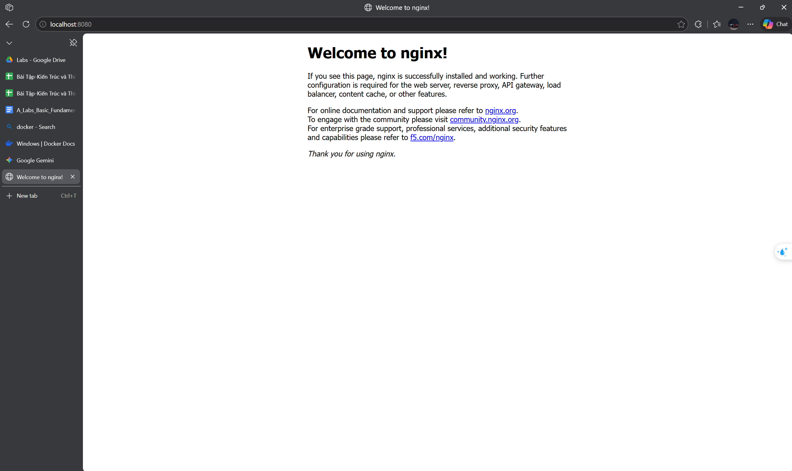
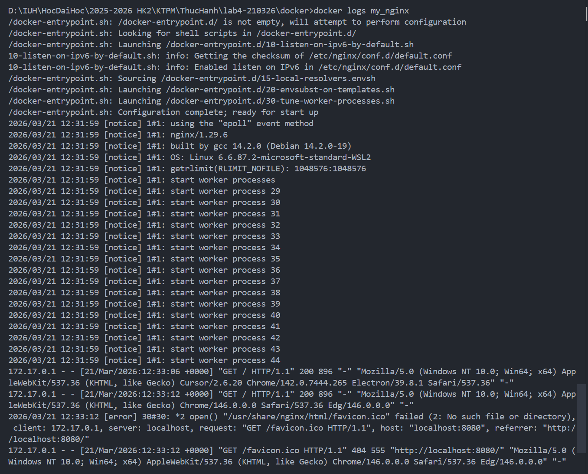
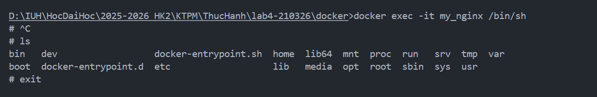
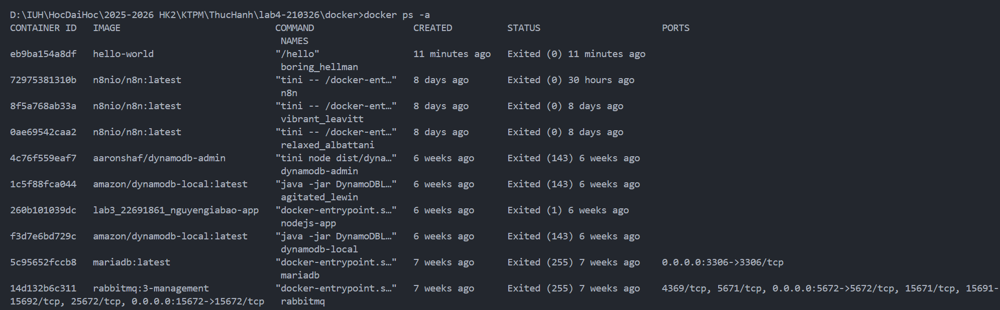

# BAO CAO THUC HANH DOCKER - LAB 4

## 1. Muc tieu

- Lam quen voi Docker CLI.
- Hieu va thuc hanh cac nhom lenh: image, container, logs, inspect, port, volume, network.
- Build image tu `Dockerfile` va chay container tu image tu tao.

## 2. Moi truong thuc hien

- He dieu hanh: Windows 10/11.
- Cong cu: Docker Desktop (Engine dang chay).
- Terminal: PowerShell.

## 3. Noi dung thuc hanh

> Ghi chu:
>
> - Tat ca lenh chay tren PowerShell.
> - Neu gap loi quyen truy cap hoac daemon, can mo Docker Desktop truoc.
> - Chen anh man hinh vao cac vi tri `[Anh ...]`.

---

### Buoc 0 - Kiem tra Docker

**Lenh**

```powershell
docker --version
```

**Ket qua mong doi**

- Hien thi phien ban Docker, vi du: `Docker version 26.x.x, build ...`.

**Anh chup can chen**


---

### Buoc 1 - Quan ly Images

**Lenh**

```powershell
docker pull nginx
docker images
```

**Ket qua mong doi**

- Tai image `nginx` thanh cong (hoac thong bao da co san).
- Danh sach image co `nginx:latest`.

**Anh chup can chen**


<!-- - `[Anh 03: Ket qua docker images co nginx]` -->

---

### Buoc 2 - Chay container kiem thu nhanh

**Lenh**

```powershell
docker run hello-world
```

**Ket qua mong doi**

- Hien thi dong `Hello from Docker!`.

**Anh chup can chen**


---

### Buoc 3 - Chay Nginx o che do nen va map cong

**Lenh**

```powershell
docker run -d --name my_nginx -p 8080:80 nginx
docker ps
```

**Ket qua mong doi**

- Tao container `my_nginx` thanh cong.
- `docker ps` hien thi container dang `Up`.
- Cot `PORTS` co dang `0.0.0.0:8080->80/tcp`.
- Truy cap `http://localhost:8080` hien trang welcome Nginx.

**Anh chup can chen**




---

### Buoc 4 - Tuong tac voi container (logs, exec, inspect, stats)

**Lenh**

```powershell
docker logs my_nginx
docker logs -f my_nginx
```

> Nhan `Ctrl + C` de thoat theo doi logs realtime.

```powershell
docker exec -it my_nginx /bin/sh
```

> Trong container, co the chay `ls`, sau do `exit`.

```powershell
docker inspect my_nginx
docker stats
```

> Nhan `Ctrl + C` de thoat `docker stats`.

**Ket qua mong doi**

- Xem duoc log khoi dong Nginx va log request.
- Truy cap duoc shell ben trong container.
- `inspect` tra ve JSON chi tiet (network, env, mounts...).
- `stats` hien thi CPU/RAM realtime.

**Anh chup can chen**





---

### Buoc 5 - Dung, khoi dong lai, xoa container

**Lenh**

```powershell
docker stop my_nginx
docker restart my_nginx
docker stop my_nginx
docker rm my_nginx
docker ps -a
```

**Ket qua mong doi**

- Container duoc dung/khoi dong lai/xoa thanh cong.
- Sau khi xoa, `my_nginx` khong con trong danh sach.

**Anh chup can chen**




---

### Buoc 6 - Volume va Network (mo rong)

#### 6.1. Volume

**Lenh**

```powershell
docker run -d --name v_nginx -v mydata:/data nginx
docker volume ls
docker stop v_nginx
docker rm v_nginx
```

**Ket qua mong doi**

- Tao volume `mydata` va gan vao container thanh cong.
- `docker volume ls` hien thi `mydata`.

**Anh chup can chen**


#### 6.2. Network

**Lenh**

```powershell
docker network create my_network
docker run -d --name n_nginx --network my_network nginx
docker network ls
docker network connect my_network n_nginx
```

**Ket qua mong doi**

- Tao network `my_network` thanh cong.
- Container chay trong network chi dinh.

**Anh chup can chen**


---

### Buoc 7 - Build image tu Dockerfile

**Lenh**

```powershell
docker build -t my_nginx_image .
docker run -d --name custom_nginx -p 8080:80 my_nginx_image
docker ps
```

**Ket qua mong doi**

- Build image `my_nginx_image` thanh cong.
- Container `custom_nginx` chay tu image vua build.

**Anh chup can chen**

- `[Anh 16: Ket qua docker build -t my_nginx_image .]`
- `[Anh 17: Ket qua chay custom_nginx]`

---

### Buoc 8 - Don dep tai nguyen (tuy chon, can than)

**Lenh**

```powershell
docker container prune -f
docker image prune -a -f
docker volume prune -f
```

**Ket qua mong doi**

- Xoa tai nguyen khong su dung va hien thi dung luong thu hoi.

**Anh chup can chen**

- `[Anh 18: Ket qua cac lenh prune]`

## 4. Bang tong hop y nghia lenh da dung

| Lenh                                  | Tac dung                                     |
| ------------------------------------- | -------------------------------------------- |
| `docker pull nginx`                   | Tai image `nginx` tu Docker Hub              |
| `docker images`                       | Liet ke image dang co                        |
| `docker run -d --name ... -p ...`     | Tao va chay container nen, dat ten, map cong |
| `docker ps`, `docker ps -a`           | Xem container dang chay / tat ca container   |
| `docker logs`, `docker logs -f`       | Xem log 1 lan / theo doi realtime            |
| `docker exec -it ... /bin/sh`         | Vao shell cua container                      |
| `docker inspect ...`                  | Xem cau hinh chi tiet container              |
| `docker stats`                        | Theo doi tai nguyen CPU/RAM                  |
| `docker stop/restart/rm`              | Dung, khoi dong lai, xoa container           |
| `docker volume ls`                    | Liet ke volume                               |
| `docker network create/ls/connect`    | Tao, liet ke, ket noi network                |
| `docker build -t ... .`               | Build image tu `Dockerfile`                  |
| `docker image/container/volume prune` | Don dep tai nguyen khong dung                |

## 5. Loi thuong gap va cach xu ly nhanh

- **Docker daemon chua chay**: Mo Docker Desktop, doi trang thai Engine running.
- **Port 8080 da duoc su dung**: Doi sang cong khac, vi du `-p 8081:80`.
- **Trung ten container**: Dung ten moi hoac xoa container cu (`docker rm <name>` sau khi stop).
- **Khong xoa duoc image**: Dung va xoa cac container dang su dung image do truoc.

## 6. Ket luan

- Da thuc hanh day du cac lenh Docker co ban va nang cao theo yeu cau.
- Da hieu quy trinh: keo image -> chay container -> theo doi/tuong tac -> dung/xoa -> build image rieng.
- Docker ho tro dong goi va trien khai ung dung nhanh, dong nhat, de quan ly moi truong.
