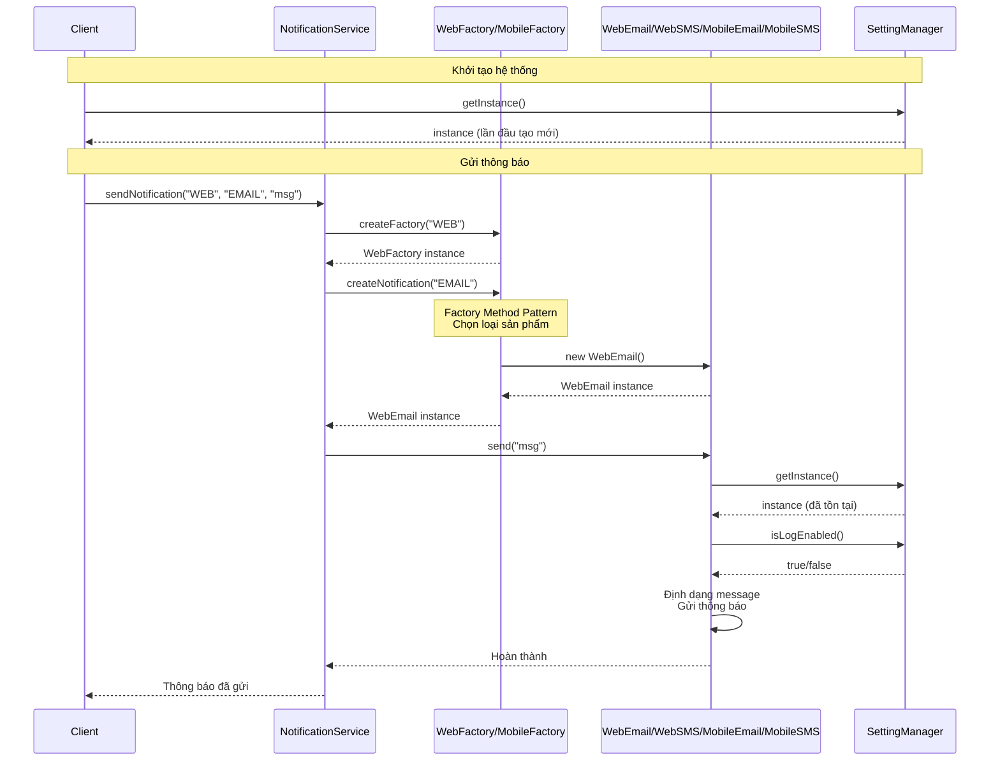
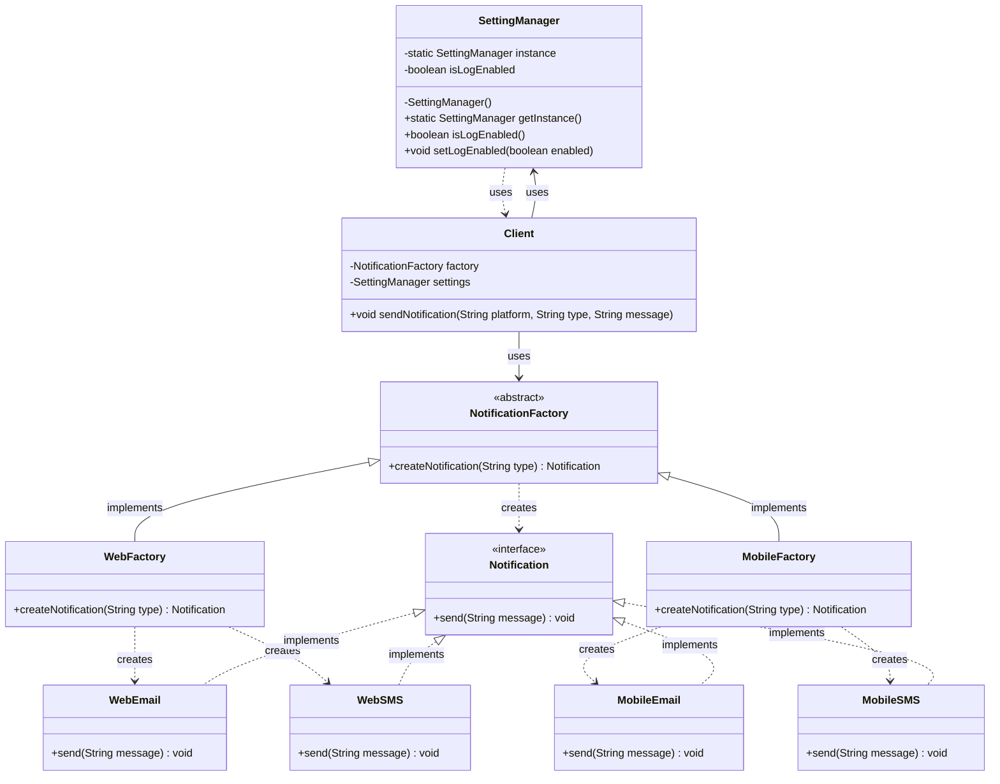

# Tài liệu: Hệ thống Gửi thông báo Đa nền tảng

## 1. Mô tả bài toán

### 1.1. Vấn đề cần giải quyết

Hệ thống cần gửi thông báo qua hai kênh chính: **SMS** và **Email** trên hai môi trường khác nhau: **Web** và **Mobile**. Mỗi nền tảng có cách định dạng và xử lý thông báo riêng biệt:

- **Web Platform**: Thông báo được định dạng phù hợp với giao diện web (HTML, CSS)
- **Mobile Platform**: Thông báo được định dạng phù hợp với ứng dụng di động (native format)

### 1.2. Yêu cầu thiết kế

Hệ thống cần áp dụng ba Design Patterns chính:

#### 1.2.1. Singleton Pattern - SettingManager
- **Mục đích**: Đảm bảo toàn bộ ứng dụng chỉ có một đối tượng quản lý cài đặt hệ thống
- **Chức năng**: 
  - Lưu trữ các cài đặt hệ thống (ví dụ: `isLogEnabled = true`)
  - Cung cấp điểm truy cập duy nhất cho các thành phần khác trong hệ thống
  - Đảm bảo tính nhất quán của cấu hình trong toàn bộ ứng dụng

#### 1.2.2. Abstract Factory Pattern - Platform Factory
- **Mục đích**: Tạo ra các nhóm đối tượng liên quan (Email/SMS) cho từng nền tảng cụ thể
- **Cấu trúc**:
  - **Abstract Factory**: Định nghĩa interface để tạo Email và SMS
  - **Concrete Factories**:
    - `WebFactory`: Tạo ra `WebEmail` và `WebSMS`
    - `MobileFactory`: Tạo ra `MobileEmail` và `MobileSMS`
- **Lợi ích**: Đảm bảo các đối tượng được tạo ra cùng một họ (cùng nền tảng) và dễ dàng mở rộng thêm nền tảng mới

#### 1.2.3. Factory Method Pattern - Notification Type Selection
- **Mục đích**: Cho phép mỗi Factory quyết định cách tạo đối tượng cụ thể dựa trên loại thông báo
- **Cơ chế**: 
  - Người dùng truyền vào chuỗi `"EMAIL"` hoặc `"SMS"`
  - Factory sẽ trả về đúng đối tượng tương ứng với nền tảng của nó
  - Ví dụ: `WebFactory.createNotification("EMAIL")` → trả về `WebEmail`
  - Ví dụ: `MobileFactory.createNotification("SMS")` → trả về `MobileSMS`

### 1.3. Luồng hoạt động chi tiết

#### 1.3.1. Giai đoạn khởi tạo hệ thống

**Bước 1: Khởi tạo SettingManager (Singleton)**
```
1. Client gọi SettingManager.getInstance() lần đầu tiên
2. Kiểm tra instance == null → true
3. Synchronized block được thực thi
4. Kiểm tra lại instance == null (double-checked locking)
5. Tạo instance mới: new SettingManager()
6. Khởi tạo mặc định: isLogEnabled = true
7. Trả về instance
```

**Bước 2: Các lần gọi tiếp theo**
```
1. Client gọi SettingManager.getInstance()
2. Kiểm tra instance == null → false
3. Trả về instance đã tồn tại (không tạo mới)
```

**Bước 3: Tạo Factory dựa trên nền tảng**
```
1. Client xác định nền tảng cần sử dụng ("WEB" hoặc "MOBILE")
2. Tạo Factory tương ứng:
   - "WEB" → new WebFactory()
   - "MOBILE" → new MobileFactory()
3. Factory được lưu trữ để sử dụng sau này
```

#### 1.3.2. Giai đoạn gửi thông báo

**Luồng hoạt động chi tiết:**

```
┌─────────┐
│ Client  │
└────┬────┘
     │
     │ 1. sendNotification("WEB", "EMAIL", "Hello")
     │
     ▼
┌─────────────────────┐
│ NotificationService │
└────┬────────────────┘
     │
     │ 2. createFactory("WEB")
     │
     ▼
┌──────────────┐
│ WebFactory   │ ← Abstract Factory Pattern
└────┬─────────┘
     │
     │ 3. createNotification("EMAIL")
     │    ↓
     │    Factory Method Pattern
     │    ↓
     │    switch("EMAIL") {
     │      case "EMAIL": return new WebEmail()
     │    }
     │
     ▼
┌──────────────┐
│ WebEmail     │ ← Concrete Product
└────┬─────────┘
     │
     │ 4. send("Hello")
     │    ↓
     │    - Lấy SettingManager.getInstance()
     │    - Kiểm tra isLogEnabled()
     │    - Định dạng message cho Web (HTML)
     │    - Gửi thông báo
     │
     ▼
┌──────────────────┐
│ SettingManager   │ ← Singleton Pattern
│ (getInstance)    │
└──────────────────┘
```

**Chi tiết từng bước:**

**Bước 1: Client yêu cầu gửi thông báo**
```java
service.sendNotification("WEB", "EMAIL", "Hello World");
```

**Bước 2: NotificationService xử lý**
- Nhận tham số: platform="WEB", type="EMAIL", message="Hello World"
- Gọi `createFactory("WEB")` → trả về `WebFactory` instance
- Gọi `factory.createNotification("EMAIL")` → Factory Method Pattern được áp dụng

**Bước 3: Factory Method xử lý**
- WebFactory nhận type="EMAIL"
- Chuyển đổi thành uppercase: "EMAIL"
- Switch case: case "EMAIL" → return new WebEmail()
- Trả về WebEmail instance

**Bước 4: Product thực hiện gửi**
- WebEmail.send("Hello World") được gọi
- Bên trong send():
  - Lấy SettingManager.getInstance() (Singleton)
  - Kiểm tra settings.isLogEnabled()
  - Nếu true → in log messages
  - Định dạng message cho Web (HTML format)
  - Thực hiện gửi thông báo
  - In kết quả

#### 1.3.3. Luồng tương tác giữa các thành phần

**Sequence Diagram:**



#### 1.3.4. Các kịch bản sử dụng

**Kịch bản 1: Gửi Email qua Web**
```
1. Client → NotificationService.sendNotification("WEB", "EMAIL", "Welcome!")
2. Service → createFactory("WEB") → WebFactory
3. Service → WebFactory.createNotification("EMAIL") → WebEmail
4. Service → WebEmail.send("Welcome!")
5. WebEmail → SettingManager.getInstance() → Lấy cấu hình
6. WebEmail → Định dạng HTML và gửi
```

**Kịch bản 2: Gửi SMS qua Mobile**
```
1. Client → NotificationService.sendNotification("MOBILE", "SMS", "New message")
2. Service → createFactory("MOBILE") → MobileFactory
3. Service → MobileFactory.createNotification("SMS") → MobileSMS
4. Service → MobileSMS.send("New message")
5. MobileSMS → SettingManager.getInstance() → Lấy cấu hình
6. MobileSMS → Định dạng native và gửi qua SMS Gateway
```

**Kịch bản 3: Thay đổi cài đặt hệ thống**
```
1. Component A → SettingManager.getInstance() → instance1
2. Component A → instance1.setLogEnabled(false)
3. Component B → SettingManager.getInstance() → instance2 (cùng instance1)
4. Component B → instance2.isLogEnabled() → false (ảnh hưởng từ Component A)
5. Tất cả Products sau đó sẽ không log
```

#### 1.3.5. Xử lý lỗi và validation

**Validation trong Factory:**
```
1. Factory nhận type parameter
2. Kiểm tra type != null
3. Chuyển đổi thành uppercase và trim
4. Switch case:
   - "EMAIL" → tạo Email product
   - "SMS" → tạo SMS product
   - default → throw IllegalArgumentException
```

**Validation trong Service:**
```
1. Service nhận platform parameter
2. Kiểm tra platform != null
3. Chuyển đổi thành uppercase và trim
4. Switch case:
   - "WEB" → tạo WebFactory
   - "MOBILE" → tạo MobileFactory
   - default → throw IllegalArgumentException
```

### 1.4. Lý do áp dụng Design Patterns

#### 1.4.1. Vấn đề nếu không sử dụng Design Patterns

**Vấn đề 1: Quản lý cài đặt phân tán**
- Nếu không có Singleton, mỗi component có thể tạo instance SettingManager riêng
- Dẫn đến cài đặt không nhất quán, khó đồng bộ
- Ví dụ: Component A bật log, Component B tắt log → xung đột

**Vấn đề 2: Tạo đối tượng phức tạp và rối rắm**
- Client phải biết chi tiết về từng loại Notification (WebEmail, MobileEmail, WebSMS, MobileSMS)
- Code sẽ có nhiều if-else phức tạp:
  ```java
  if (platform.equals("WEB") && type.equals("EMAIL")) {
      notification = new WebEmail();
  } else if (platform.equals("WEB") && type.equals("SMS")) {
      notification = new WebSMS();
  } else if (platform.equals("MOBILE") && type.equals("EMAIL")) {
      notification = new MobileEmail();
  } // ... và nhiều điều kiện khác
  ```
- Khó bảo trì, dễ sai sót, vi phạm nguyên tắc Open/Closed

**Vấn đề 3: Không đảm bảo tính nhất quán**
- Có thể vô tình tạo WebEmail với MobileSMS (không cùng nền tảng)
- Khó kiểm soát việc tạo các đối tượng không tương thích

#### 1.4.2. Giải pháp với Design Patterns

**Singleton Pattern giải quyết:**
- Đảm bảo chỉ có một instance SettingManager trong toàn bộ ứng dụng
- Tất cả components dùng chung một cấu hình → nhất quán
- Tiết kiệm bộ nhớ, dễ quản lý

**Abstract Factory Pattern giải quyết:**
- Tách biệt logic tạo đối tượng ra khỏi Client
- Đảm bảo các đối tượng được tạo cùng một họ (cùng nền tảng)
- Dễ mở rộng: chỉ cần thêm Factory mới, không sửa code cũ

**Factory Method Pattern giải quyết:**
- Cho phép Factory quyết định cách tạo đối tượng cụ thể
- Client chỉ cần truyền type ("EMAIL" hoặc "SMS")
- Linh hoạt, dễ mở rộng thêm loại thông báo mới

### 1.5. Lợi ích chi tiết của thiết kế

#### 1.5.1. Lợi ích của Singleton Pattern

**1. Quản lý tài nguyên tập trung**
- Chỉ có một instance duy nhất trong suốt vòng đời ứng dụng
- Tiết kiệm bộ nhớ (không tạo nhiều object không cần thiết)
- Đảm bảo cấu hình hệ thống nhất quán

**2. Điểm truy cập toàn cục**
- Bất kỳ component nào cũng có thể truy cập SettingManager
- Không cần truyền instance qua nhiều lớp
- Giảm coupling giữa các components

**3. Thread-safe**
- Implementation với double-checked locking đảm bảo an toàn trong môi trường đa luồng
- Tránh race condition khi nhiều thread cùng truy cập

**4. Lazy initialization**
- Instance chỉ được tạo khi cần thiết (lần đầu gọi getInstance())
- Tiết kiệm tài nguyên khi ứng dụng khởi động

#### 1.5.2. Lợi ích của Abstract Factory Pattern

**1. Đảm bảo tính nhất quán của sản phẩm**
- WebFactory luôn tạo WebEmail và WebSMS (cùng họ Web)
- MobileFactory luôn tạo MobileEmail và MobileSMS (cùng họ Mobile)
- Không thể tạo WebEmail với MobileSMS → tránh lỗi logic

**2. Tách biệt logic tạo đối tượng**
- Client không cần biết chi tiết về cách tạo từng loại Notification
- Giảm coupling giữa Client và Concrete Products
- Code Client sạch hơn, dễ đọc hơn

**3. Dễ mở rộng**
- Thêm nền tảng mới (ví dụ: DesktopFactory) chỉ cần:
  - Tạo DesktopFactory implements NotificationFactory
  - Tạo DesktopEmail và DesktopSMS implements Notification
  - Không cần sửa code cũ → tuân thủ Open/Closed Principle

**4. Tái sử dụng**
- Các Factory có thể được sử dụng ở nhiều nơi trong ứng dụng
- Có thể cache Factory instance để tối ưu hiệu suất

#### 1.5.3. Lợi ích của Factory Method Pattern

**1. Linh hoạt trong việc chọn loại sản phẩm**
- Client chỉ cần truyền string "EMAIL" hoặc "SMS"
- Factory tự quyết định tạo đối tượng nào
- Không cần biết tên class cụ thể (WebEmail, MobileEmail, ...)

**2. Dễ mở rộng loại thông báo**
- Thêm loại mới (ví dụ: "PUSH") chỉ cần:
  - Thêm case trong createNotification() của mỗi Factory
  - Tạo class mới (WebPush, MobilePush)
  - Không cần sửa Client code

**3. Encapsulation**
- Logic tạo đối tượng được đóng gói trong Factory
- Client không cần biết cách Factory quyết định tạo object nào

**4. Hỗ trợ validation**
- Factory có thể validate input trước khi tạo object
- Có thể throw exception nếu type không hợp lệ
- Centralized error handling

#### 1.5.4. Lợi ích tổng hợp của việc kết hợp 3 Patterns

**1. Separation of Concerns (Tách biệt mối quan tâm)**
- Singleton: Quản lý cấu hình hệ thống
- Abstract Factory: Quản lý việc tạo nhóm sản phẩm theo nền tảng
- Factory Method: Quản lý việc chọn loại sản phẩm cụ thể
- Mỗi pattern giải quyết một vấn đề riêng biệt

**2. Maintainability (Dễ bảo trì)**
- Code có cấu trúc rõ ràng, dễ hiểu
- Thay đổi một phần không ảnh hưởng đến phần khác
- Dễ debug và test từng component riêng lẻ

**3. Scalability (Khả năng mở rộng)**
- Dễ thêm nền tảng mới (Desktop, Tablet, ...)
- Dễ thêm loại thông báo mới (Push, In-App, ...)
- Không cần refactor code hiện có

**4. Testability (Dễ kiểm thử)**
- Có thể mock Factory để test Client
- Có thể test từng Product riêng lẻ
- Singleton có thể được reset trong test

**5. Code Reusability (Tái sử dụng code)**
- Factory có thể được sử dụng ở nhiều nơi
- Products có thể được extend cho các use case khác
- SettingManager có thể được dùng cho các module khác

## 2. Sơ đồ Class Diagram



### 2.1. Giải thích các thành phần

#### Singleton Pattern
- **SettingManager**: 
  - Có thuộc tính `instance` static để lưu trữ instance duy nhất
  - Constructor private để ngăn việc tạo instance từ bên ngoài
  - Method `getInstance()` đảm bảo chỉ có một instance được tạo

#### Abstract Factory Pattern
- **NotificationFactory** (Abstract Factory):
  - Interface định nghĩa method `createNotification()` để tạo các đối tượng Notification
- **WebFactory** và **MobileFactory** (Concrete Factories):
  - Implement `NotificationFactory`
  - Mỗi Factory tạo ra các sản phẩm phù hợp với nền tảng của nó

#### Factory Method Pattern
- Được tích hợp trong `createNotification(String type)`:
  - Method này nhận tham số `type` ("EMAIL" hoặc "SMS")
  - Dựa trên `type`, Factory sẽ tạo và trả về đối tượng phù hợp
  - Mỗi Concrete Factory có cách triển khai riêng

#### Products
- **Notification** (Abstract Product): Interface định nghĩa method `send()`
- **WebEmail, WebSMS, MobileEmail, MobileSMS** (Concrete Products):
  - Implement interface `Notification`
  - Mỗi loại có cách triển khai `send()` riêng phù hợp với nền tảng

#### Client
- Sử dụng Factory để tạo Notification
- Sử dụng SettingManager để lấy cấu hình hệ thống
- Không cần biết chi tiết về cách tạo đối tượng cụ thể

### 2.2. Sự tương tác chi tiết giữa các thành phần

#### 2.2.1. Mối quan hệ giữa các thành phần

**1. Client ↔ NotificationService**
- **Mối quan hệ**: Client sử dụng Service để gửi thông báo
- **Tương tác**: 
  - Client gọi `sendNotification(platform, type, message)`
  - Service xử lý và trả về kết quả
- **Lợi ích**: Client không cần biết chi tiết về Factory và Products

**2. NotificationService ↔ NotificationFactory**
- **Mối quan hệ**: Service sử dụng Factory để tạo Products
- **Tương tác**:
  - Service gọi `createFactory(platform)` → trả về Factory phù hợp
  - Service gọi `factory.createNotification(type)` → trả về Product
- **Lợi ích**: Service không cần biết chi tiết về cách Factory tạo Products

**3. NotificationFactory ↔ Concrete Factories (WebFactory, MobileFactory)**
- **Mối quan hệ**: Inheritance (implements)
- **Tương tác**:
  - Abstract Factory định nghĩa contract: `createNotification(String type)`
  - Concrete Factories implement và quyết định tạo Product nào
- **Lợi ích**: Đảm bảo tất cả Factory có cùng interface, dễ thay thế

**4. NotificationFactory ↔ Notification Products**
- **Mối quan hệ**: Factory tạo ra Products
- **Tương tác**:
  - Factory sử dụng Factory Method để chọn Product phù hợp
  - Factory tạo instance của Product và trả về
- **Lợi ích**: Encapsulation - logic tạo object được đóng gói trong Factory

**5. Notification Products ↔ SettingManager**
- **Mối quan hệ**: Products sử dụng Singleton để lấy cấu hình
- **Tương tác**:
  - Mỗi Product gọi `SettingManager.getInstance()` khi khởi tạo
  - Product sử dụng settings để quyết định hành vi (ví dụ: có log hay không)
- **Lợi ích**: Tất cả Products dùng chung một cấu hình → nhất quán

**6. Client ↔ SettingManager**
- **Mối quan hệ**: Client có thể truy cập trực tiếp để cấu hình
- **Tương tác**:
  - Client gọi `SettingManager.getInstance()` để lấy instance
  - Client thay đổi cài đặt: `setLogEnabled(true/false)`
- **Lợi ích**: Client có thể điều khiển hành vi của toàn hệ thống

#### 2.2.2. Luồng tương tác chi tiết

**Luồng 1: Khởi tạo và cấu hình**
```
Client
  │
  ├─→ SettingManager.getInstance()
  │     │
  │     ├─→ Kiểm tra instance == null?
  │     │     ├─→ Yes: Tạo instance mới
  │     │     └─→ No: Trả về instance hiện có
  │     │
  │     └─→ Trả về instance
  │
  └─→ settings.setLogEnabled(true)
        │
        └─→ Cập nhật isLogEnabled = true
              │
              └─→ Tất cả Products sau đó sẽ log
```

**Luồng 2: Gửi thông báo qua Web Email**
```
Client
  │
  └─→ NotificationService.sendNotification("WEB", "EMAIL", "Hello")
        │
        ├─→ createFactory("WEB")
        │     │
        │     └─→ new WebFactory() → WebFactory instance
        │
        ├─→ factory.createNotification("EMAIL")
        │     │
        │     ├─→ Factory Method Pattern:
        │     │     switch("EMAIL") {
        │     │       case "EMAIL": return new WebEmail()
        │     │     }
        │     │
        │     └─→ WebEmail instance
        │
        └─→ notification.send("Hello")
              │
              ├─→ SettingManager.getInstance()
              │     └─→ Lấy instance (đã tồn tại)
              │
              ├─→ settings.isLogEnabled()
              │     └─→ true/false
              │
              └─→ Định dạng và gửi thông báo
                    │
                    └─→ In kết quả (nếu log enabled)
```

**Luồng 3: Gửi thông báo qua Mobile SMS**
```
Client
  │
  └─→ NotificationService.sendNotification("MOBILE", "SMS", "Hi")
        │
        ├─→ createFactory("MOBILE")
        │     │
        │     └─→ new MobileFactory() → MobileFactory instance
        │
        ├─→ factory.createNotification("SMS")
        │     │
        │     ├─→ Factory Method Pattern:
        │     │     switch("SMS") {
        │     │       case "SMS": return new MobileSMS()
        │     │     }
        │     │
        │     └─→ MobileSMS instance
        │
        └─→ notification.send("Hi")
              │
              ├─→ SettingManager.getInstance()
              │     └─→ Lấy instance (đã tồn tại)
              │
              ├─→ settings.isLogEnabled()
              │     └─→ true/false
              │
              └─→ Định dạng native và gửi qua SMS Gateway
                    │
                    └─→ In kết quả (nếu log enabled)
```

#### 2.2.3. Sự phụ thuộc và coupling

**Low Coupling (Giảm sự phụ thuộc):**
- Client không phụ thuộc vào Concrete Products (WebEmail, MobileSMS, ...)
- Client chỉ phụ thuộc vào NotificationService và NotificationFactory interface
- Products không phụ thuộc vào nhau
- Có thể thay đổi implementation mà không ảnh hưởng Client

**High Cohesion (Tính gắn kết cao):**
- Các Products cùng nền tảng được nhóm lại (WebEmail + WebSMS)
- Factory chịu trách nhiệm tạo Products cùng họ
- SettingManager tập trung quản lý cấu hình

#### 2.2.4. Điểm tương tác chính

**1. Điểm tương tác: Factory Creation**
```
Service.createFactory(platform)
  ↓
Factory được tạo dựa trên platform
  ↓
Factory có thể được cache để tái sử dụng
```

**2. Điểm tương tác: Product Creation**
```
Factory.createNotification(type)
  ↓
Factory Method Pattern được áp dụng
  ↓
Product phù hợp được tạo và trả về
```

**3. Điểm tương tác: Configuration Access**
```
Product → SettingManager.getInstance()
  ↓
Singleton đảm bảo cùng một instance
  ↓
Cấu hình được chia sẻ giữa tất cả Products
```

**4. Điểm tương tác: Message Sending**
```
Product.send(message)
  ↓
Lấy cấu hình từ SettingManager
  ↓
Định dạng message theo platform
  ↓
Thực hiện gửi thông báo
```

## 3. Phân tích chi tiết sự tương tác

### 3.1. Tương tác giữa Singleton và các thành phần khác

**SettingManager được sử dụng bởi:**

1. **NotificationService**
   - Có thể truy cập để lấy cấu hình hệ thống
   - Quyết định có log hay không khi gửi thông báo

2. **Tất cả Concrete Products (WebEmail, WebSMS, MobileEmail, MobileSMS)**
   - Mỗi Product lưu reference đến SettingManager trong constructor
   - Sử dụng để kiểm tra `isLogEnabled()` trước khi log
   - Đảm bảo hành vi nhất quán giữa tất cả Products

**Lợi ích của sự tương tác này:**
- Một thay đổi cài đặt ảnh hưởng đến toàn bộ hệ thống ngay lập tức
- Không cần truyền SettingManager qua nhiều lớp
- Giảm coupling giữa các components

### 3.2. Tương tác giữa Abstract Factory và Factory Method

**Abstract Factory Pattern cung cấp:**
- Interface chung cho tất cả Factories: `NotificationFactory`
- Đảm bảo mỗi Factory có thể tạo cả Email và SMS

**Factory Method Pattern tích hợp trong:**
- Method `createNotification(String type)` của mỗi Factory
- Cho phép Factory quyết định tạo Product nào dựa trên `type`

**Sự kết hợp:**
```
Abstract Factory định nghĩa: "Mỗi Factory phải có thể tạo Notification"
Factory Method quyết định: "Tạo Email hay SMS dựa trên type"
```

**Ví dụ cụ thể:**
```java
// Abstract Factory Pattern
NotificationFactory factory = new WebFactory();

// Factory Method Pattern (bên trong createNotification)
Notification notification = factory.createNotification("EMAIL");
// → WebFactory quyết định tạo WebEmail dựa trên "EMAIL"
```

### 3.3. Tương tác giữa Factory và Products

**Mối quan hệ tạo (Creation):**
- Factory tạo ra Products nhưng không sở hữu chúng
- Factory chỉ chịu trách nhiệm tạo, không quản lý lifecycle

**Mối quan hệ sử dụng:**
- Client nhận Product từ Factory và sử dụng trực tiếp
- Product độc lập với Factory sau khi được tạo

**Luồng lifecycle:**
```
1. Factory.createNotification(type) → Tạo Product
2. Factory trả về Product instance
3. Client sử dụng Product.send(message)
4. Product có thể được garbage collected sau khi dùng xong
```

### 3.4. Tương tác giữa Client và toàn bộ hệ thống

**Client tương tác với 3 lớp:**

1. **NotificationService** (Lớp cao nhất)
   - Client gọi `sendNotification()` với tham số đơn giản
   - Service che giấu tất cả complexity bên dưới

2. **NotificationFactory** (Lớp trung gian)
   - Client có thể truy cập trực tiếp nếu cần
   - Cho phép tạo Products mà không qua Service

3. **SettingManager** (Lớp cấu hình)
   - Client có thể cấu hình hệ thống trước khi gửi
   - Ảnh hưởng đến hành vi của tất cả Products

**Lợi ích của kiến trúc nhiều lớp:**
- Client có thể chọn mức độ chi tiết cần thiết
- Có thể sử dụng Service cho use case đơn giản
- Có thể sử dụng Factory trực tiếp cho use case phức tạp hơn

## 4. Kết luận

### 4.1. Tóm tắt thiết kế

Thiết kế này kết hợp ba Design Patterns một cách hiệu quả:

**Singleton Pattern:**
- Đảm bảo quản lý cài đặt tập trung và nhất quán
- Cung cấp điểm truy cập toàn cục cho cấu hình hệ thống
- Tiết kiệm tài nguyên và đảm bảo thread-safe

**Abstract Factory Pattern:**
- Quản lý việc tạo các nhóm đối tượng theo nền tảng
- Đảm bảo tính nhất quán (WebEmail + WebSMS, MobileEmail + MobileSMS)
- Dễ mở rộng thêm nền tảng mới mà không sửa code cũ

**Factory Method Pattern:**
- Cho phép linh hoạt trong việc chọn loại thông báo
- Encapsulation logic tạo đối tượng trong Factory
- Dễ mở rộng thêm loại thông báo mới

### 4.2. Lợi ích tổng hợp

**Về mặt kỹ thuật:**
- ✅ Code có cấu trúc rõ ràng, dễ hiểu
- ✅ Tuân thủ các nguyên tắc SOLID (đặc biệt là Open/Closed Principle)
- ✅ Giảm coupling, tăng cohesion
- ✅ Dễ test và debug

**Về mặt nghiệp vụ:**
- ✅ Hệ thống linh hoạt, có thể mở rộng dễ dàng
- ✅ Dễ bảo trì và nâng cấp
- ✅ Giảm thiểu lỗi do đảm bảo tính nhất quán
- ✅ Tái sử dụng code hiệu quả

**Về mặt phát triển:**
- ✅ Dễ onboarding cho developer mới
- ✅ Code dễ review và refactor
- ✅ Có thể phát triển song song các module
- ✅ Giảm thời gian phát triển tính năng mới

### 4.3. Kết luận

Sự kết hợp này tạo ra một hệ thống:
- **Linh hoạt**: Có thể mở rộng mà không sửa code cũ
- **Nhất quán**: Đảm bảo các đối tượng được tạo đúng cách
- **Dễ bảo trì**: Code có cấu trúc rõ ràng, dễ hiểu
- **Hiệu quả**: Tái sử dụng code, giảm duplication
- **An toàn**: Thread-safe, validation đầy đủ

Đây là một ví dụ điển hình về việc áp dụng Design Patterns để giải quyết các vấn đề thực tế trong phát triển phần mềm, tạo ra một kiến trúc vững chắc và có thể mở rộng.
